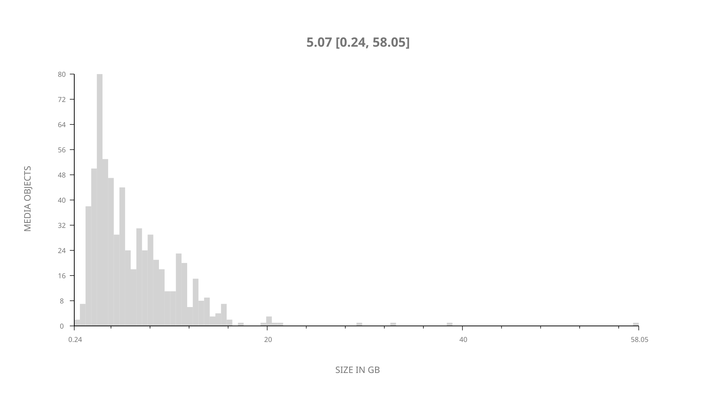
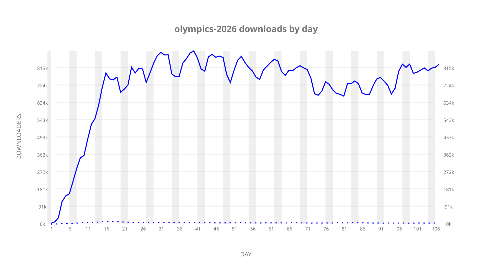
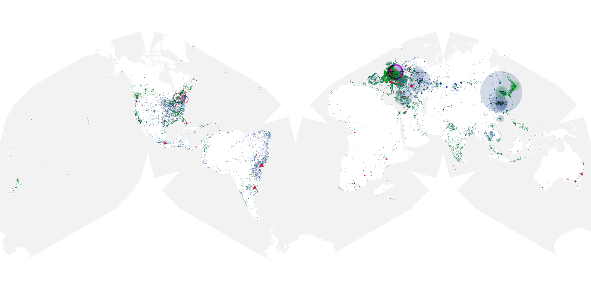
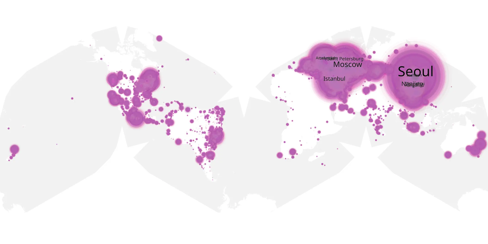
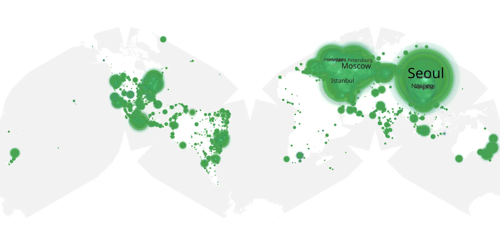

# olympics-2026 sample cache audit

## 1. Media object

| Field | Value |
| --- | --- |
| Media object | Olympics |
| Collection key | `olympics-2026` |
| imdb_id | [tt32863289](https://www.imdb.com/title/tt32863289/) |
| wikipedia_url | [2026 Winter Olympics](https://en.wikipedia.org/wiki/2026_Winter_Olympics) |
| Sample dates | 2026-02-08-to-2026-05-25 |
| Sample days | 107 |
| BTIH count | 682 |
| Unique BTIH count | 645 |
| Downloaders total | 63,968,139 |
| Uploaders total | 272,855 |
| Data version | `2026-08-05` |
| IP geolocation version | `6:1777968300` |

## 2. Sample coverage report

- Generated: 2026-09-13T17:13:08Z
- Sample archive directory: `/mnt/gold/src/alpha60-samples-raw.gold/olympics-2026.xz`
- Hour directories: 2565
- Zero-length sample files: 0
- Other unparsable sample files: 0
- Hourly discontinuities: 1 (1 missing hours)
- Missing days: 0

### Sample archive discontinuities

- hourly gap: last `2026-03-29 01:06`, resumed `2026-03-29 03:06` — missing 1 hour(s)

## 3. Media objects file size histogram

## 4. Visualization pass — graphs

### Downloads by week cumulative (normalized start)



### Downloads by day, Saturday and Sunday in gray

## 5. Visualization pass — maps

### Cumulative geographic slices

| Africa | Americas | Asia | Europe | Oceania | Unknown |
| --- | --- | --- | --- | --- | --- |
| 0.93 | 13.66 | 35.99 | 47.27 | 0.95 | 0.70 |

### Cumulative network infrastructure

{:target="_blank" rel="noopener"}

### Cumulative data maps

**Cumulative >= 1080p**

{:target="_blank" rel="noopener"}

**Cumulative < 1080p**

{:target="_blank" rel="noopener"}
