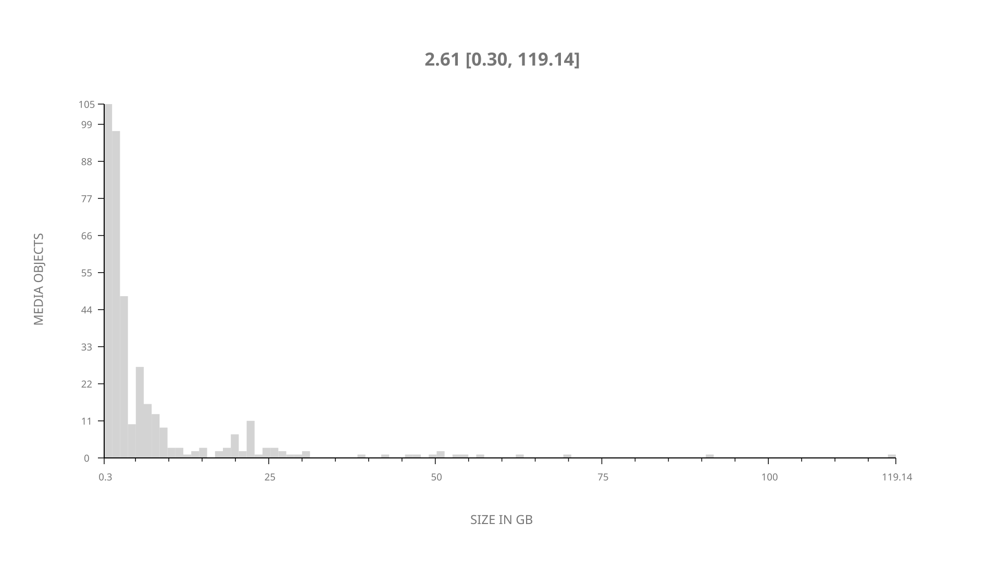
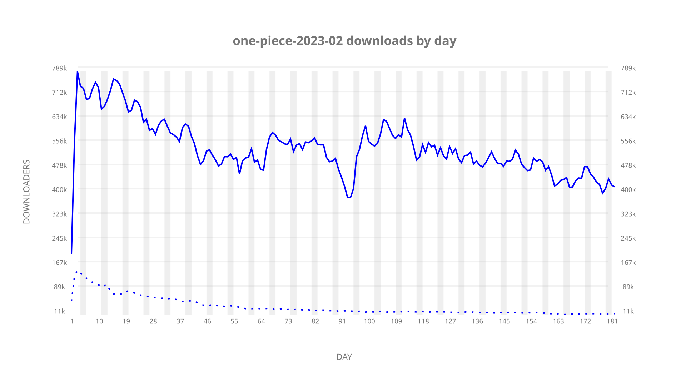
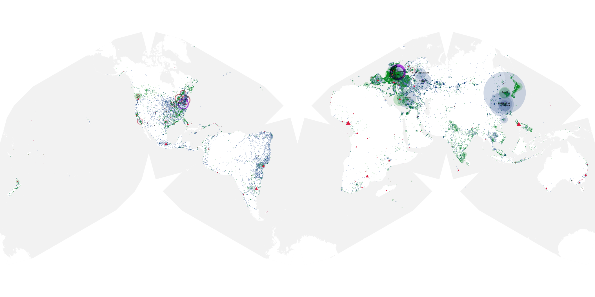
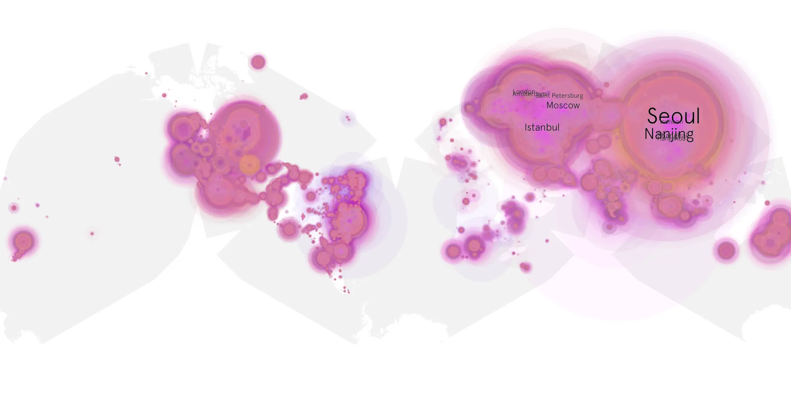
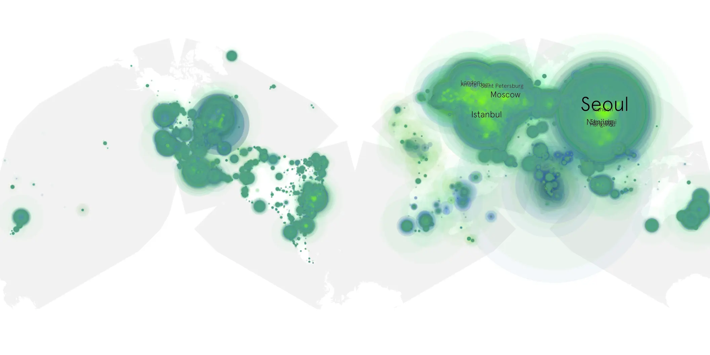

# one-piece-2023-02 sample cache audit

## 1. Media object

| Field | Value |
| --- | --- |
| Media object | One Piece 2023 |
| Collection key | `one-piece-2023-02` |
| imdb_id | [tt11737520](https://www.imdb.com/title/tt11737520/) |
| wikipedia_url | [One Piece (2023 TV series)](https://en.wikipedia.org/wiki/One_Piece_(2023_TV_series)) |
| Sample dates | 2026-03-10-to-2026-09-07 |
| Sample days | 182 |
| BTIH count | 407 |
| Unique BTIH count | 389 |
| Downloaders total | 73,616,589 |
| Uploaders total | 3,603,831 |
| Data version | `2026-08-05` |
| IP geolocation version | `6:1777968300` |

## 2. Coverage report

- Generated: 2026-09-13T17:13:08Z
- Sample archive directory: `/mnt/gold/src/alpha60-samples-raw.gold/one-piece-2023-02.xz`
- Hour directories: 4348
- Zero-length sample files: 0
- Other unparsable sample files: 0
- Hourly discontinuities: 1 (1 missing hours)
- Missing days: 0

### Sample archive discontinuities

- hourly gap: last `2026-03-29 01:01`, resumed `2026-03-29 03:01` — missing 1 hour(s)

## 3. File sizes histogram *median[lowest, highest]*

## 4. Graphs

### Downloads by week cumulative (normalized start)



### Downloads by day, Saturday and Sunday in gray

## 5. Cumulative Maps

<!-- https://raw.githubusercontent.com/alpha60-devops/alpha60-results-2026/refs/heads/main/data/ -->

### <a href="https://raw.githubusercontent.com/alpha60-devops/alpha60-results-2026/refs/heads/main/data/geojson.cumulative/one-piece-2023-02-cumulative-aggregate.geojson.gz" data-map-title="One Piece 2023 — one-piece-2023-02" onclick="leaflet_map_open_window(this.href, this.dataset.mapTitle); return false;" class="table-link" aria-label="Open One Piece 2023 (one-piece-2023-02) cumulative data map in new window" title="Opens interactive map for One Piece 2023 (one-piece-2023-02) data">Swarm Detail</a>

### Geographic Regions

| Africa | Americas | Asia | Europe | Oceania | Unknown |
| --- | --- | --- | --- | --- | --- |
| 1.64 | 16.00 | 35.66 | 43.48 | 1.14 | 0.80 |

### Network infrastructure

{:target="_blank" rel="noopener"}

### Resolution >= 1080p

{:target="_blank" rel="noopener"}

### Resolution < 1080p

{:target="_blank" rel="noopener"}
