# pitt-201 sample cache audit

## 1. Media object

| Field | Value |
| --- | --- |
| Media object | The Pitt |
| Collection key | `pitt-201` |
| imdb_id | [tt31938062](https://www.imdb.com/title/tt31938062/) |
| wikipedia_url | [The Pitt](https://en.wikipedia.org/wiki/The_Pitt) |
| Sample dates | 2026-01-09-to-2026-07-09 |
| Sample days | 182 |
| BTIH count | 416 |
| Unique BTIH count | 392 |
| Downloaders total | 67,397,119 |
| Uploaders total | 3,331,462 |
| Data version | `2026-08-05` |
| IP geolocation version | `6:1777968300` |

## 2. Coverage report

- Generated: 2026-09-13T17:13:08Z
- Sample archive directory: `/mnt/gold/src/alpha60-samples-raw.gold/pitt-201.xz`
- Hour directories: 4325
- Zero-length sample files: 0
- Other unparsable sample files: 0
- Hourly discontinuities: 3 (34 missing hours)
- Missing days: 1

### Sample archive discontinuities

- hourly gap: last `2026-02-08 22:00`, resumed `2026-02-09 00:00` — missing 1 hour(s)
- hourly gap: last `2026-03-29 01:00`, resumed `2026-03-29 03:00` — missing 1 hour(s)
- hourly gap: last `2026-07-02 23:00`, resumed `2026-07-04 08:26` — missing 32 hour(s)
- missing day: `2026-07-03`

## 3. File sizes histogram *median[lowest, highest]*

## 4. Graphs

### Downloads by week cumulative (normalized start)



### Downloads by day, Saturday and Sunday in gray

## 5. Cumulative Maps

<!-- https://raw.githubusercontent.com/alpha60-devops/alpha60-results-2026/refs/heads/main/data/ -->

### <a href="https://raw.githubusercontent.com/alpha60-devops/alpha60-results-2026/refs/heads/main/data/geojson.cumulative/pitt-201-cumulative-aggregate.geojson.gz" data-map-title="The Pitt — pitt-201" onclick="leaflet_map_open_window(this.href, this.dataset.mapTitle); return false;" class="table-link" aria-label="Open The Pitt (pitt-201) cumulative data map in new window" title="Opens interactive map for The Pitt (pitt-201) data">Swarm Detail</a>

### Geographic Regions

| Africa | Americas | Asia | Europe | Oceania | Unknown |
| --- | --- | --- | --- | --- | --- |
| 1.25 | 15.20 | 34.40 | 45.96 | 1.29 | 0.72 |

### Network infrastructure

{:target="_blank" rel="noopener"}

### Resolution >= 1080p

{:target="_blank" rel="noopener"}

### Resolution < 1080p

{:target="_blank" rel="noopener"}

<!-- BEGIN country-resolution-detail -->

## Country resolution detail

These country close-ups use the same full cumulative sample and worldwide member rescaling as the resolution maps above. They are not sums of weekly products. No ITU adjustment or missing-hour imputation is applied.

Country membership follows the exact source ISO3 code. Boundaries are Natural Earth 1:10m v5.1.2; boundary disagreements are retained and reported in the downloadable receipts. Maps use native izzi and Cartofreako vector outlines, registered Cahill–Keyes coordinates, and fixed page-space bubble areas. All countries and resolution views share the same bubble coefficient and 5% opacity.

### Philippines (PHL)

Sample: **2026-01-09-to-2026-07-09**. Radius coefficient: `0.996561031328`. Combined = 1080 + 2160 + 720 + SD; ≥1080p = 1080 + 2160; <1080p = 720 + SD.

| View | Published downloader sum | Rescaled downloaders | Published uploader sum | Rescaled uploaders |
| --- | ---: | ---: | ---: | ---: |
| combined | 113,333 | 116,664 | 25,252 | 25,555 |
| ge-1080p | 81,694 | 83,974 | 22,363 | 22,620 |
| lt-1080p | 31,639 | 32,690 | 2,889 | 2,935 |

[Accounting and layout receipt](figures/pitt-201-data-country-phl.json)

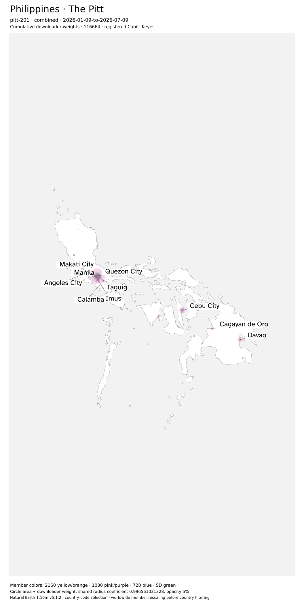

[Vector SVG](figures/pitt-201-data-country-phl-combined.svg) · [3840-pixel long edge](figures/pitt-201-data-country-phl-combined-4k.webp)

ge-1080p plate

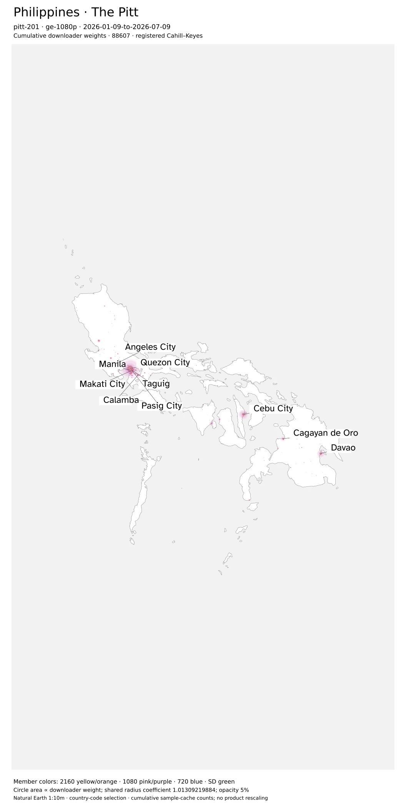

[Vector SVG](figures/pitt-201-data-country-phl-ge-1080p.svg) · [3840-pixel long edge](figures/pitt-201-data-country-phl-ge-1080p-4k.webp)

lt-1080p plate

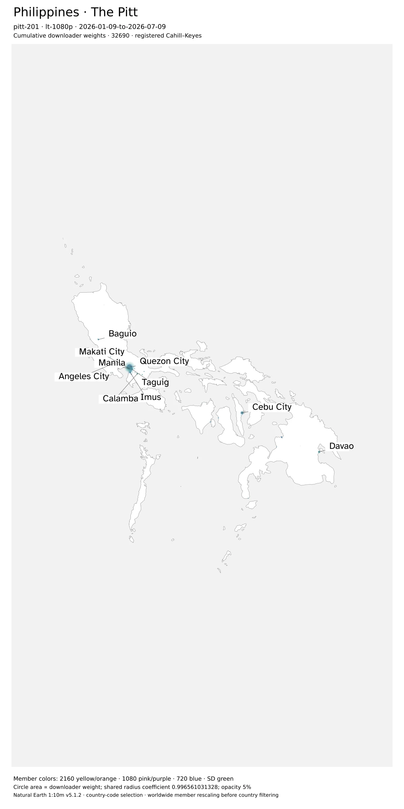

[Vector SVG](figures/pitt-201-data-country-phl-lt-1080p.svg) · [3840-pixel long edge](figures/pitt-201-data-country-phl-lt-1080p-4k.webp)

Country-ranked locations and diagnostics

| View | City | Downloader weight | Label drawn |
| --- | --- | ---: | --- |
| combined | Quezon City | 45,355 | yes |
| combined | Cebu City | 10,057 | yes |
| combined | Manila | 8,618 | yes |
| combined | Davao | 5,911 | yes |
| combined | Taguig | 4,283 | yes |
| combined | Angeles City | 3,376 | yes |
| combined | Imus | 3,136 | yes |
| combined | Makati City | 2,373 | yes |
| combined | Calamba | 2,191 | yes |
| combined | Cagayan de Oro | 2,136 | yes |
| ge-1080p | Quezon City | 31,325 | yes |
| ge-1080p | Cebu City | 7,179 | yes |
| ge-1080p | Manila | 6,076 | yes |
| ge-1080p | Davao | 4,294 | yes |
| ge-1080p | Taguig | 2,920 | yes |
| ge-1080p | Angeles City | 2,275 | yes |
| ge-1080p | Imus | 2,105 | yes |
| ge-1080p | Cagayan de Oro | 1,578 | yes |
| ge-1080p | Calamba | 1,518 | yes |
| ge-1080p | Baguio | 1,326 | yes |
| lt-1080p | Quezon City | 13,220 | yes |
| lt-1080p | Cebu City | 2,768 | yes |
| lt-1080p | Manila | 2,016 | yes |
| lt-1080p | Davao | 1,554 | yes |
| lt-1080p | Taguig | 1,287 | yes |
| lt-1080p | Angeles City | 1,048 | yes |
| lt-1080p | Makati City | 841 | yes |
| lt-1080p | Imus | 818 | yes |
| lt-1080p | Calamba | 658 | yes |
| lt-1080p | Baguio | 594 | yes |

Outside-boundary coordinate pairs retained: **12**. Unsupported-resolution downloader weight excluded: **0**.

### India (IND)

Sample: **2026-01-09-to-2026-07-09**. Radius coefficient: `0.996561031328`. Combined = 1080 + 2160 + 720 + SD; ≥1080p = 1080 + 2160; <1080p = 720 + SD.

| View | Published downloader sum | Rescaled downloaders | Published uploader sum | Rescaled uploaders |
| --- | ---: | ---: | ---: | ---: |
| combined | 316,233 | 326,617 | 30,526 | 30,964 |
| ge-1080p | 210,164 | 216,774 | 25,204 | 25,526 |
| lt-1080p | 106,069 | 109,843 | 5,322 | 5,438 |

[Accounting and layout receipt](figures/pitt-201-data-country-ind.json)

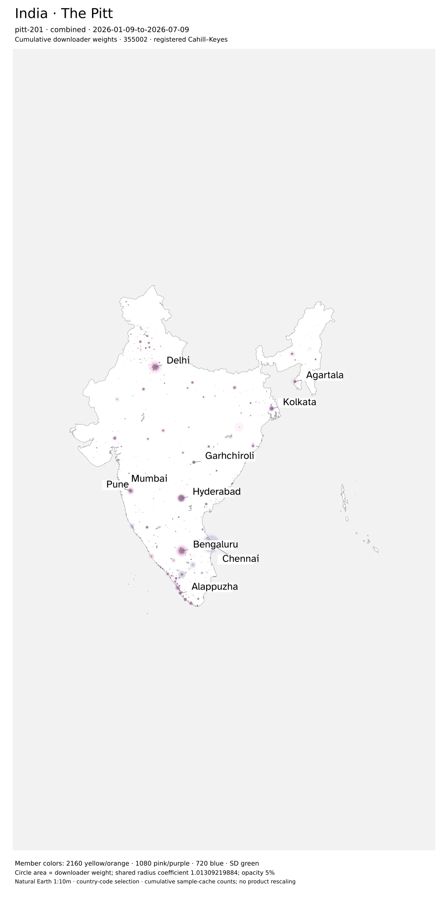

[Vector SVG](figures/pitt-201-data-country-ind-combined.svg) · [3840-pixel long edge](figures/pitt-201-data-country-ind-combined-4k.webp)

ge-1080p plate

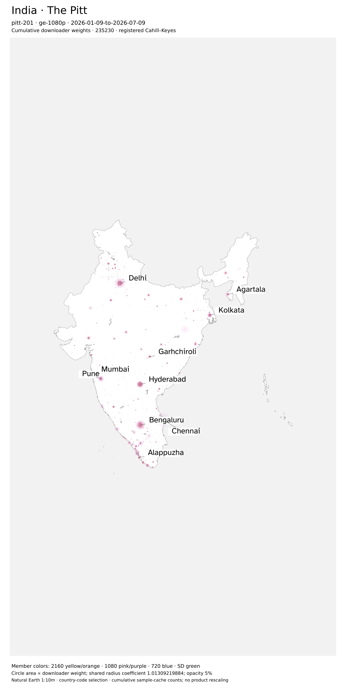

[Vector SVG](figures/pitt-201-data-country-ind-ge-1080p.svg) · [3840-pixel long edge](figures/pitt-201-data-country-ind-ge-1080p-4k.webp)

lt-1080p plate

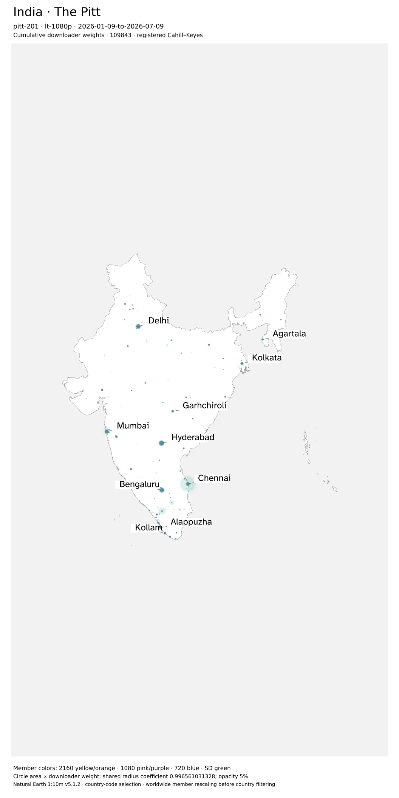

[Vector SVG](figures/pitt-201-data-country-ind-lt-1080p.svg) · [3840-pixel long edge](figures/pitt-201-data-country-ind-lt-1080p-4k.webp)

Country-ranked locations and diagnostics

| View | City | Downloader weight | Label drawn |
| --- | --- | ---: | --- |
| combined | Hyderabad | 32,023 | yes |
| combined | Bengaluru | 30,157 | yes |
| combined | Delhi | 28,157 | yes |
| combined | Chennai | 26,499 | yes |
| combined | Mumbai | 21,916 | yes |
| combined | Kolkata | 9,066 | yes |
| combined | Pune | 7,710 | yes |
| combined | Garhchiroli | 6,879 | yes |
| combined | Agartala | 6,666 | yes |
| combined | Alappuzha | 6,408 | yes |
| ge-1080p | Hyderabad | 20,627 | yes |
| ge-1080p | Bengaluru | 20,619 | yes |
| ge-1080p | Delhi | 19,721 | yes |
| ge-1080p | Chennai | 14,169 | yes |
| ge-1080p | Mumbai | 14,161 | yes |
| ge-1080p | Kolkata | 6,072 | yes |
| ge-1080p | Pune | 5,516 | yes |
| ge-1080p | Garhchiroli | 4,399 | yes |
| ge-1080p | Agartala | 4,239 | yes |
| ge-1080p | Alappuzha | 4,131 | yes |
| lt-1080p | Hyderabad | 11,089 | yes |
| lt-1080p | Chennai | 10,025 | yes |
| lt-1080p | Bengaluru | 9,214 | yes |
| lt-1080p | Delhi | 8,298 | yes |
| lt-1080p | Mumbai | 7,647 | yes |
| lt-1080p | Kolkata | 2,960 | yes |
| lt-1080p | Garhchiroli | 2,457 | yes |
| lt-1080p | Agartala | 2,407 | yes |
| lt-1080p | Alappuzha | 2,253 | yes |
| lt-1080p | Kollam | 2,213 | yes |

Outside-boundary coordinate pairs retained: **1**. Unsupported-resolution downloader weight excluded: **0**.

### Japan (JPN)

Sample: **2026-01-09-to-2026-07-09**. Radius coefficient: `0.996561031328`. Combined = 1080 + 2160 + 720 + SD; ≥1080p = 1080 + 2160; <1080p = 720 + SD.

| View | Published downloader sum | Rescaled downloaders | Published uploader sum | Rescaled uploaders |
| --- | ---: | ---: | ---: | ---: |
| combined | 864,428 | 894,507 | 8,489 | 8,613 |
| ge-1080p | 556,614 | 575,797 | 7,369 | 7,477 |
| lt-1080p | 307,814 | 318,710 | 1,120 | 1,136 |

[Accounting and layout receipt](figures/pitt-201-data-country-jpn.json)

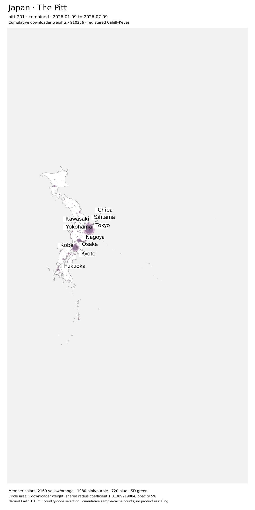

[Vector SVG](figures/pitt-201-data-country-jpn-combined.svg) · [3840-pixel long edge](figures/pitt-201-data-country-jpn-combined-4k.webp)

ge-1080p plate

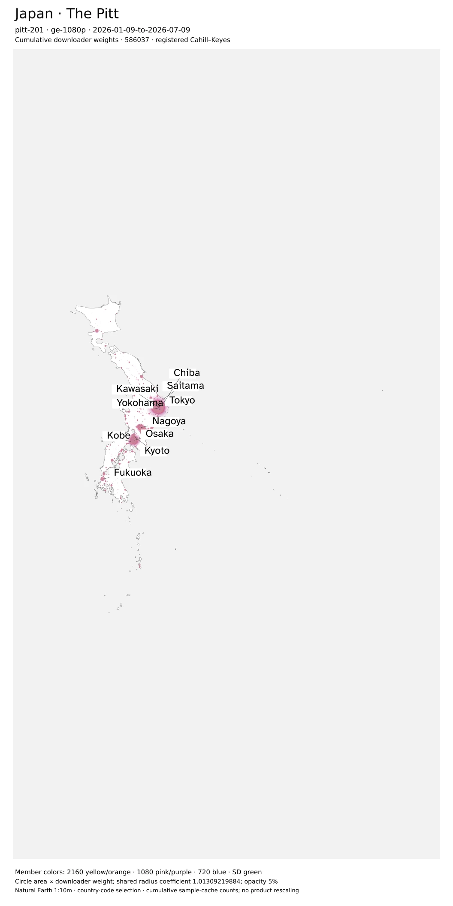

[Vector SVG](figures/pitt-201-data-country-jpn-ge-1080p.svg) · [3840-pixel long edge](figures/pitt-201-data-country-jpn-ge-1080p-4k.webp)

lt-1080p plate

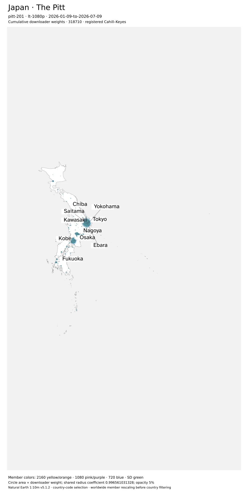

[Vector SVG](figures/pitt-201-data-country-jpn-lt-1080p.svg) · [3840-pixel long edge](figures/pitt-201-data-country-jpn-lt-1080p-4k.webp)

Country-ranked locations and diagnostics

| View | City | Downloader weight | Label drawn |
| --- | --- | ---: | --- |
| combined | Tokyo | 256,327 | yes |
| combined | Osaka | 83,118 | yes |
| combined | Kawasaki | 46,346 | yes |
| combined | Nagoya | 41,041 | yes |
| combined | Yokohama | 38,694 | yes |
| combined | Kobe | 18,857 | yes |
| combined | Saitama | 15,627 | yes |
| combined | Ebara | 13,228 | yes |
| combined | Chiba | 12,431 | yes |
| combined | Fukuoka | 12,413 | yes |
| ge-1080p | Tokyo | 165,187 | yes |
| ge-1080p | Osaka | 52,260 | yes |
| ge-1080p | Kawasaki | 29,865 | yes |
| ge-1080p | Nagoya | 26,129 | yes |
| ge-1080p | Yokohama | 23,939 | yes |
| ge-1080p | Kobe | 11,934 | yes |
| ge-1080p | Saitama | 9,915 | yes |
| ge-1080p | Ebara | 8,847 | yes |
| ge-1080p | Sakai | 8,716 | yes |
| ge-1080p | Chiba | 7,981 | yes |
| lt-1080p | Tokyo | 88,880 | yes |
| lt-1080p | Osaka | 29,985 | yes |
| lt-1080p | Kawasaki | 15,792 | yes |
| lt-1080p | Nagoya | 14,541 | yes |
| lt-1080p | Yokohama | 14,108 | yes |
| lt-1080p | Kobe | 6,750 | yes |
| lt-1080p | Saitama | 5,503 | yes |
| lt-1080p | Fukuoka | 4,367 | yes |
| lt-1080p | Chiba | 4,337 | yes |
| lt-1080p | Ebara | 4,224 | yes |

Outside-boundary coordinate pairs retained: **6**. Unsupported-resolution downloader weight excluded: **0**.

### South Korea (KOR)

Sample: **2026-01-09-to-2026-07-09**. Radius coefficient: `0.996561031328`. Combined = 1080 + 2160 + 720 + SD; ≥1080p = 1080 + 2160; <1080p = 720 + SD.

| View | Published downloader sum | Rescaled downloaders | Published uploader sum | Rescaled uploaders |
| --- | ---: | ---: | ---: | ---: |
| combined | 8,564,466 | 8,871,525 | 11,536 | 11,633 |
| ge-1080p | 5,489,401 | 5,684,736 | 10,759 | 10,852 |
| lt-1080p | 3,075,065 | 3,186,789 | 777 | 781 |

[Accounting and layout receipt](figures/pitt-201-data-country-kor.json)

[Vector SVG](figures/pitt-201-data-country-kor-combined.svg) · [3840-pixel long edge](figures/pitt-201-data-country-kor-combined-4k.webp)

ge-1080p plate

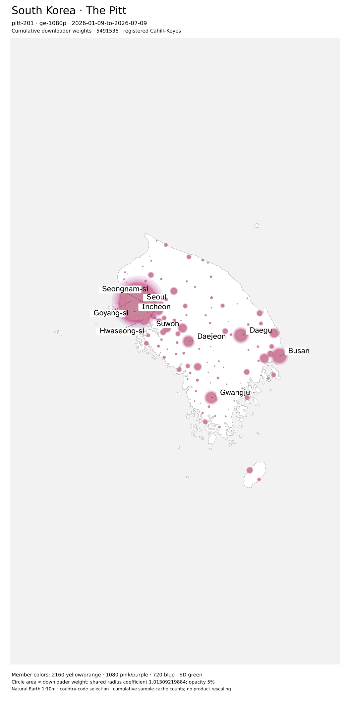

[Vector SVG](figures/pitt-201-data-country-kor-ge-1080p.svg) · [3840-pixel long edge](figures/pitt-201-data-country-kor-ge-1080p-4k.webp)

lt-1080p plate

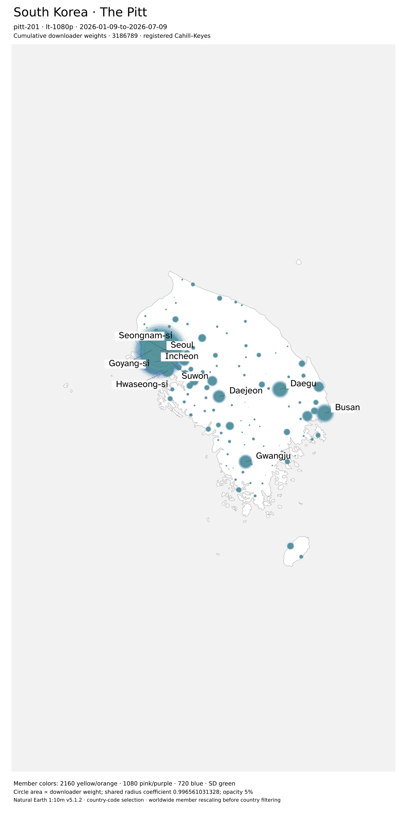

[Vector SVG](figures/pitt-201-data-country-kor-lt-1080p.svg) · [3840-pixel long edge](figures/pitt-201-data-country-kor-lt-1080p-4k.webp)

Country-ranked locations and diagnostics

| View | City | Downloader weight | Label drawn |
| --- | --- | ---: | --- |
| combined | Seoul | 3,021,462 | yes |
| combined | Incheon | 780,956 | yes |
| combined | Busan | 374,241 | yes |
| combined | Daegu | 316,859 | yes |
| combined | Suwon | 238,585 | yes |
| combined | Gwangju | 231,967 | yes |
| combined | Daejeon | 199,039 | yes |
| combined | Seongnam-si | 189,087 | yes |
| combined | Hwaseong-si | 181,059 | yes |
| combined | Goyang-si | 176,598 | yes |
| ge-1080p | Seoul | 1,913,515 | yes |
| ge-1080p | Incheon | 497,814 | yes |
| ge-1080p | Busan | 238,397 | yes |
| ge-1080p | Daegu | 202,209 | yes |
| ge-1080p | Suwon | 152,624 | yes |
| ge-1080p | Gwangju | 147,985 | yes |
| ge-1080p | Daejeon | 126,344 | yes |
| ge-1080p | Seongnam-si | 120,446 | yes |
| ge-1080p | Hwaseong-si | 115,494 | yes |
| ge-1080p | Goyang-si | 112,727 | yes |
| lt-1080p | Seoul | 1,083,526 | yes |
| lt-1080p | Incheon | 277,013 | yes |
| lt-1080p | Busan | 132,702 | yes |
| lt-1080p | Daegu | 111,951 | yes |
| lt-1080p | Suwon | 84,140 | yes |
| lt-1080p | Gwangju | 82,107 | yes |
| lt-1080p | Daejeon | 71,094 | yes |
| lt-1080p | Seongnam-si | 67,116 | yes |
| lt-1080p | Hwaseong-si | 64,163 | yes |
| lt-1080p | Goyang-si | 62,432 | yes |

Outside-boundary coordinate pairs retained: **0**. Unsupported-resolution downloader weight excluded: **0**.

### China (CHN)

Sample: **2026-01-09-to-2026-07-09**. Radius coefficient: `0.996561031328`. Combined = 1080 + 2160 + 720 + SD; ≥1080p = 1080 + 2160; <1080p = 720 + SD.

| View | Published downloader sum | Rescaled downloaders | Published uploader sum | Rescaled uploaders |
| --- | ---: | ---: | ---: | ---: |
| combined | 5,550,820 | 5,747,354 | 191,474 | 193,563 |
| ge-1080p | 3,678,703 | 3,807,621 | 178,693 | 180,537 |
| lt-1080p | 1,872,117 | 1,939,733 | 12,781 | 13,026 |

[Accounting and layout receipt](figures/pitt-201-data-country-chn.json)

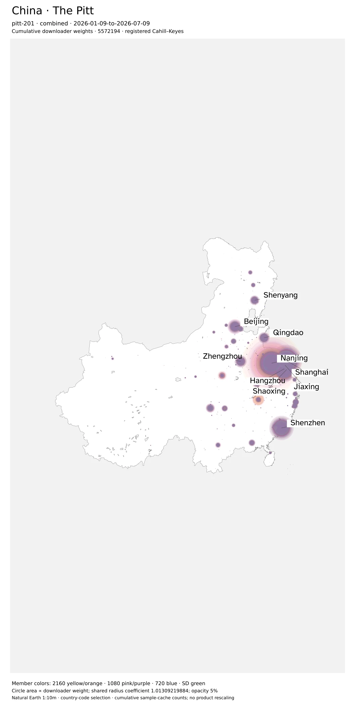

[Vector SVG](figures/pitt-201-data-country-chn-combined.svg) · [3840-pixel long edge](figures/pitt-201-data-country-chn-combined-4k.webp)

ge-1080p plate

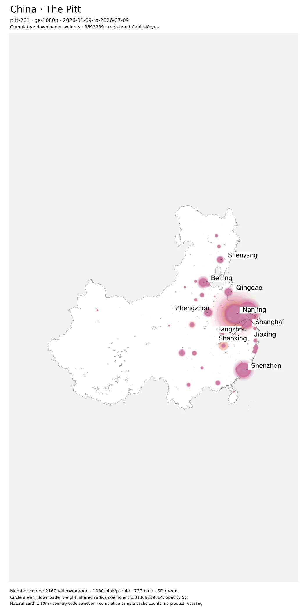

[Vector SVG](figures/pitt-201-data-country-chn-ge-1080p.svg) · [3840-pixel long edge](figures/pitt-201-data-country-chn-ge-1080p-4k.webp)

lt-1080p plate

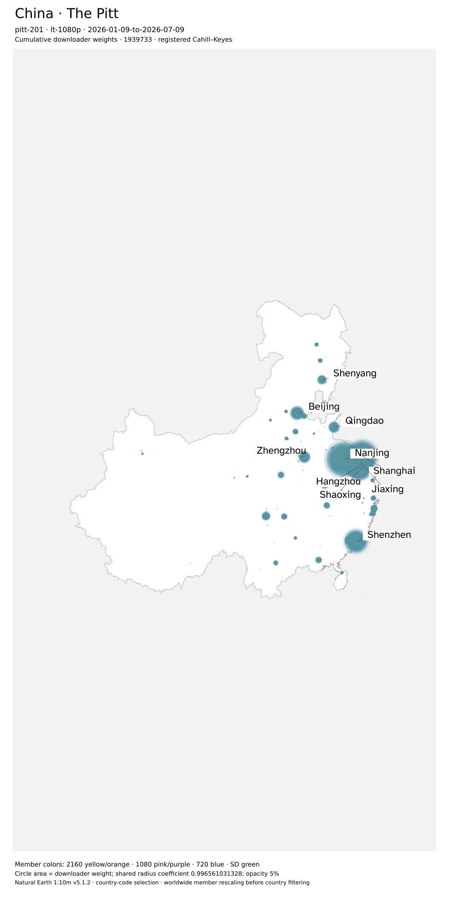

[Vector SVG](figures/pitt-201-data-country-chn-lt-1080p.svg) · [3840-pixel long edge](figures/pitt-201-data-country-chn-lt-1080p-4k.webp)

Country-ranked locations and diagnostics

| View | City | Downloader weight | Label drawn |
| --- | --- | ---: | --- |
| combined | Nanjing | 1,481,275 | yes |
| combined | Shanghai | 1,010,712 | yes |
| combined | Hangzhou | 832,870 | yes |
| combined | Shenzhen | 552,107 | yes |
| combined | Beijing | 186,762 | yes |
| combined | Jiaxing | 140,346 | yes |
| combined | Zhengzhou | 132,578 | yes |
| combined | Qingdao | 119,632 | yes |
| combined | Shaoxing | 87,959 | yes |
| combined | Shenyang | 85,564 | yes |
| ge-1080p | Nanjing | 1,038,162 | yes |
| ge-1080p | Shanghai | 647,942 | yes |
| ge-1080p | Hangzhou | 536,269 | yes |
| ge-1080p | Shenzhen | 353,346 | yes |
| ge-1080p | Beijing | 120,704 | yes |
| ge-1080p | Jiaxing | 89,712 | yes |
| ge-1080p | Zhengzhou | 84,870 | yes |
| ge-1080p | Qingdao | 76,327 | yes |
| ge-1080p | Shaoxing | 56,771 | yes |
| ge-1080p | Shenyang | 54,797 | yes |
| lt-1080p | Nanjing | 434,752 | yes |
| lt-1080p | Shanghai | 354,289 | yes |
| lt-1080p | Hangzhou | 290,614 | yes |
| lt-1080p | Shenzhen | 193,737 | yes |
| lt-1080p | Beijing | 64,449 | yes |
| lt-1080p | Jiaxing | 49,463 | yes |
| lt-1080p | Zhengzhou | 46,379 | yes |
| lt-1080p | Qingdao | 42,203 | yes |
| lt-1080p | Shaoxing | 30,523 | yes |
| lt-1080p | Shenyang | 29,894 | yes |

Outside-boundary coordinate pairs retained: **1**. Unsupported-resolution downloader weight excluded: **0**.

### United States (USA)

Sample: **2026-01-09-to-2026-07-09**. Radius coefficient: `0.996561031328`. Combined = 1080 + 2160 + 720 + SD; ≥1080p = 1080 + 2160; <1080p = 720 + SD.

| View | Published downloader sum | Rescaled downloaders | Published uploader sum | Rescaled uploaders |
| --- | ---: | ---: | ---: | ---: |
| combined | 3,683,427 | 3,798,939 | 415,715 | 423,927 |
| ge-1080p | 2,494,094 | 2,570,734 | 338,363 | 344,512 |
| lt-1080p | 1,189,333 | 1,228,205 | 77,352 | 79,415 |

[Accounting and layout receipt](figures/pitt-201-data-country-usa.json)

Insets use independent geographic scales. Bubble areas retain the same weight scale in every panel.

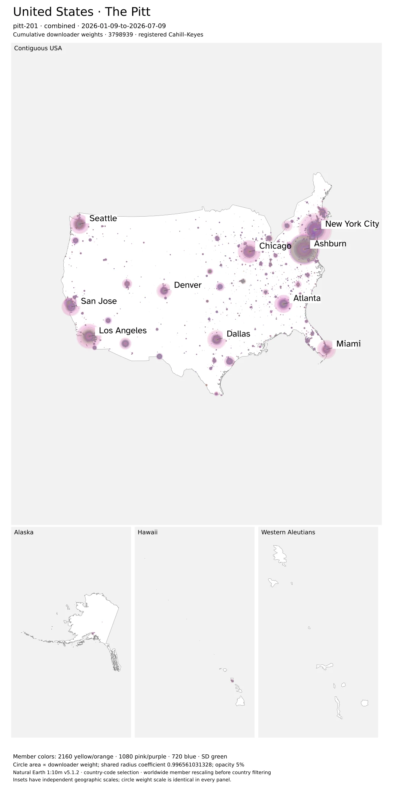

[Vector SVG](figures/pitt-201-data-country-usa-combined.svg) · [3840-pixel long edge](figures/pitt-201-data-country-usa-combined-4k.webp)

ge-1080p plate

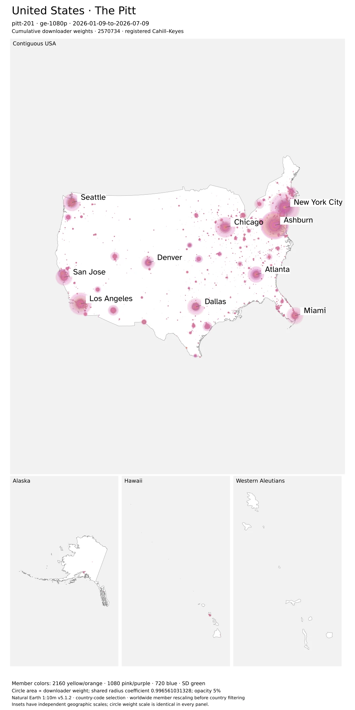

[Vector SVG](figures/pitt-201-data-country-usa-ge-1080p.svg) · [3840-pixel long edge](figures/pitt-201-data-country-usa-ge-1080p-4k.webp)

lt-1080p plate

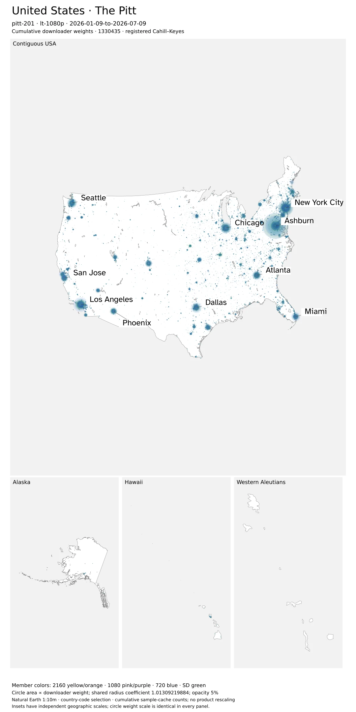

[Vector SVG](figures/pitt-201-data-country-usa-lt-1080p.svg) · [3840-pixel long edge](figures/pitt-201-data-country-usa-lt-1080p-4k.webp)

Country-ranked locations and diagnostics

| View | City | Downloader weight | Label drawn |
| --- | --- | ---: | --- |
| combined | Ashburn | 369,640 | yes |
| combined | New York City | 321,337 | yes |
| combined | Los Angeles | 183,856 | yes |
| combined | Chicago | 158,998 | yes |
| combined | Seattle | 100,433 | yes |
| combined | Atlanta | 100,025 | yes |
| combined | Dallas | 99,718 | yes |
| combined | Miami | 83,239 | yes |
| combined | San Jose | 72,697 | yes |
| combined | Denver | 69,379 | yes |
| ge-1080p | Ashburn | 241,240 | yes |
| ge-1080p | New York City | 225,312 | yes |
| ge-1080p | Los Angeles | 127,423 | yes |
| ge-1080p | Chicago | 112,474 | yes |
| ge-1080p | Atlanta | 71,863 | yes |
| ge-1080p | Seattle | 70,541 | yes |
| ge-1080p | Dallas | 69,747 | yes |
| ge-1080p | Miami | 58,683 | yes |
| ge-1080p | San Jose | 50,590 | yes |
| ge-1080p | Denver | 48,090 | yes |
| lt-1080p | Ashburn | 122,401 | yes |
| lt-1080p | New York City | 93,487 | yes |
| lt-1080p | Los Angeles | 54,626 | yes |
| lt-1080p | Chicago | 45,292 | yes |
| lt-1080p | Seattle | 29,000 | yes |
| lt-1080p | Dallas | 28,950 | yes |
| lt-1080p | Atlanta | 27,311 | yes |
| lt-1080p | Miami | 23,797 | yes |
| lt-1080p | San Jose | 22,096 | yes |
| lt-1080p | Denver | 20,785 | yes |

Outside-boundary coordinate pairs retained: **45**. Unsupported-resolution downloader weight excluded: **0**.

<!-- END country-resolution-detail -->
