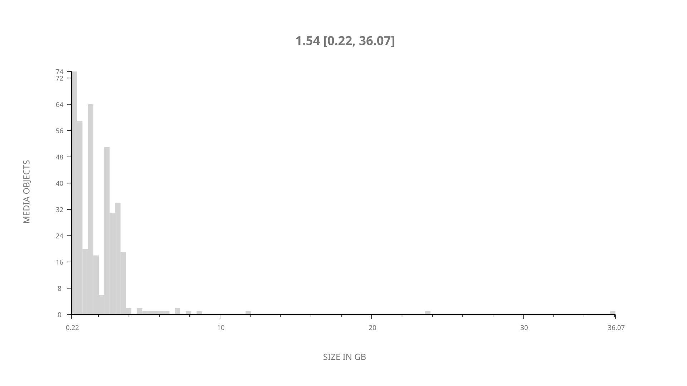
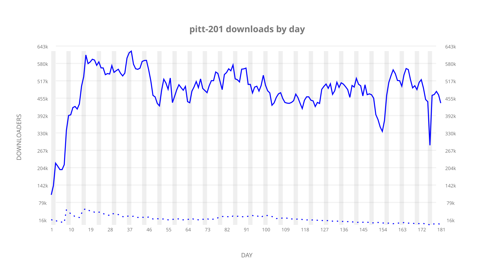
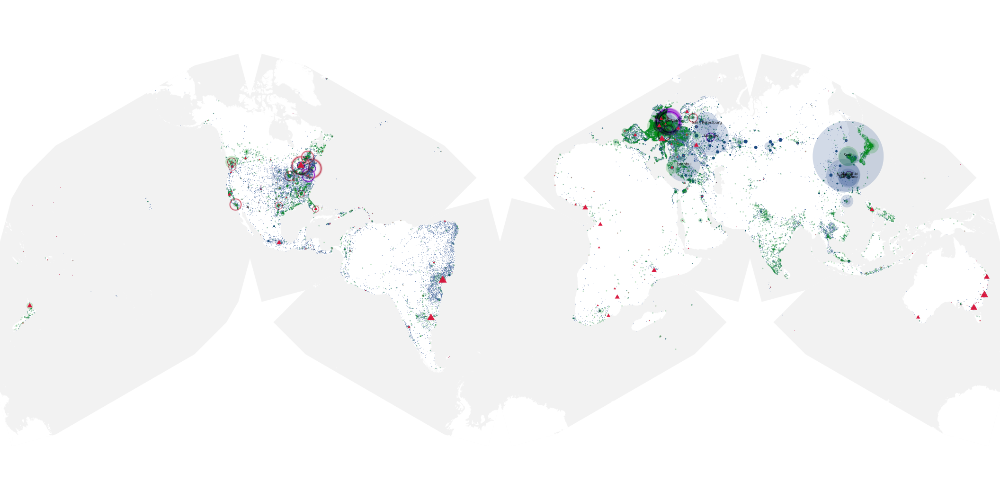
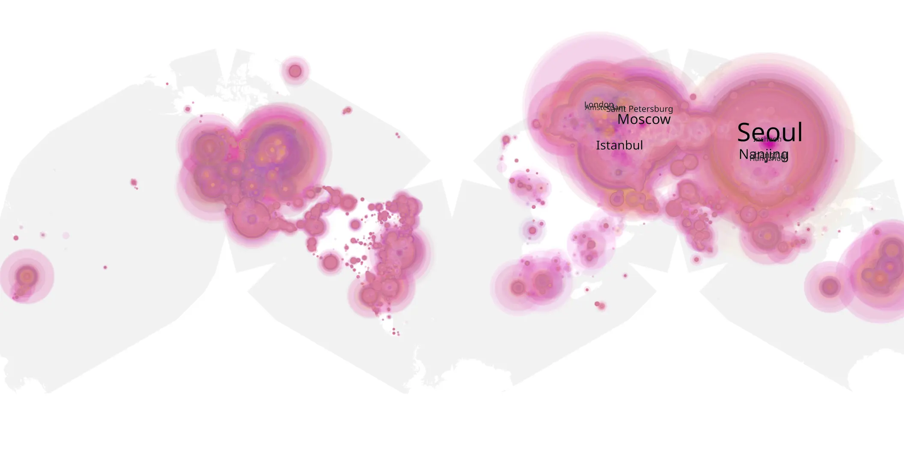
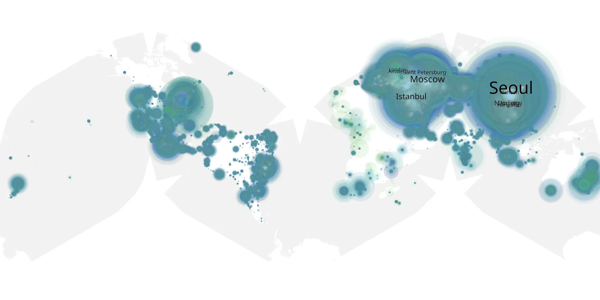

# pitt-201 sample cache audit

## 1. Media object

| Field | Value |
| --- | --- |
| Media object | The Pitt |
| Collection key | `pitt-201` |
| imdb_id | [tt31938062](https://www.imdb.com/title/tt31938062/) |
| wikipedia_url | [The Pitt](https://en.wikipedia.org/wiki/The_Pitt) |
| Sample dates | 2026-01-09-to-2026-07-09 |
| Sample days | 182 |
| BTIH count | 416 |
| Unique BTIH count | 392 |
| Downloaders total | 67,397,119 |
| Uploaders total | 3,331,462 |
| Data version | `2026-08-05` |
| IP geolocation version | `6:1777968300` |

## 2. Coverage report

- Generated: 2026-09-13T17:13:08Z
- Sample archive directory: `/mnt/gold/src/alpha60-samples-raw.gold/pitt-201.xz`
- Hour directories: 4325
- Zero-length sample files: 0
- Other unparsable sample files: 0
- Hourly discontinuities: 3 (34 missing hours)
- Missing days: 1

### Sample archive discontinuities

- hourly gap: last `2026-02-08 22:00`, resumed `2026-02-09 00:00` — missing 1 hour(s)
- hourly gap: last `2026-03-29 01:00`, resumed `2026-03-29 03:00` — missing 1 hour(s)
- hourly gap: last `2026-07-02 23:00`, resumed `2026-07-04 08:26` — missing 32 hour(s)
- missing day: `2026-07-03`

## 3. File sizes histogram *median[lowest, highest]*

## 4. Graphs

### Downloads by week cumulative (normalized start)



### Downloads by day, Saturday and Sunday in gray

## 5. Cumulative Maps

<!-- https://raw.githubusercontent.com/alpha60-devops/alpha60-results-2026/refs/heads/main/data/ -->

### <a href="https://raw.githubusercontent.com/alpha60-devops/alpha60-results-2026/refs/heads/main/data/geojson.cumulative/pitt-201-cumulative-aggregate.geojson.gz" data-map-title="The Pitt — pitt-201" onclick="leaflet_map_open_window(this.href, this.dataset.mapTitle); return false;" class="table-link" aria-label="Open The Pitt (pitt-201) cumulative data map in new window" title="Opens interactive map for The Pitt (pitt-201) data">Swarm Detail</a>

### Geographic Regions

| Africa | Americas | Asia | Europe | Oceania | Unknown |
| --- | --- | --- | --- | --- | --- |
| 1.25 | 15.20 | 34.40 | 45.96 | 1.29 | 0.72 |

### Network infrastructure

{:target="_blank" rel="noopener"}

### Resolution >= 1080p

{:target="_blank" rel="noopener"}

### Resolution < 1080p

{:target="_blank" rel="noopener"}
