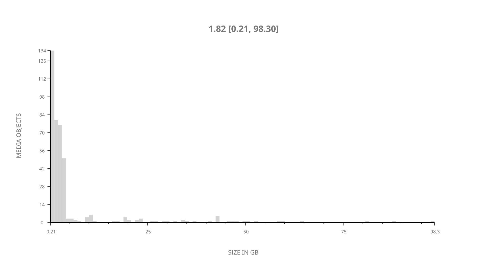
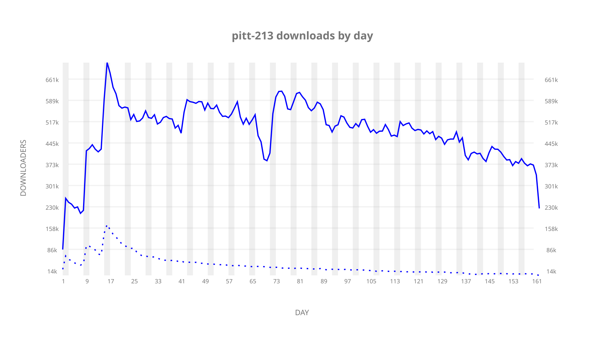
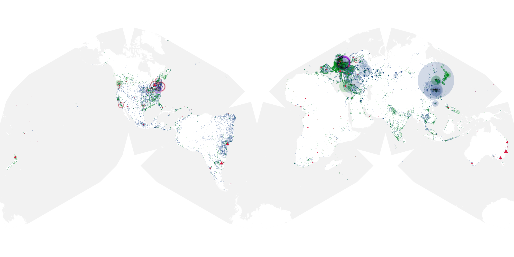
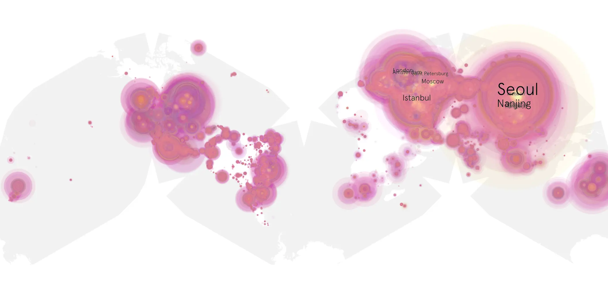
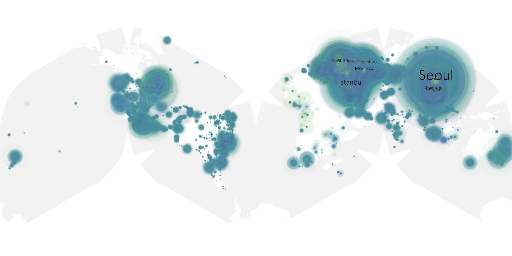

# pitt-213 sample cache audit

## 1. Media object

| Field | Value |
| --- | --- |
| Media object | The Pitt |
| Collection key | `pitt-213` |
| imdb_id | [tt31938062](https://www.imdb.com/title/tt31938062/) |
| wikipedia_url | [The Pitt](https://en.wikipedia.org/wiki/The_Pitt) |
| Sample dates | 2026-04-03-to-2026-09-11 |
| Sample days | 162 |
| BTIH count | 421 |
| Unique BTIH count | 400 |
| Downloaders total | 58,426,395 |
| Uploaders total | 3,397,238 |
| Data version | `2026-08-05` |
| IP geolocation version | `6:1777968300` |

## 2. Coverage report

- Generated: 2026-09-13T17:13:09Z
- Sample archive directory: `/mnt/gold/src/alpha60-samples-raw.gold/pitt-213.xz`
- Hour directories: 3866
- Zero-length sample files: 0
- Other unparsable sample files: 0
- Hourly discontinuities: 4 (17 missing hours)
- Missing days: 0

### Sample archive discontinuities

- hourly gap: last `2026-04-25 22:01`, resumed `2026-04-26 03:01` — missing 4 hour(s)
- hourly gap: last `2026-06-02 22:01`, resumed `2026-06-03 02:01` — missing 3 hour(s)
- hourly gap: last `2026-08-30 22:01`, resumed `2026-08-31 00:01` — missing 1 hour(s)
- hourly gap: last `2026-09-10 22:01`, resumed `2026-09-11 08:01` — missing 9 hour(s)

## 3. File sizes histogram *median[lowest, highest]*

## 4. Graphs

### Downloads by week cumulative (normalized start)



### Downloads by day, Saturday and Sunday in gray

## 5. Cumulative Maps

<!-- https://raw.githubusercontent.com/alpha60-devops/alpha60-results-2026/refs/heads/main/data/ -->

### <a href="https://raw.githubusercontent.com/alpha60-devops/alpha60-results-2026/refs/heads/main/data/geojson.cumulative/pitt-213-cumulative-aggregate.geojson.gz" data-map-title="The Pitt — pitt-213" onclick="leaflet_map_open_window(this.href, this.dataset.mapTitle); return false;" class="table-link" aria-label="Open The Pitt (pitt-213) cumulative data map in new window" title="Opens interactive map for The Pitt (pitt-213) data">Swarm Detail</a>

### Geographic Regions

| Africa | Americas | Asia | Europe | Oceania | Unknown |
| --- | --- | --- | --- | --- | --- |
| 1.36 | 16.97 | 34.80 | 43.75 | 1.38 | 0.79 |

### Network infrastructure

{:target="_blank" rel="noopener"}

### Resolution >= 1080p

{:target="_blank" rel="noopener"}

### Resolution < 1080p

{:target="_blank" rel="noopener"}
