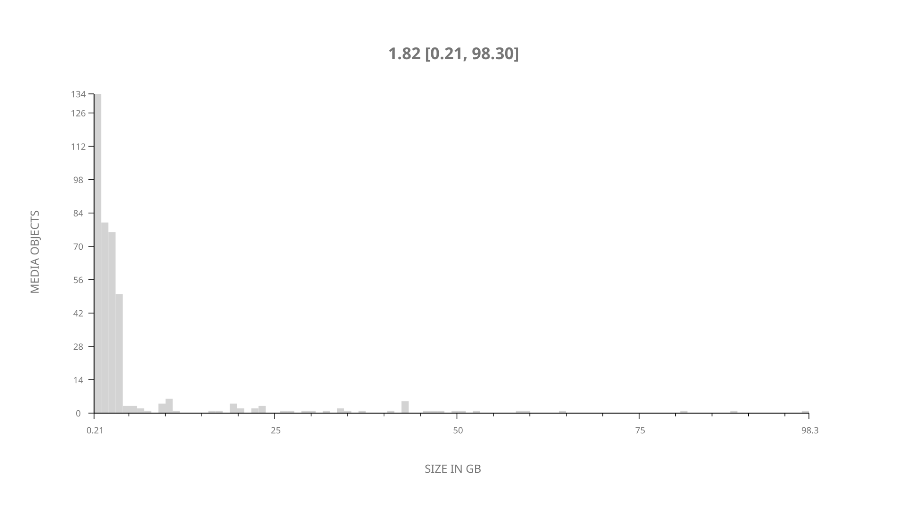
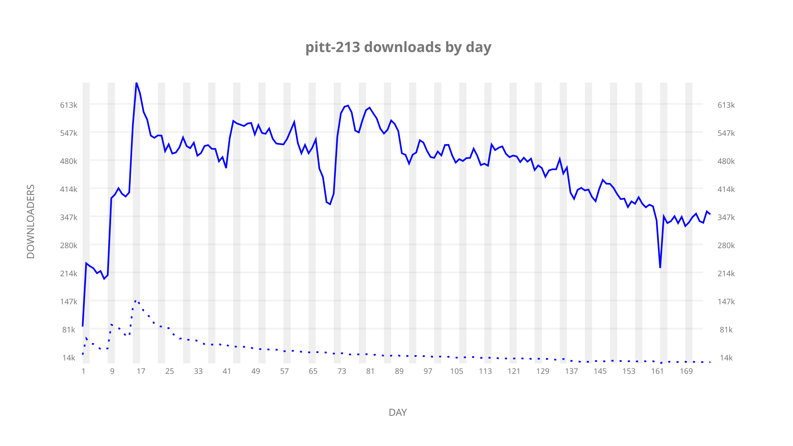
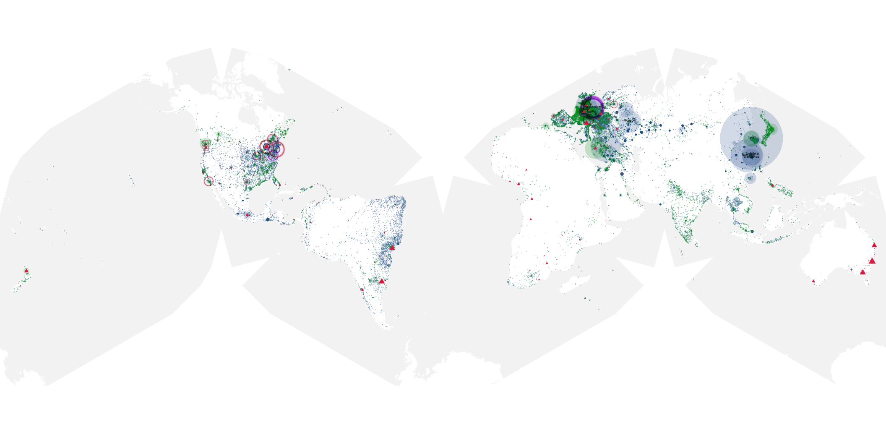
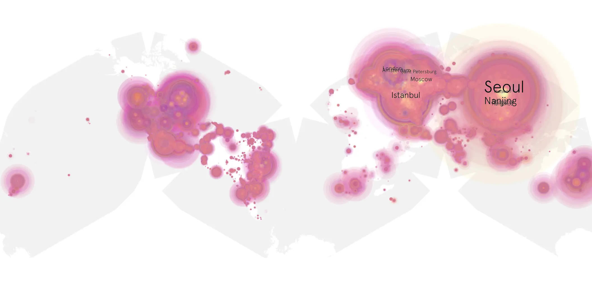
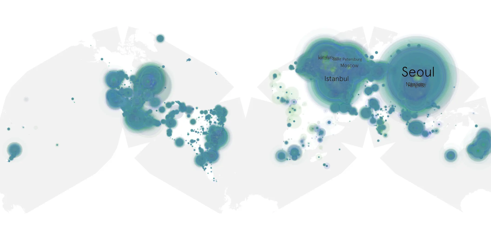

# pitt-213 sample cache audit

## 1. Media object

| Field | Value |
| --- | --- |
| Media object | The Pitt |
| Collection key | `pitt-213` |
| imdb_id | [tt31938062](https://www.imdb.com/title/tt31938062/) |
| wikipedia_url | [The Pitt](https://en.wikipedia.org/wiki/The_Pitt) |
| Sample dates | 2026-04-03-to-2026-09-25 |
| Sample days | 176 |
| BTIH count | 421 |
| Unique BTIH count | 400 |
| Downloaders total | 60,961,278 |
| Uploaders total | 3,285,994 |
| Data version | `2026-08-05` |
| IP geolocation version | `6:1777968300` |

## 2. Sample coverage report

- Generated: 2026-10-07T13:31:30Z
- Frozen sample archive directory: `/mnt/gold/src/alpha60-samples-raw.gold/pitt-213.xz`
- Hour directories: 4202
- Zero-length sample files: 0
- Malformed in-scope records accepted: 0 (producer rejects nonempty malformed input)
- Hourly discontinuities: 4 (17 missing hours)
- Missing days: 0

### Sample archive discontinuities

- hourly gap: last `2026-04-25 22:01`, resumed `2026-04-26 03:01` — missing 4 hour(s)
- hourly gap: last `2026-06-02 22:01`, resumed `2026-06-03 02:01` — missing 3 hour(s)
- hourly gap: last `2026-08-30 22:01`, resumed `2026-08-31 00:01` — missing 1 hour(s)
- hourly gap: last `2026-09-10 22:01`, resumed `2026-09-11 08:01` — missing 9 hour(s)

### Frozen validation evidence

- Frozen content SHA-256: `b98f45ed892f0a606cacbd5fbf12d386c7cd5908c27ecade0a7bb1ad9034cc76`
- Full-input producer receipt SHA-256: `62b780b05b1f443b782ca28fa0e7ebc9f992c5c0694177b5fe0850b0ac801c98`
- Frozen raw archives: 4202
- Empty sampler observations remain explicit gaps; no observations were imputed.
- Out-of-scope records retain the collection factory's established filtering.
- Excluded raw members: 19
- Excluded observations: 57197

## 3. Media objects file size histogram

## 4. Visualization pass — graphs

### Downloads by week cumulative (normalized start)



### Downloads by day, Saturday and Sunday in gray

## 5. Visualization pass — maps

### Cumulative geographic slices

| Africa | Americas | Asia | Europe | Oceania | Unknown |
| --- | --- | --- | --- | --- | --- |
| 1.40 | 17.31 | 34.87 | 44.27 | 1.35 | 0.81 |

### Cumulative network infrastructure

{:target="_blank" rel="noopener"}

### Cumulative data maps

**Cumulative >= 1080p**

{:target="_blank" rel="noopener"}

**Cumulative < 1080p**

{:target="_blank" rel="noopener"}
