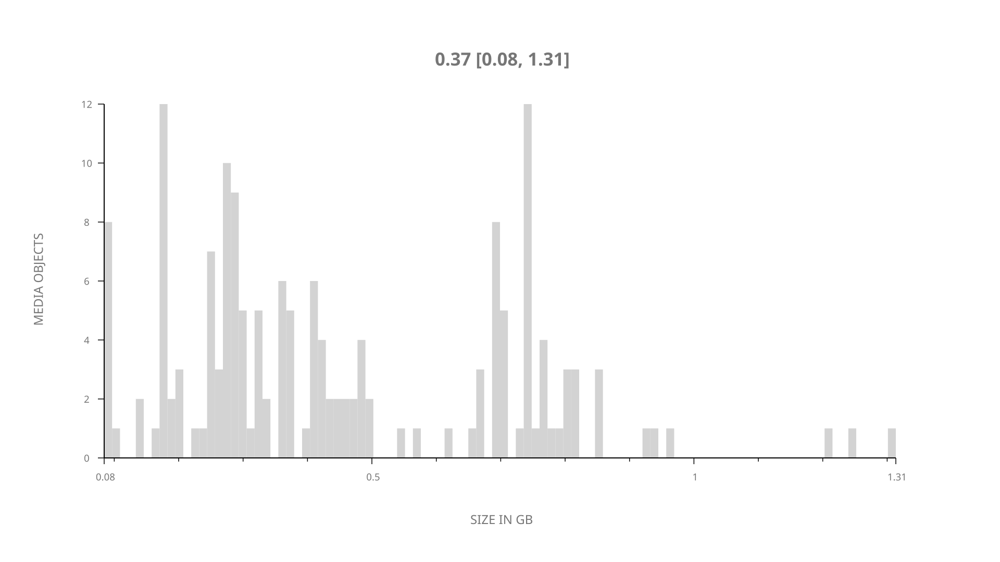
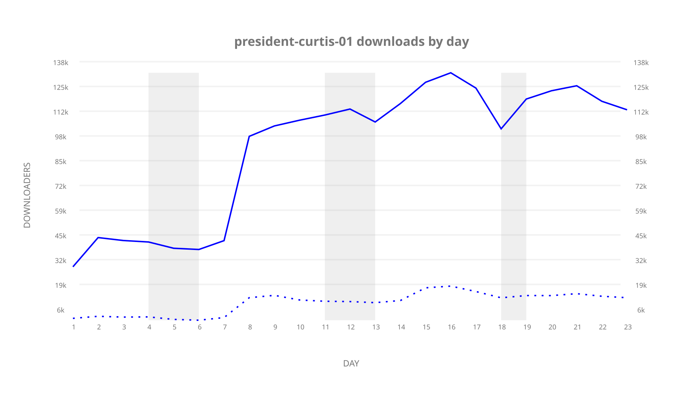
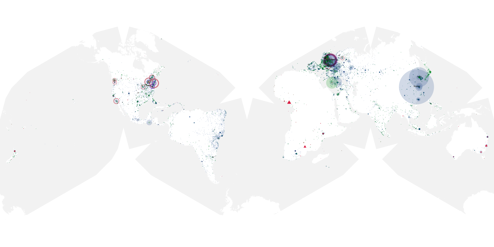
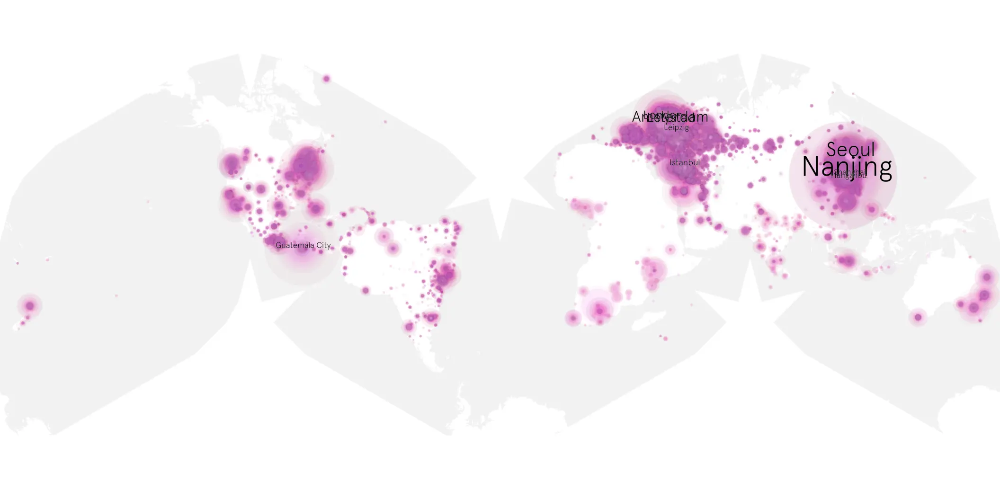
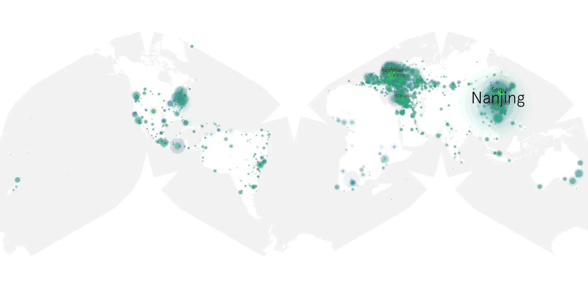

# president-curtis-01 sample cache audit

## 1. Media object

| Field | Value |
| --- | --- |
| Media object | President Curtis |
| Collection key | `president-curtis-01` |
| imdb_id | [tt37692332](https://www.imdb.com/title/tt37692332/) |
| wikipedia_url | [President Curtis (TV series)](https://en.wikipedia.org/wiki/President_Curtis_(TV_series)) |
| Sample dates | 2026-07-28-to-2026-08-20 |
| Sample days | 24 |
| BTIH count | 170 |
| Unique BTIH count | 164 |
| Downloaders total | 1,729,803 |
| Uploaders total | 195,203 |
| Data version | `2026-08-05` |
| IP geolocation version | `6:1777968300` |

## 2. Coverage report

- Generated: 2026-09-13T17:13:09Z
- Sample archive directory: `/mnt/gold/src/alpha60-samples-raw.gold/president-curtis-01.xz`
- Hour directories: 547
- Zero-length sample files: 0
- Other unparsable sample files: 0
- Hourly discontinuities: 1 (29 missing hours)
- Missing days: 1

### Sample archive discontinuities

- hourly gap: last `2026-08-14 18:03`, resumed `2026-08-16 00:03` — missing 29 hour(s)
- missing day: `2026-08-15`

## 3. File sizes histogram *median[lowest, highest]*

## 4. Graphs

### Downloads by week cumulative (normalized start)



### Downloads by day, Saturday and Sunday in gray

## 5. Cumulative Maps

<!-- https://raw.githubusercontent.com/alpha60-devops/alpha60-results-2026/refs/heads/main/data/ -->

### <a href="https://raw.githubusercontent.com/alpha60-devops/alpha60-results-2026/refs/heads/main/data/geojson.cumulative/president-curtis-01-cumulative-aggregate.geojson.gz" data-map-title="President Curtis — president-curtis-01" onclick="leaflet_map_open_window(this.href, this.dataset.mapTitle); return false;" class="table-link" aria-label="Open President Curtis (president-curtis-01) cumulative data map in new window" title="Opens interactive map for President Curtis (president-curtis-01) data">Swarm Detail</a>

### Geographic Regions

| Africa | Americas | Asia | Europe | Oceania | Unknown |
| --- | --- | --- | --- | --- | --- |
| 2.51 | 19.17 | 30.45 | 39.90 | 1.78 | 0.63 |

### Network infrastructure

{:target="_blank" rel="noopener"}

### Resolution >= 1080p

{:target="_blank" rel="noopener"}

### Resolution < 1080p

{:target="_blank" rel="noopener"}
