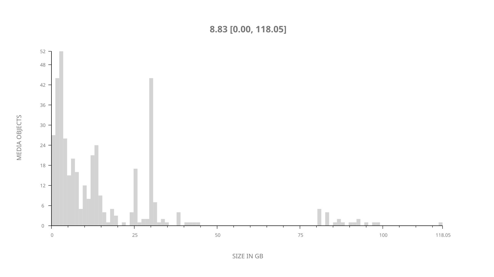
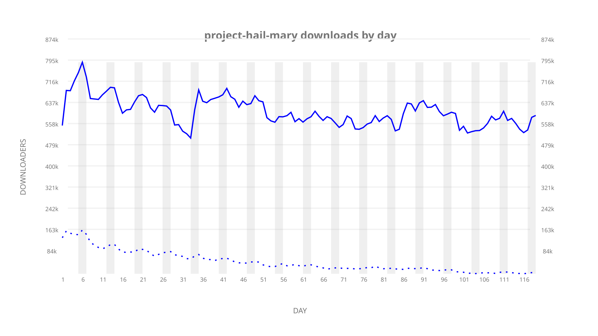
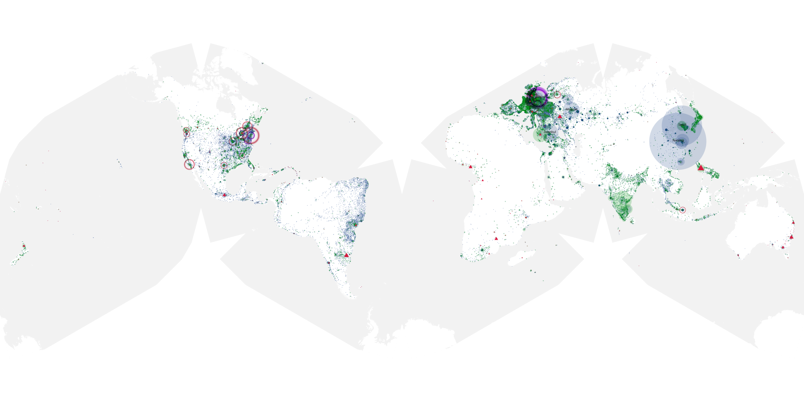
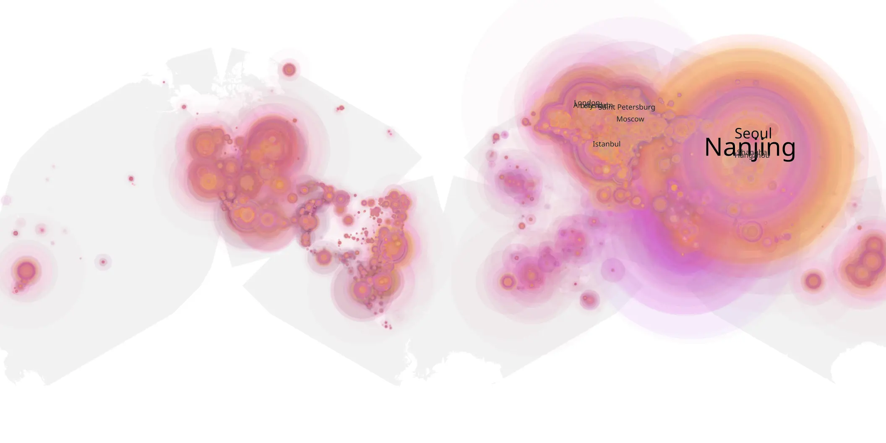
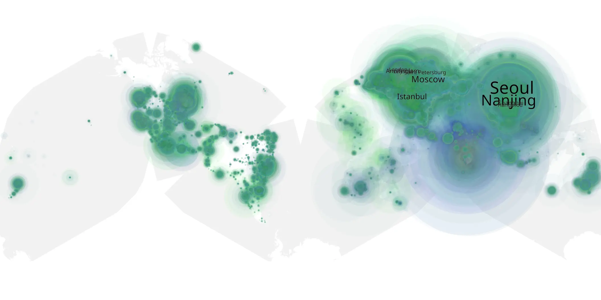

# project-hail-mary sample cache audit

## 1. Media object

| Field | Value |
| --- | --- |
| Media object | Project Hail Mary |
| Collection key | `project-hail-mary` |
| imdb_id | [tt12042730](https://www.imdb.com/title/tt12042730/) |
| wikipedia_url | [Project Hail Mary (film)](https://en.wikipedia.org/wiki/Project_Hail_Mary_(film)) |
| Sample dates | 2026-05-11-to-2026-09-06 |
| Sample days | 119 |
| BTIH count | 446 |
| Unique BTIH count | 403 |
| Downloaders total | 55,317,428 |
| Uploaders total | 7,488,151 |
| Data version | `2026-08-05` |
| IP geolocation version | `6:1777968300` |

## 2. Coverage report

- Generated: 2026-09-13T17:13:09Z
- Sample archive directory: `/mnt/gold/src/alpha60-samples-raw.gold/project-hail-mary.xz`
- Hour directories: 2845
- Zero-length sample files: 0
- Other unparsable sample files: 0
- Hourly discontinuities: 3 (5 missing hours)
- Missing days: 0

### Sample archive discontinuities

- hourly gap: last `2026-06-02 22:03`, resumed `2026-06-03 02:03` — missing 3 hour(s)
- hourly gap: last `2026-06-12 22:03`, resumed `2026-06-13 00:03` — missing 1 hour(s)
- hourly gap: last `2026-08-30 22:03`, resumed `2026-08-31 00:03` — missing 1 hour(s)

## 3. File sizes histogram *median[lowest, highest]*

## 4. Graphs

### Downloads by week cumulative (normalized start)



### Downloads by day, Saturday and Sunday in gray

## 5. Cumulative Maps

<!-- https://raw.githubusercontent.com/alpha60-devops/alpha60-results-2026/refs/heads/main/data/ -->

### <a href="https://raw.githubusercontent.com/alpha60-devops/alpha60-results-2026/refs/heads/main/data/geojson.cumulative/project-hail-mary-cumulative-aggregate.geojson.gz" data-map-title="Project Hail Mary — project-hail-mary" onclick="leaflet_map_open_window(this.href, this.dataset.mapTitle); return false;" class="table-link" aria-label="Open Project Hail Mary (project-hail-mary) cumulative data map in new window" title="Opens interactive map for Project Hail Mary (project-hail-mary) data">Swarm Detail</a>

### Geographic Regions

| Africa | Americas | Asia | Europe | Oceania | Unknown |
| --- | --- | --- | --- | --- | --- |
| 1.84 | 15.58 | 37.34 | 39.43 | 1.24 | 0.79 |

### Network infrastructure

{:target="_blank" rel="noopener"}

### Resolution >= 1080p

{:target="_blank" rel="noopener"}

### Resolution < 1080p

{:target="_blank" rel="noopener"}
