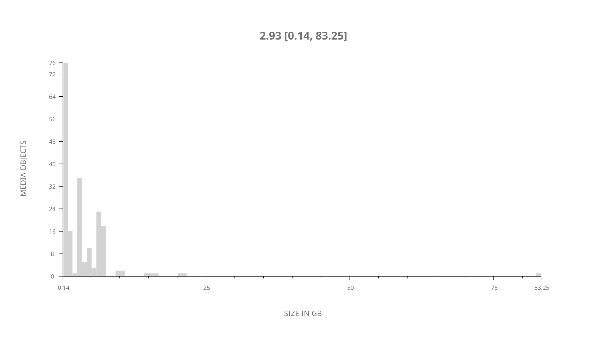
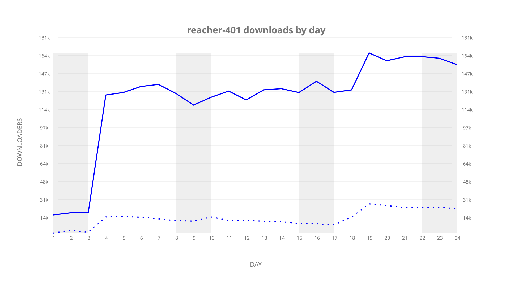
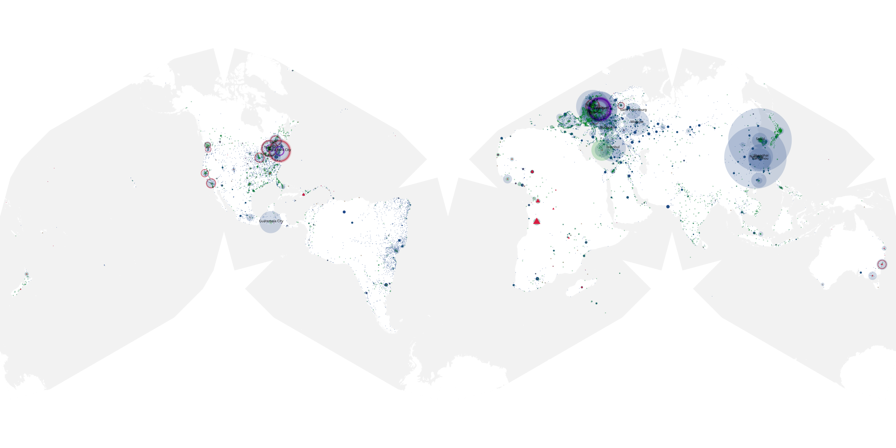
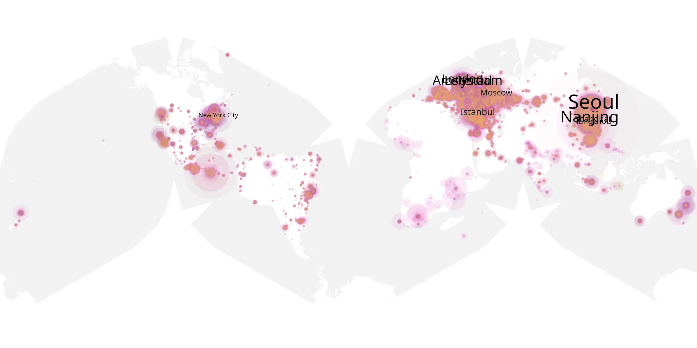
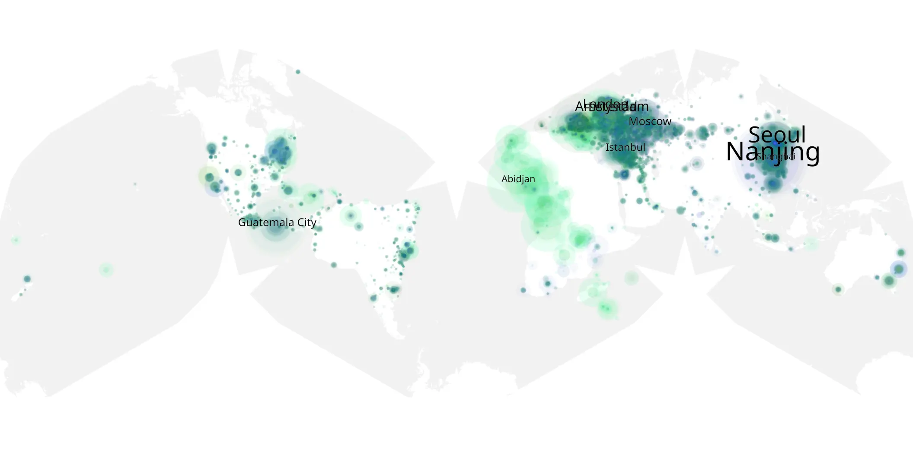

# reacher-401 sample cache audit

## 1. Media object

| Field | Value |
| --- | --- |
| Media object | Reacher |
| Collection key | `reacher-401` |
| imdb_id | [tt9288030](https://www.imdb.com/title/tt9288030/) |
| wikipedia_url | [Reacher (TV series)](https://en.wikipedia.org/wiki/Reacher_(TV_series)) |
| Sample dates | 2026-08-14-to-2026-09-06 |
| Sample days | 24 |
| BTIH count | 203 |
| Unique BTIH count | 197 |
| Downloaders total | 2,138,588 |
| Uploaders total | 232,048 |
| Data version | `2026-08-05` |
| IP geolocation version | `6:1777968300` |

## 2. Coverage report

- Generated: 2026-09-13T17:13:09Z
- Sample archive directory: `/mnt/gold/src/alpha60-samples-raw.gold/reacher-401.xz`
- Hour directories: 571
- Zero-length sample files: 0
- Other unparsable sample files: 0
- Hourly discontinuities: 0 (0 missing hours)
- Missing days: 0

### Sample archive discontinuities

None detected.

## 3. File sizes histogram *median[lowest, highest]*

## 4. Graphs

### Downloads by week cumulative (normalized start)



### Downloads by day, Saturday and Sunday in gray

## 5. Cumulative Maps

<!-- https://raw.githubusercontent.com/alpha60-devops/alpha60-results-2026/refs/heads/main/data/ -->

### <a href="https://raw.githubusercontent.com/alpha60-devops/alpha60-results-2026/refs/heads/main/data/geojson.cumulative/reacher-401-cumulative-aggregate.geojson.gz" data-map-title="Reacher — reacher-401" onclick="leaflet_map_open_window(this.href, this.dataset.mapTitle); return false;" class="table-link" aria-label="Open Reacher (reacher-401) cumulative data map in new window" title="Opens interactive map for Reacher (reacher-401) data">Swarm Detail</a>

### Geographic Regions

| Africa | Americas | Asia | Europe | Oceania | Unknown |
| --- | --- | --- | --- | --- | --- |
| 4.75 | 19.03 | 28.51 | 40.82 | 1.92 | 0.73 |

### Network infrastructure

{:target="_blank" rel="noopener"}

### Resolution >= 1080p

{:target="_blank" rel="noopener"}

### Resolution < 1080p

{:target="_blank" rel="noopener"}
