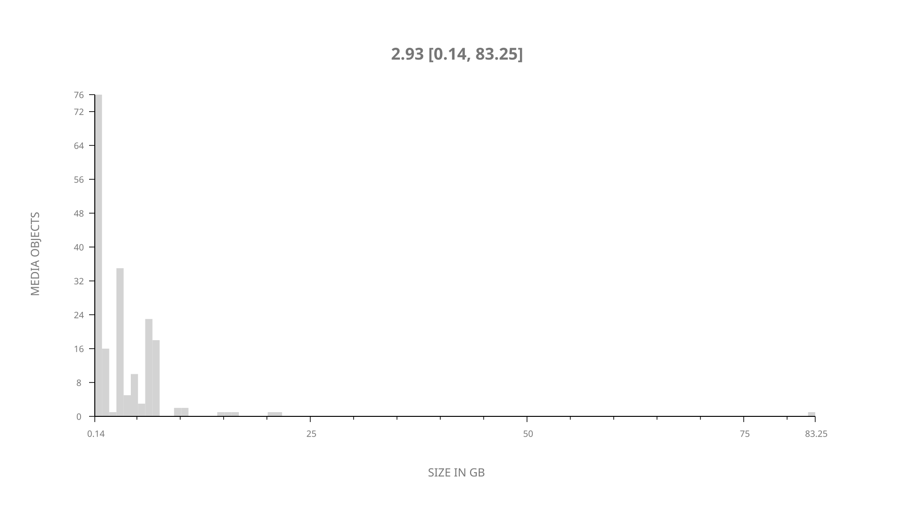
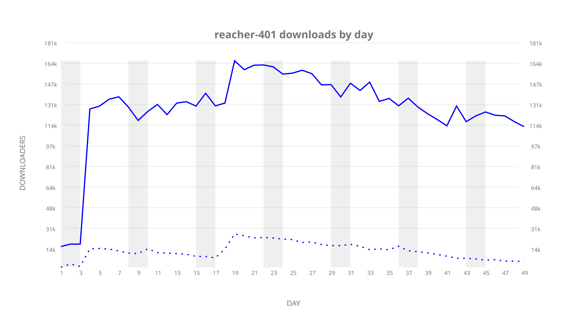
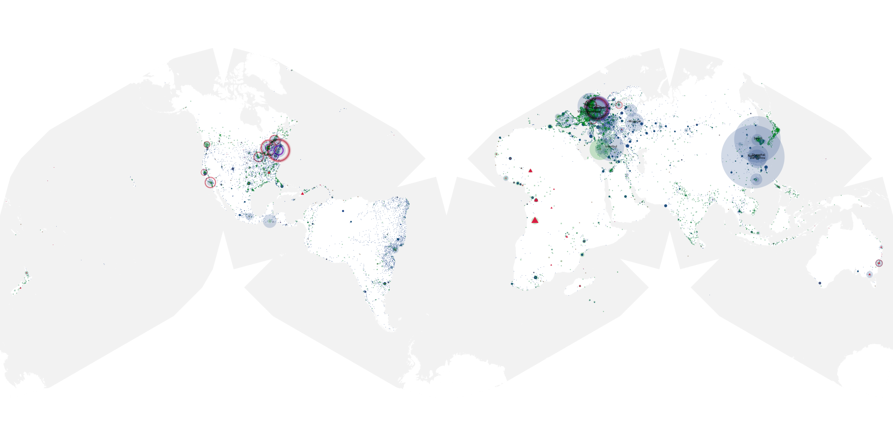
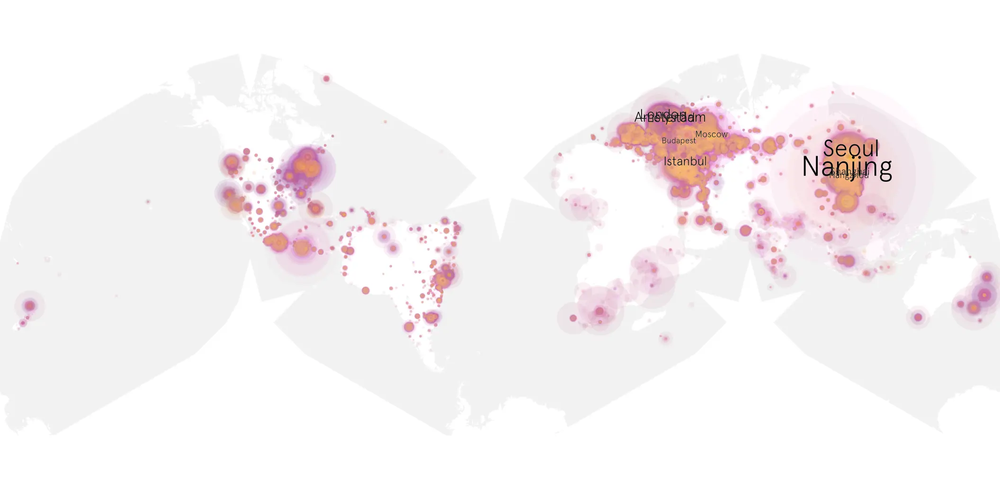
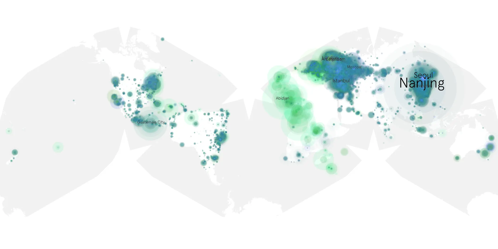

# reacher-401 sample cache audit

## 1. Media object

| Field | Value |
| --- | --- |
| Media object | Reacher |
| Collection key | `reacher-401` |
| imdb_id | [tt9288030](https://www.imdb.com/title/tt9288030/) |
| wikipedia_url | [Reacher (TV series)](https://en.wikipedia.org/wiki/Reacher_(TV_series)) |
| Sample dates | 2026-08-14-to-2026-09-17 |
| Sample days | 35 |
| BTIH count | 204 |
| Unique BTIH count | 197 |
| Downloaders total | 3,209,253 |
| Uploaders total | 343,512 |
| Data version | `2026-08-05` |
| IP geolocation version | `6:1777968300` |

## 2. Coverage report

- Generated: 2026-10-03T19:10:22Z
- Frozen sample archive directory: `/mnt/gold/src/alpha60-samples-raw.gold/reacher-401.xz`
- Hour directories: 834
- Zero-length sample files: 0
- Malformed in-scope records accepted: 0 (producer rejects nonempty malformed input)
- Hourly discontinuities: 1 (1 missing hours)
- Missing days: 0

### Sample archive discontinuities

- hourly gap: last `2026-09-09 22:01`, resumed `2026-09-10 00:01` — missing 1 hour(s)

### Frozen validation evidence

- Frozen content SHA-256: `ba5675f78d979dac5e94eafec1c25dcab94f7d384758561c93bc55598f794fc6`
- Full-input producer receipt SHA-256: `8b5ba353d9eecb2724dbdc3b338e4a667ab2f6a1a6ffda82ed3d84a814a5025c`
- Frozen raw archives: 834
- Empty sampler observations remain explicit gaps; no observations were imputed.
- Out-of-scope records retain the collection factory's established filtering.
- Excluded raw members: 0
- Excluded observations: 0

## 3. File sizes histogram *median[lowest, highest]*

## 4. Graphs

### Downloads by week cumulative (normalized start)



### Downloads by day, Saturday and Sunday in gray

## 5. Cumulative Maps

<!-- https://raw.githubusercontent.com/alpha60-devops/alpha60-results-2026/refs/heads/main/data/ -->

### <a href="https://raw.githubusercontent.com/alpha60-devops/alpha60-results-2026/refs/heads/main/data/geojson.cumulative/reacher-401-cumulative-aggregate.geojson.gz" data-map-title="Reacher — reacher-401" onclick="leaflet_map_open_window(this.href, this.dataset.mapTitle); return false;" class="table-link" aria-label="Open Reacher (reacher-401) cumulative data map in new window" title="Opens interactive map for Reacher (reacher-401) data">Swarm Detail</a>

### Geographic Regions

| Africa | Americas | Asia | Europe | Oceania | Unknown |
| --- | --- | --- | --- | --- | --- |
| 5.78 | 19.63 | 29.81 | 42.18 | 1.88 | 0.72 |

### Network infrastructure

{:target="_blank" rel="noopener"}

### Resolution >= 1080p

{:target="_blank" rel="noopener"}

### Resolution < 1080p

{:target="_blank" rel="noopener"}
