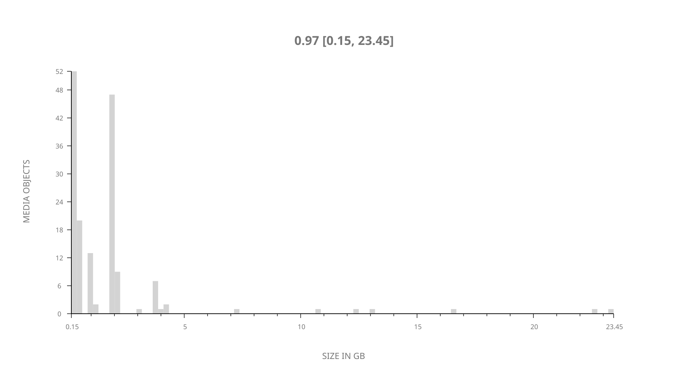
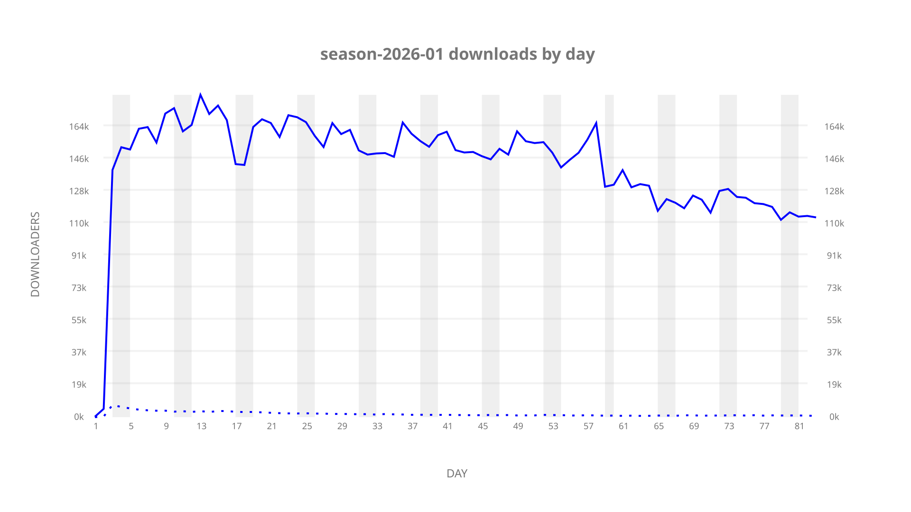
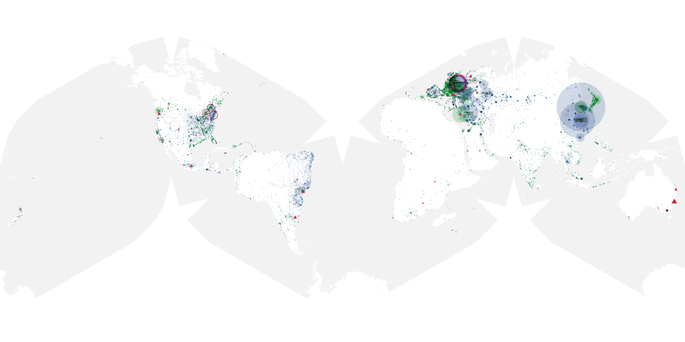
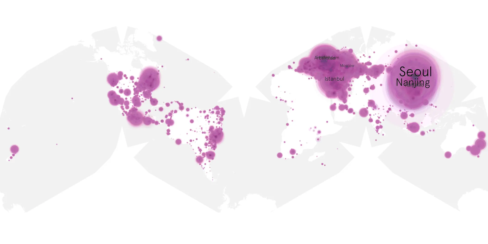
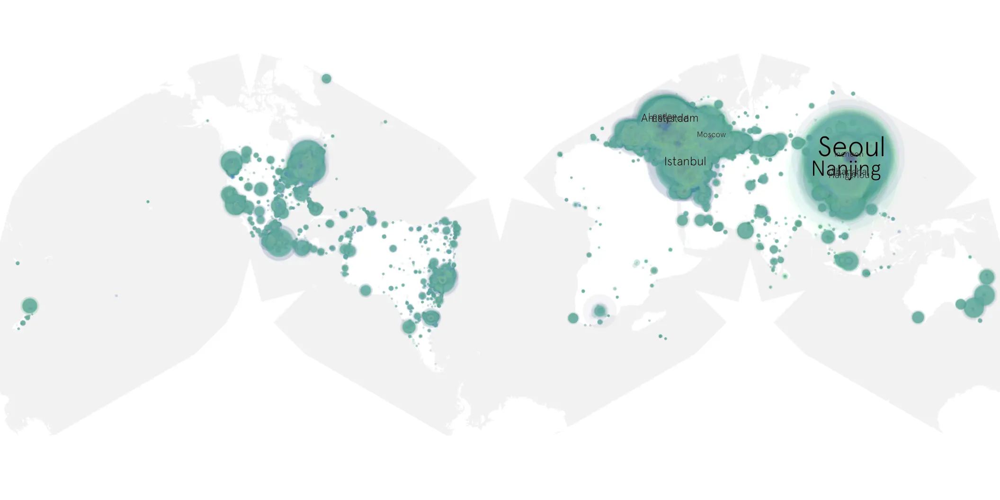

# season-2026-01 sample cache audit

## 1. Media object

| Field | Value |
| --- | --- |
| Media object | The Season |
| Collection key | `season-2026-01` |
| imdb_id | [tt36237567](https://www.imdb.com/title/tt36237567/) |
| wikipedia_url | [The Season](https://en.wikipedia.org/wiki/The_Season) |
| Sample dates | 2026-06-17-to-2026-09-08 |
| Sample days | 84 |
| BTIH count | 169 |
| Unique BTIH count | 161 |
| Downloaders total | 9,617,136 |
| Uploaders total | 95,742 |
| Data version | `2026-08-05` |
| IP geolocation version | `6:1777968300` |

## 2. Sample coverage report

- Generated: 2026-09-13T17:13:09Z
- Sample archive directory: `/mnt/gold/src/alpha60-samples-raw.gold/season-2026-01.xz`
- Hour directories: 1968
- Zero-length sample files: 0
- Other unparsable sample files: 0
- Hourly discontinuities: 1 (29 missing hours)
- Missing days: 1

### Sample archive discontinuities

- hourly gap: last `2026-08-14 18:00`, resumed `2026-08-16 00:00` — missing 29 hour(s)
- missing day: `2026-08-15`

## 3. Media objects file size histogram

## 4. Visualization pass — graphs

### Downloads by week cumulative (normalized start)



### Downloads by day, Saturday and Sunday in gray

## 5. Visualization pass — maps

### Cumulative geographic slices

| Africa | Americas | Asia | Europe | Oceania | Unknown |
| --- | --- | --- | --- | --- | --- |
| 1.12 | 16.07 | 36.70 | 42.03 | 1.08 | 0.85 |

### Cumulative network infrastructure

{:target="_blank" rel="noopener"}

### Cumulative data maps

**Cumulative >= 1080p**

{:target="_blank" rel="noopener"}

**Cumulative < 1080p**

{:target="_blank" rel="noopener"}
