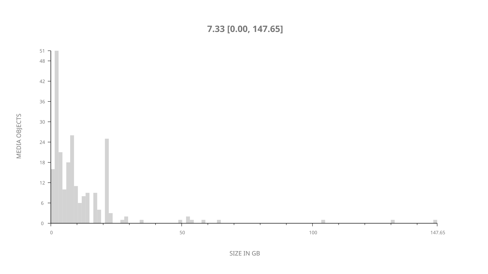
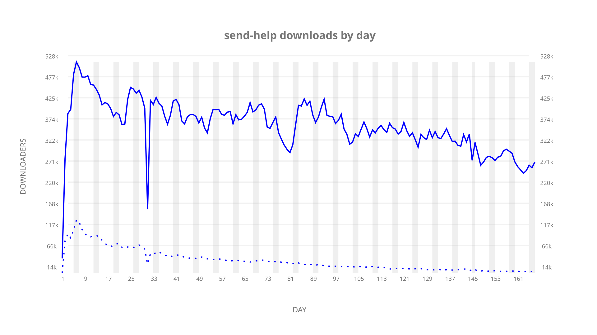
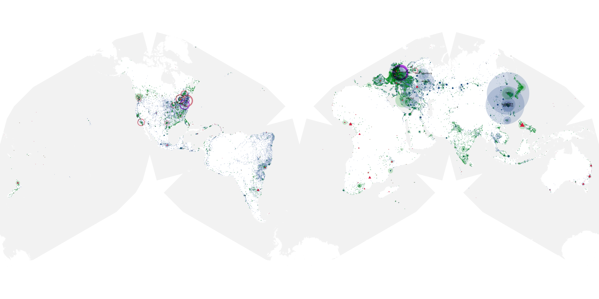
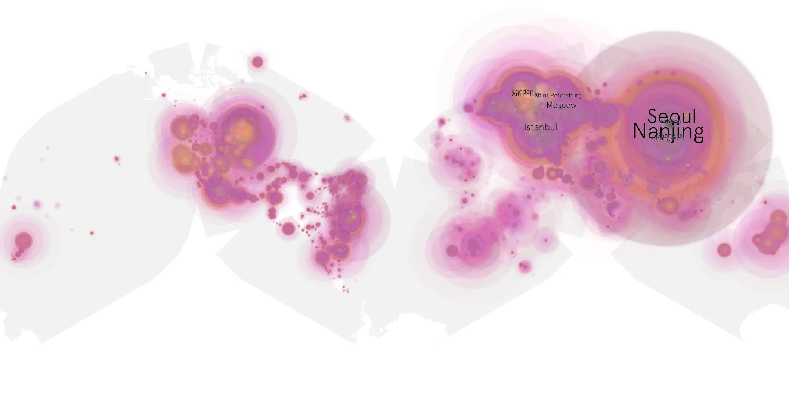
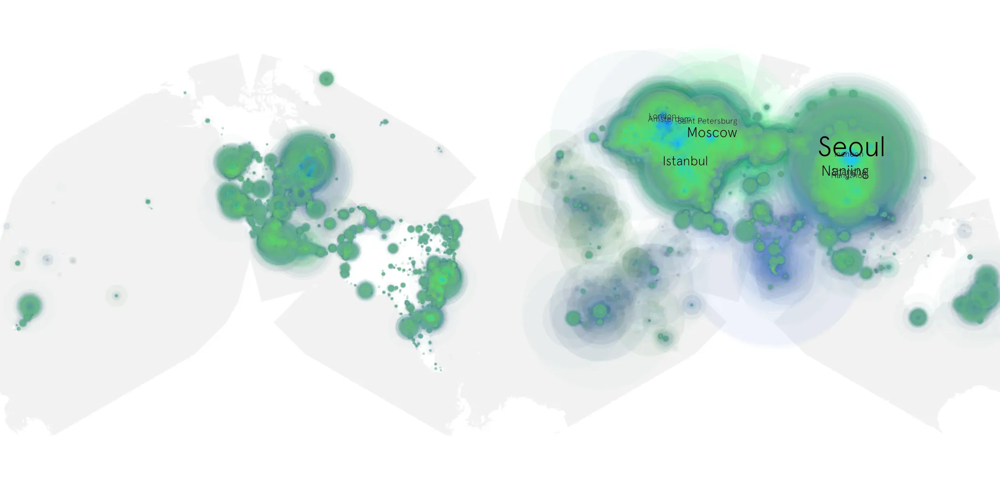

# send-help sample cache audit

## 1. Media object

| Field | Value |
| --- | --- |
| Media object | Send Help |
| Collection key | `send-help` |
| imdb_id | [tt8036976](https://www.imdb.com/title/tt8036976/) |
| wikipedia_url | [Send Help](https://en.wikipedia.org/wiki/Send_Help) |
| Sample dates | 2026-03-23-to-2026-09-06 |
| Sample days | 168 |
| BTIH count | 249 |
| Unique BTIH count | 230 |
| Downloaders total | 45,137,016 |
| Uploaders total | 3,854,538 |
| Data version | `2026-08-05` |
| IP geolocation version | `6:1777968300` |

## 2. Sample coverage report

- Generated: 2026-09-13T17:13:09Z
- Sample archive directory: `/mnt/gold/src/alpha60-samples-raw.gold/send-help.xz`
- Hour directories: 3963
- Zero-length sample files: 0
- Other unparsable sample files: 0
- Hourly discontinuities: 4 (48 missing hours)
- Missing days: 1

### Sample archive discontinuities

- hourly gap: last `2026-03-29 01:05`, resumed `2026-03-29 03:05` — missing 1 hour(s)
- hourly gap: last `2026-04-21 23:05`, resumed `2026-04-22 17:05` — missing 17 hour(s)
- hourly gap: last `2026-05-10 22:05`, resumed `2026-05-11 00:05` — missing 1 hour(s)
- hourly gap: last `2026-08-14 18:05`, resumed `2026-08-16 00:05` — missing 29 hour(s)
- missing day: `2026-08-15`

## 3. Media objects file size histogram

## 4. Visualization pass — graphs

### Downloads by week cumulative (normalized start)



### Downloads by day, Saturday and Sunday in gray

## 5. Visualization pass — maps

### Cumulative geographic slices

| Africa | Americas | Asia | Europe | Oceania | Unknown |
| --- | --- | --- | --- | --- | --- |
| 2.07 | 15.86 | 35.54 | 42.05 | 1.21 | 0.77 |

### Cumulative network infrastructure

{:target="_blank" rel="noopener"}

### Cumulative data maps

**Cumulative >= 1080p**

{:target="_blank" rel="noopener"}

**Cumulative < 1080p**

{:target="_blank" rel="noopener"}
