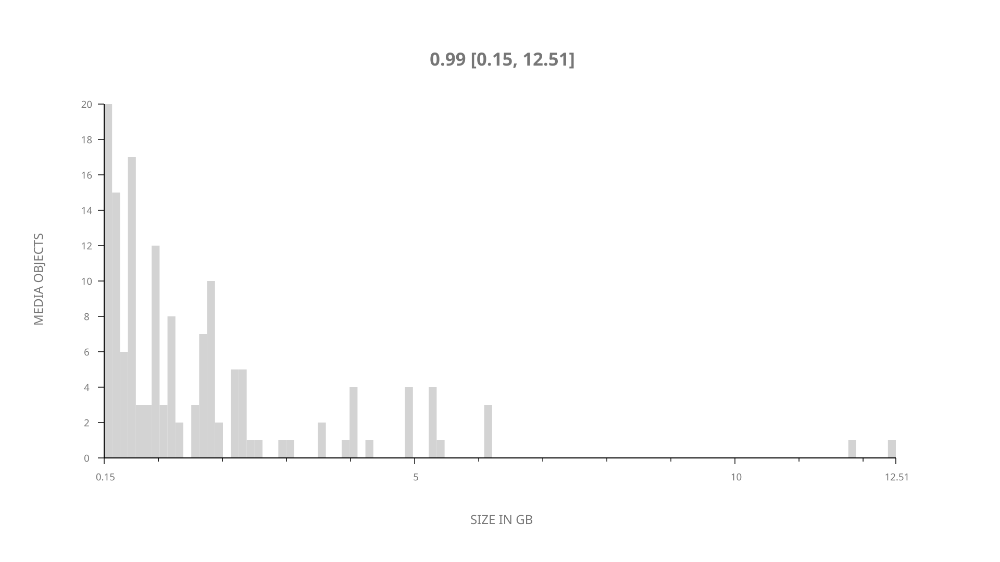
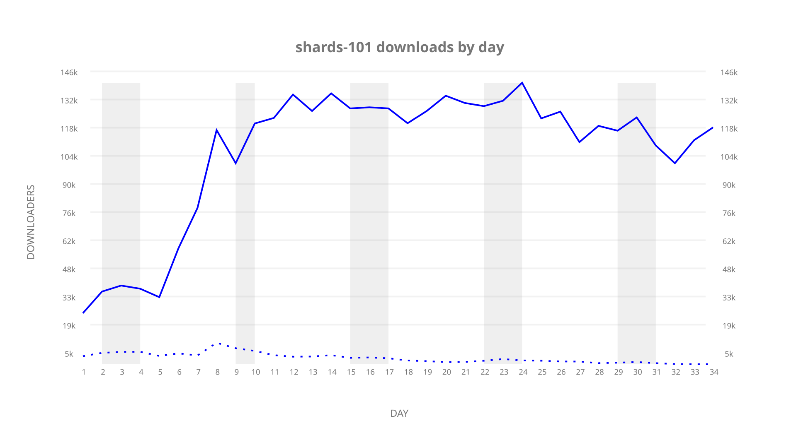
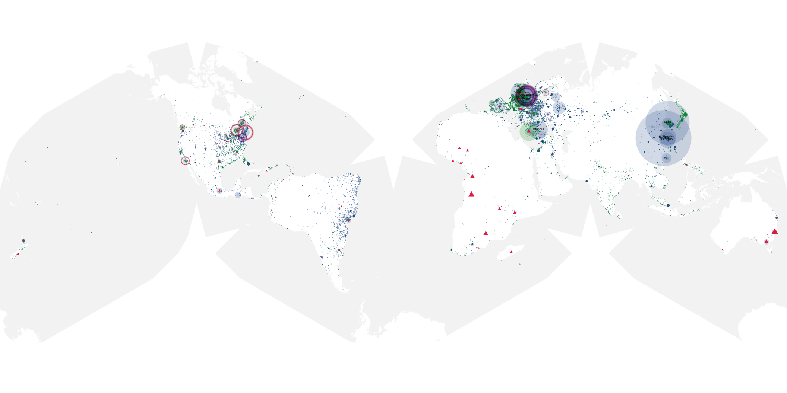
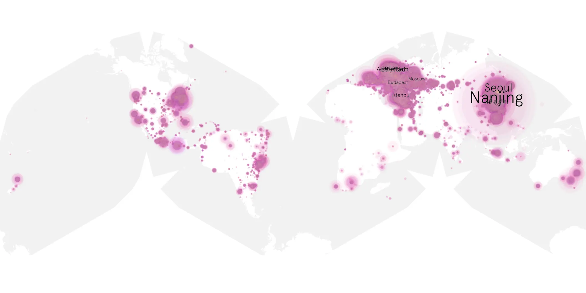
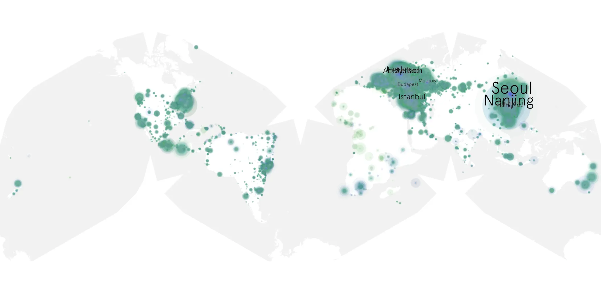

# shards-101 sample cache audit

## 1. Media object

| Field | Value |
| --- | --- |
| Media object | The Shards |
| Collection key | `shards-101` |
| imdb_id | [tt27543562](https://www.imdb.com/title/tt27543562/) |
| wikipedia_url | [The Shards (TV series)](https://en.wikipedia.org/wiki/The_Shards_(TV_series)) |
| Sample dates | 2026-08-06-to-2026-09-09 |
| Sample days | 35 |
| BTIH count | 150 |
| Unique BTIH count | 147 |
| Downloaders total | 3,055,905 |
| Uploaders total | 166,731 |
| Data version | `2026-08-05` |
| IP geolocation version | `6:1777968300` |

## 2. Coverage report

- Generated: 2026-09-13T17:13:09Z
- Sample archive directory: `/mnt/gold/src/alpha60-samples-raw.gold/shards-101.xz`
- Hour directories: 799
- Zero-length sample files: 0
- Other unparsable sample files: 0
- Hourly discontinuities: 1 (29 missing hours)
- Missing days: 1

### Sample archive discontinuities

- hourly gap: last `2026-08-14 18:00`, resumed `2026-08-16 00:00` — missing 29 hour(s)
- missing day: `2026-08-15`

## 3. File sizes histogram *median[lowest, highest]*

## 4. Graphs

### Downloads by week cumulative (normalized start)



### Downloads by day, Saturday and Sunday in gray

## 5. Cumulative Maps

<!-- https://raw.githubusercontent.com/alpha60-devops/alpha60-results-2026/refs/heads/main/data/ -->

### <a href="https://raw.githubusercontent.com/alpha60-devops/alpha60-results-2026/refs/heads/main/data/geojson.cumulative/shards-101-cumulative-aggregate.geojson.gz" data-map-title="The Shards — shards-101" onclick="leaflet_map_open_window(this.href, this.dataset.mapTitle); return false;" class="table-link" aria-label="Open The Shards (shards-101) cumulative data map in new window" title="Opens interactive map for The Shards (shards-101) data">Swarm Detail</a>

### Geographic Regions

| Africa | Americas | Asia | Europe | Oceania | Unknown |
| --- | --- | --- | --- | --- | --- |
| 2.02 | 18.34 | 32.27 | 42.08 | 1.54 | 0.76 |

### Network infrastructure

{:target="_blank" rel="noopener"}

### Resolution >= 1080p

{:target="_blank" rel="noopener"}

### Resolution < 1080p

{:target="_blank" rel="noopener"}
