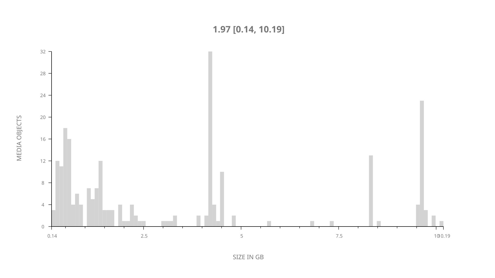
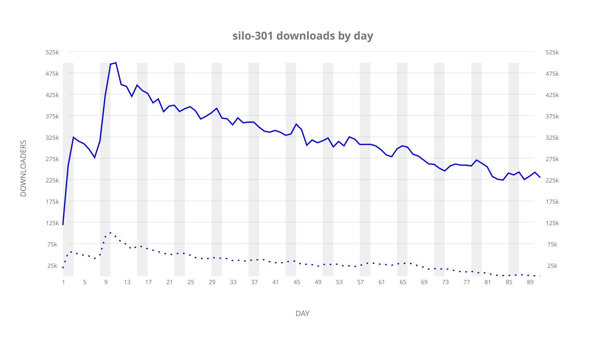
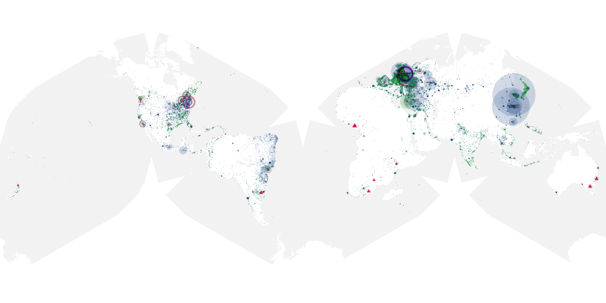
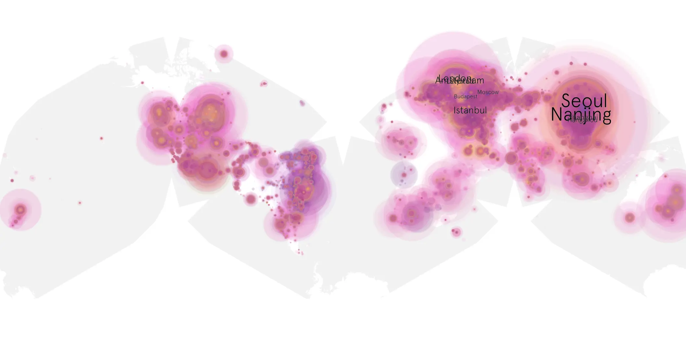
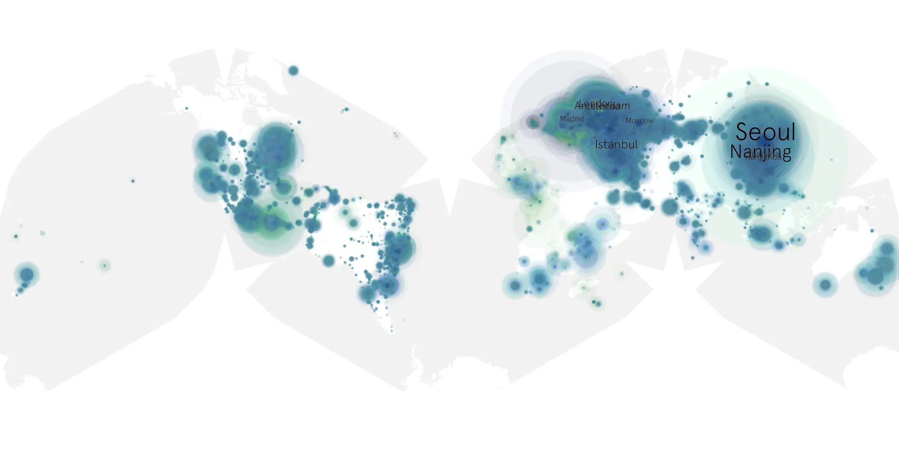

# silo-301 sample cache audit

## 1. Media object

| Field | Value |
| --- | --- |
| Media object | Silo |
| Collection key | `silo-301` |
| imdb_id | [tt14688458](https://www.imdb.com/title/tt14688458/) |
| wikipedia_url | [Silo (TV series)](https://en.wikipedia.org/wiki/Silo_(TV_series)) |
| Sample dates | 2026-07-03-to-2026-10-01 |
| Sample days | 91 |
| BTIH count | 238 |
| Unique BTIH count | 236 |
| Downloaders total | 20,614,817 |
| Uploaders total | 2,185,267 |
| Data version | `2026-08-05` |
| IP geolocation version | `6:1777968300` |

## 2. Sample coverage report

- Generated: 2026-10-07T13:31:30Z
- Frozen sample archive directory: `/mnt/gold/src/alpha60-samples-raw.gold/silo-301.xz`
- Hour directories: 2167
- Zero-length sample files: 0
- Malformed in-scope records accepted: 0 (producer rejects nonempty malformed input)
- Hourly discontinuities: 0 (0 missing hours)
- Missing days: 0

### Sample archive discontinuities

None detected.

### Frozen validation evidence

- Frozen content SHA-256: `b2946178e0b0ea5c39f95a7477f54b089cb5d870df34e70c35e52ba48556a193`
- Full-input producer receipt SHA-256: `6d63661798778a00de47b3a80f7bba28874c87a4755d31de34e49d3f98fff22d`
- Frozen raw archives: 2167
- Empty sampler observations remain explicit gaps; no observations were imputed.
- Out-of-scope records retain the collection factory's established filtering.
- Excluded raw members: 0
- Excluded observations: 0

## 3. Media objects file size histogram

## 4. Visualization pass — graphs

### Downloads by week cumulative (normalized start)



### Downloads by day, Saturday and Sunday in gray

## 5. Visualization pass — maps

### Cumulative geographic slices

| Africa | Americas | Asia | Europe | Oceania | Unknown |
| --- | --- | --- | --- | --- | --- |
| 2.85 | 19.97 | 31.53 | 43.25 | 1.62 | 0.79 |

### Cumulative network infrastructure

{:target="_blank" rel="noopener"}

### Cumulative data maps

**Cumulative >= 1080p**

{:target="_blank" rel="noopener"}

**Cumulative < 1080p**

{:target="_blank" rel="noopener"}
