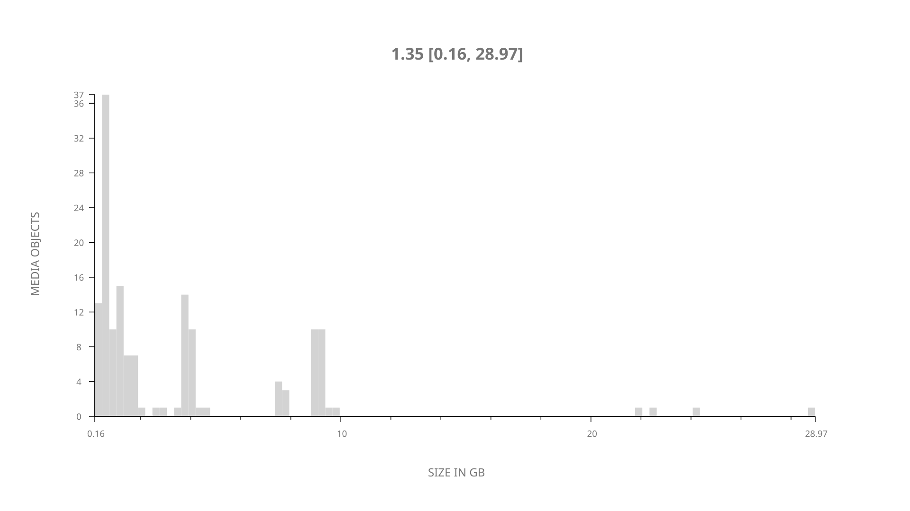
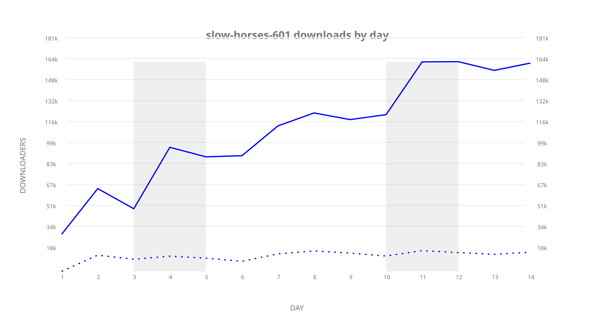
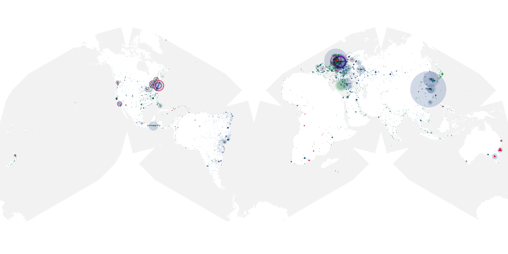
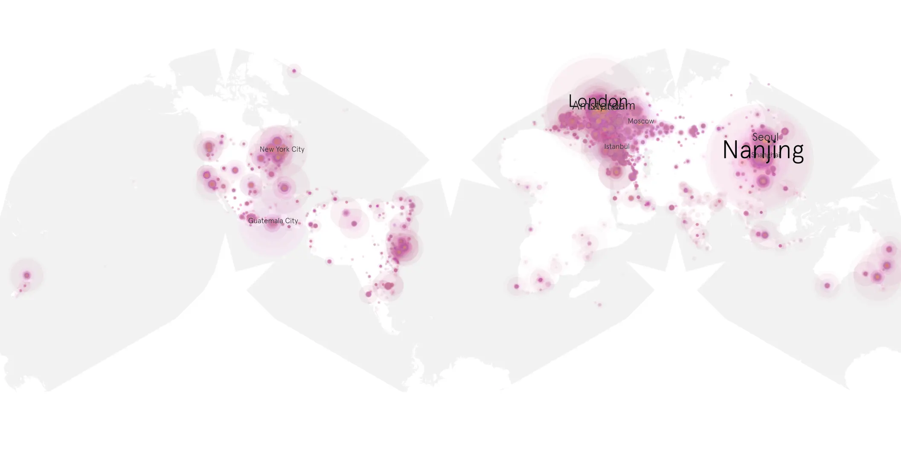
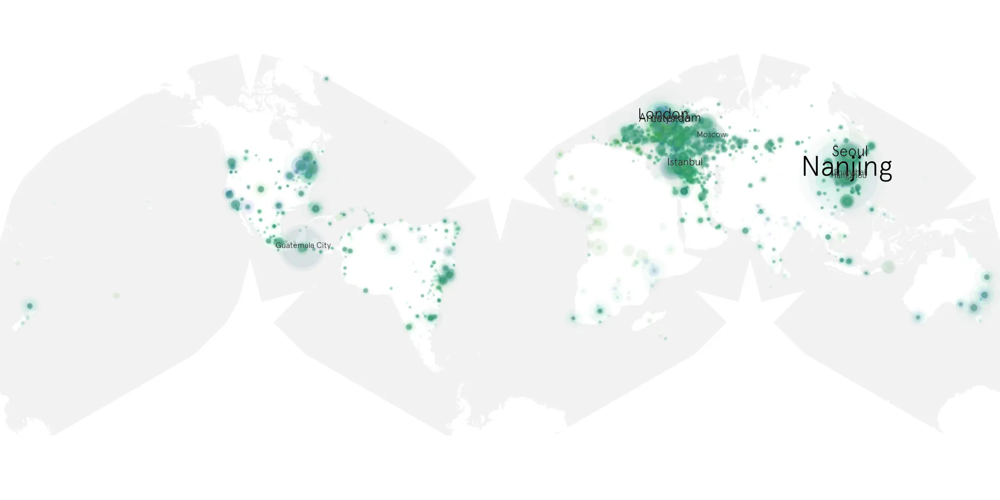

# slow-horses-601 sample cache audit

## 1. Media object

| Field | Value |
| --- | --- |
| Media object | Slow Horses |
| Collection key | `slow-horses-601` |
| imdb_id | [tt5875444](https://www.imdb.com/title/tt5875444/) |
| wikipedia_url | [Slow Horses#Series 6 (2026)](https://en.wikipedia.org/wiki/Slow_Horses#Series_6_(2026)) |
| Sample dates | 2026-09-16-to-2026-09-29 |
| Sample days | 14 |
| BTIH count | 157 |
| Unique BTIH count | 152 |
| Downloaders total | 1,248,501 |
| Uploaders total | 221,640 |
| Data version | `2026-08-05` |
| IP geolocation version | `6:1777968300` |

## 2. Coverage report

- Generated: 2026-10-03T19:10:22Z
- Frozen sample archive directory: `/mnt/gold/src/alpha60-samples-raw.gold/slow-horses-601.xz`
- Hour directories: 320
- Zero-length sample files: 0
- Malformed in-scope records accepted: 0 (producer rejects nonempty malformed input)
- Hourly discontinuities: 0 (0 missing hours)
- Missing days: 0

### Sample archive discontinuities

None detected.

### Frozen validation evidence

- Frozen content SHA-256: `90cd7041f7fffe3a6728ac3085ff9970e549bbe8c1fcf00634811efb6da484b6`
- Full-input producer receipt SHA-256: `59e4b3f82d92601250862865d8db53cdda55d1528575c060bec62dbb5ed4c5fe`
- Frozen raw archives: 320
- Empty sampler observations remain explicit gaps; no observations were imputed.
- Out-of-scope records retain the collection factory's established filtering.
- Excluded raw members: 0
- Excluded observations: 0

## 3. File sizes histogram *median[lowest, highest]*

## 4. Graphs

### Downloads by week cumulative (normalized start)



### Downloads by day, Saturday and Sunday in gray

## 5. Cumulative Maps

<!-- https://raw.githubusercontent.com/alpha60-devops/alpha60-results-2026/refs/heads/main/data/ -->

### <a href="https://raw.githubusercontent.com/alpha60-devops/alpha60-results-2026/refs/heads/main/data/geojson.cumulative/slow-horses-601-cumulative-aggregate.geojson.gz" data-map-title="Slow Horses — slow-horses-601" onclick="leaflet_map_open_window(this.href, this.dataset.mapTitle); return false;" class="table-link" aria-label="Open Slow Horses (slow-horses-601) cumulative data map in new window" title="Opens interactive map for Slow Horses (slow-horses-601) data">Swarm Detail</a>

### Geographic Regions

| Africa | Americas | Asia | Europe | Oceania | Unknown |
| --- | --- | --- | --- | --- | --- |
| 2.44 | 22.27 | 26.90 | 44.90 | 2.90 | 0.60 |

### Network infrastructure

{:target="_blank" rel="noopener"}

### Resolution >= 1080p

{:target="_blank" rel="noopener"}

### Resolution < 1080p

{:target="_blank" rel="noopener"}
