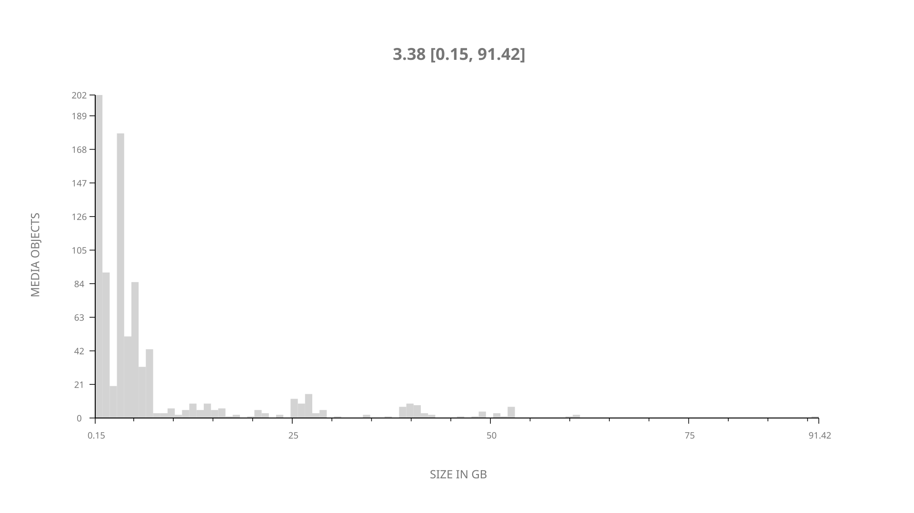
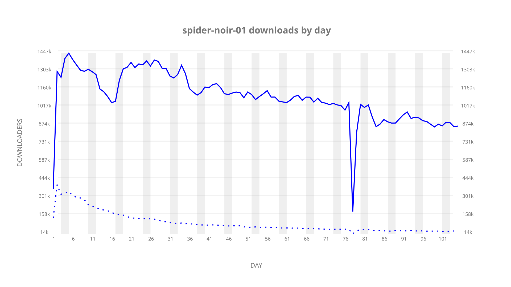
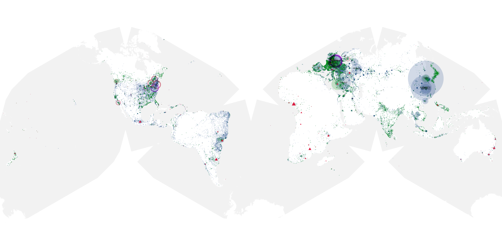
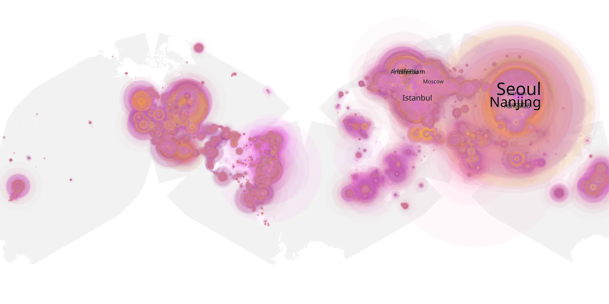
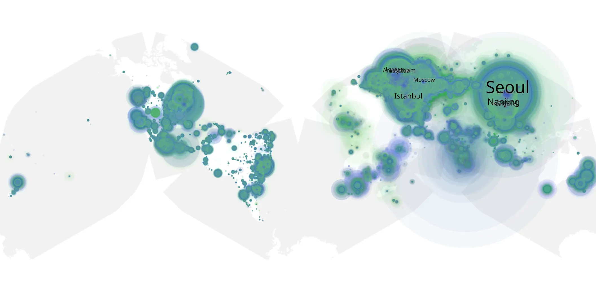

# spider-noir-01 sample cache audit

## 1. Media object

| Field | Value |
| --- | --- |
| Media object | Spider-Noir |
| Collection key | `spider-noir-01` |
| imdb_id | [tt30460310](https://www.imdb.com/title/tt30460310/) |
| wikipedia_url | [Spider-Noir](https://en.wikipedia.org/wiki/Spider-Noir) |
| Sample dates | 2026-05-27-to-2026-09-08 |
| Sample days | 105 |
| BTIH count | 878 |
| Unique BTIH count | 867 |
| Downloaders total | 85,901,037 |
| Uploaders total | 5,395,713 |
| Data version | `2026-08-05` |
| IP geolocation version | `6:1777968300` |

## 2. Sample coverage report

- Generated: 2026-09-13T17:13:09Z
- Sample archive directory: `/mnt/gold/src/alpha60-samples-raw.gold/spider-noir-01.xz`
- Hour directories: 2477
- Zero-length sample files: 0
- Other unparsable sample files: 0
- Hourly discontinuities: 1 (26 missing hours)
- Missing days: 0

### Sample archive discontinuities

- hourly gap: last `2026-08-12 03:04`, resumed `2026-08-13 06:04` — missing 26 hour(s)

## 3. Media objects file size histogram

## 4. Visualization pass — graphs

### Downloads by week cumulative (normalized start)



### Downloads by day, Saturday and Sunday in gray

## 5. Visualization pass — maps

### Cumulative geographic slices

| Africa | Americas | Asia | Europe | Oceania | Unknown |
| --- | --- | --- | --- | --- | --- |
| 1.80 | 17.11 | 36.31 | 41.71 | 1.22 | 0.83 |

### Cumulative network infrastructure

{:target="_blank" rel="noopener"}

### Cumulative data maps

**Cumulative >= 1080p**

{:target="_blank" rel="noopener"}

**Cumulative < 1080p**

{:target="_blank" rel="noopener"}
