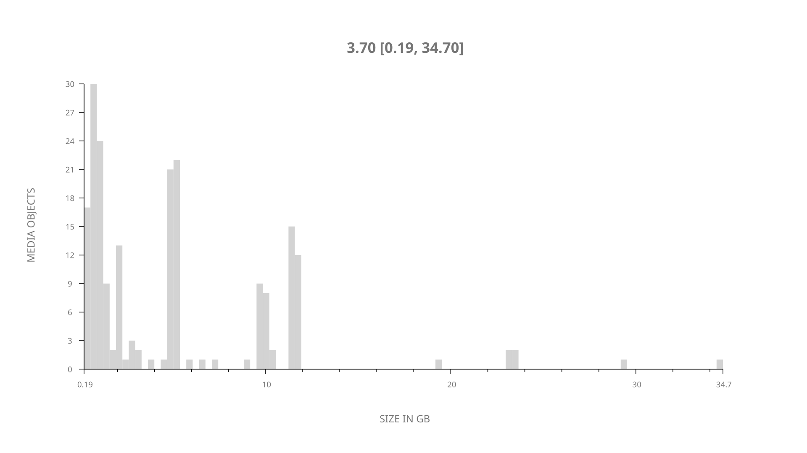
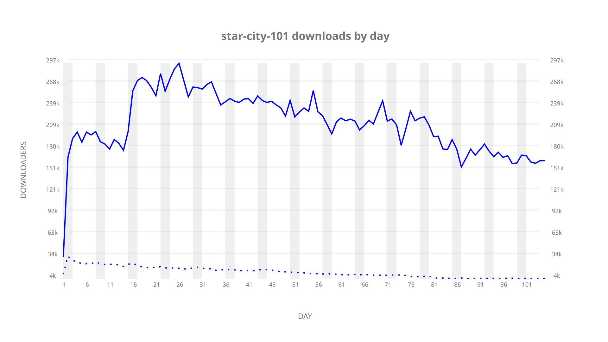
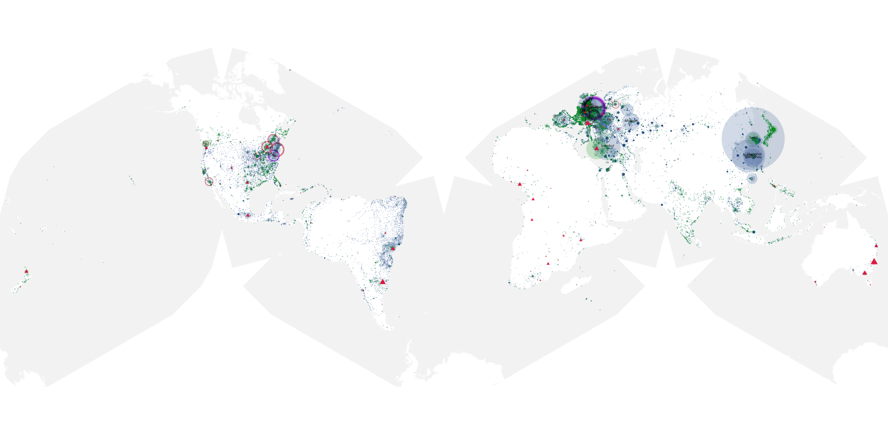
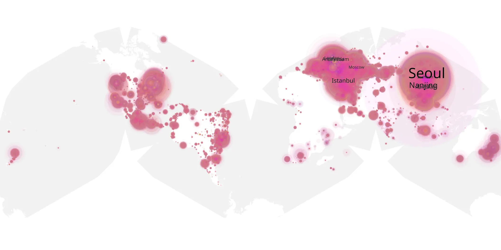
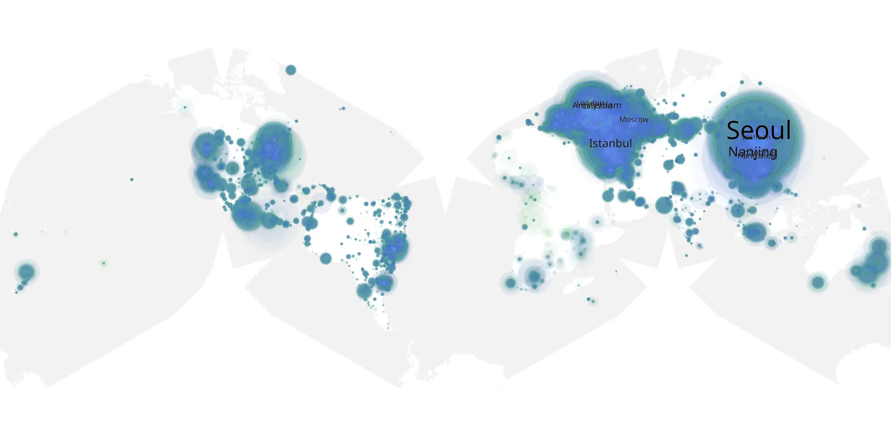

# star-city-101 sample cache audit

## 1. Media object

| Field | Value |
| --- | --- |
| Media object | Star City |
| Collection key | `star-city-101` |
| imdb_id | [tt32140872](https://www.imdb.com/title/tt32140872/) |
| wikipedia_url | [Star City (TV series)](https://en.wikipedia.org/wiki/Star_City_(TV_series)) |
| Sample dates | 2026-05-29-to-2026-09-10 |
| Sample days | 105 |
| BTIH count | 205 |
| Unique BTIH count | 203 |
| Downloaders total | 17,299,952 |
| Uploaders total | 665,800 |
| Data version | `2026-08-05` |
| IP geolocation version | `6:1777968300` |

## 2. Sample coverage report

- Generated: 2026-09-13T17:13:09Z
- Sample archive directory: `/mnt/gold/src/alpha60-samples-raw.gold/star-city-101.xz`
- Hour directories: 2500
- Zero-length sample files: 0
- Other unparsable sample files: 0
- Hourly discontinuities: 0 (0 missing hours)
- Missing days: 0

### Sample archive discontinuities

None detected.

## 3. Media objects file size histogram

## 4. Visualization pass — graphs

### Downloads by week cumulative (normalized start)



### Downloads by day, Saturday and Sunday in gray

## 5. Visualization pass — maps

### Cumulative geographic slices

| Africa | Americas | Asia | Europe | Oceania | Unknown |
| --- | --- | --- | --- | --- | --- |
| 1.37 | 17.12 | 35.10 | 42.80 | 1.30 | 0.83 |

### Cumulative network infrastructure

{:target="_blank" rel="noopener"}

### Cumulative data maps

**Cumulative >= 1080p**

{:target="_blank" rel="noopener"}

**Cumulative < 1080p**

{:target="_blank" rel="noopener"}
