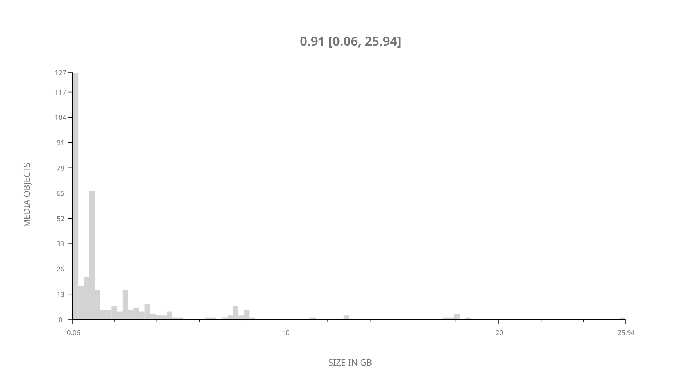
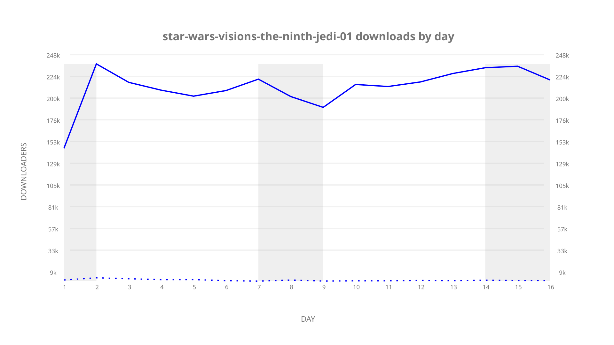
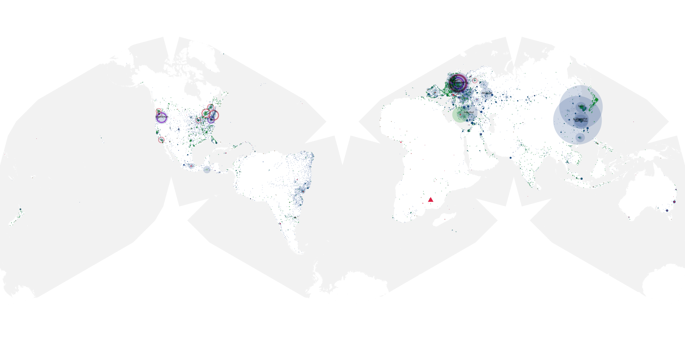
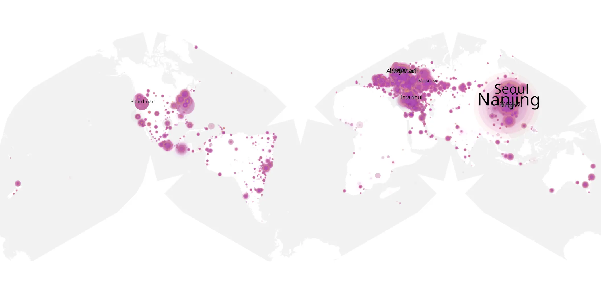
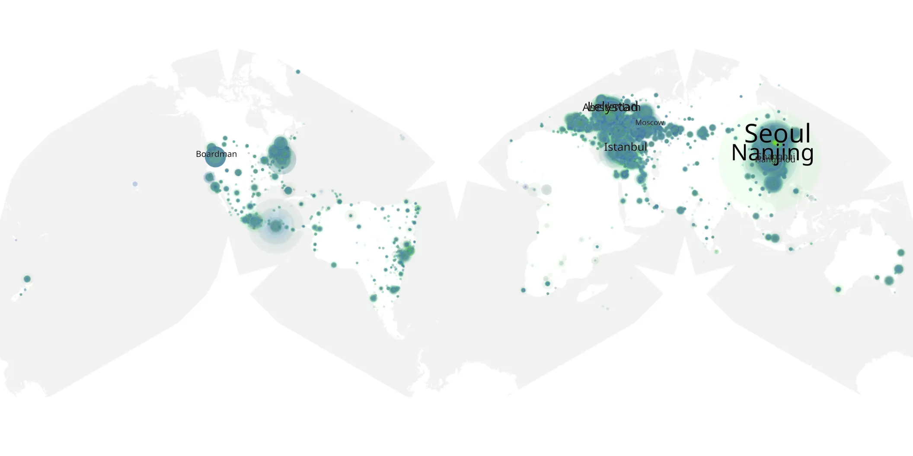

# star-wars-visions-the-ninth-jedi-01 sample cache audit

## 1. Media object

| Field | Value |
| --- | --- |
| Media object | Star Wars: Visions Presents — The Ninth Jedi |
| Collection key | `star-wars-visions-the-ninth-jedi-01` |
| imdb_id | [tt43337681](https://www.imdb.com/title/tt43337681/) |
| wikipedia_url | [Star Wars: Visions Presents#The Ninth Jedi (2026)](https://en.wikipedia.org/wiki/Star_Wars:_Visions_Presents#The_Ninth_Jedi_(2026)) |
| Sample dates | 2026-08-14-to-2026-08-30 |
| Sample days | 17 |
| BTIH count | 351 |
| Unique BTIH count | 349 |
| Downloaders total | 3,065,796 |
| Uploaders total | 105,941 |
| Data version | `2026-08-05` |
| IP geolocation version | `6:1777968300` |

## 2. Sample coverage report

- Generated: 2026-09-13T17:13:09Z
- Sample archive directory: `/mnt/gold/src/alpha60-samples-raw.gold/star-wars-visions-the-ninth-jedi-01.xz`
- Hour directories: 374
- Zero-length sample files: 0
- Other unparsable sample files: 0
- Hourly discontinuities: 1 (29 missing hours)
- Missing days: 1

### Sample archive discontinuities

- hourly gap: last `2026-08-14 18:02`, resumed `2026-08-16 00:02` — missing 29 hour(s)
- missing day: `2026-08-15`

## 3. Media objects file size histogram

## 4. Visualization pass — graphs

### Downloads by week cumulative (normalized start)



### Downloads by day, Saturday and Sunday in gray

## 5. Visualization pass — maps

### Cumulative geographic slices

| Africa | Americas | Asia | Europe | Oceania | Unknown |
| --- | --- | --- | --- | --- | --- |
| 1.13 | 18.44 | 34.44 | 42.69 | 0.99 | 0.80 |

### Cumulative network infrastructure

{:target="_blank" rel="noopener"}

### Cumulative data maps

**Cumulative >= 1080p**

{:target="_blank" rel="noopener"}

**Cumulative < 1080p**

{:target="_blank" rel="noopener"}
