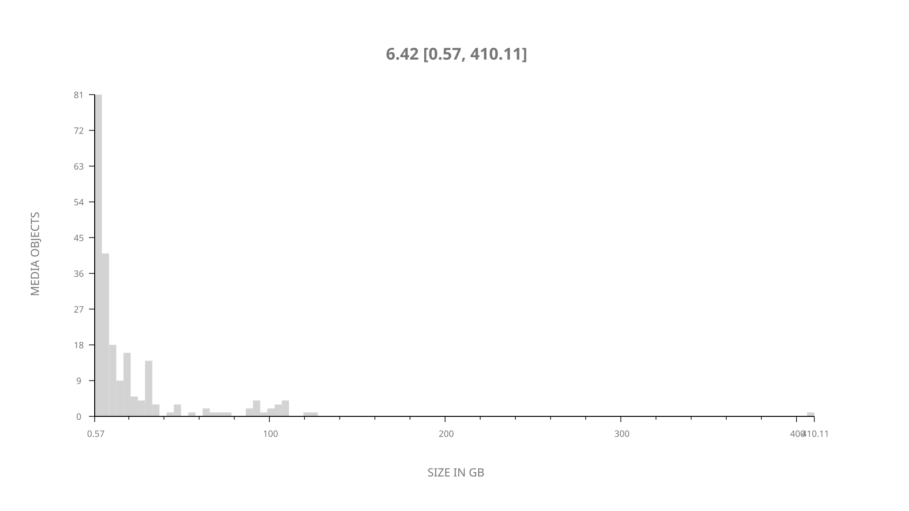
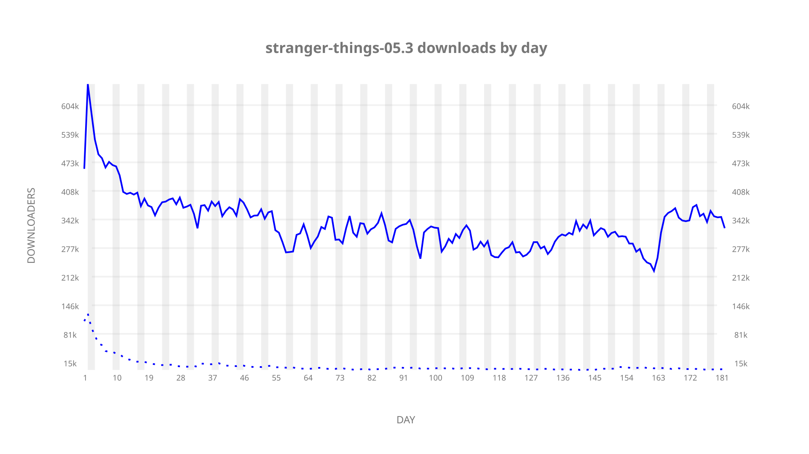
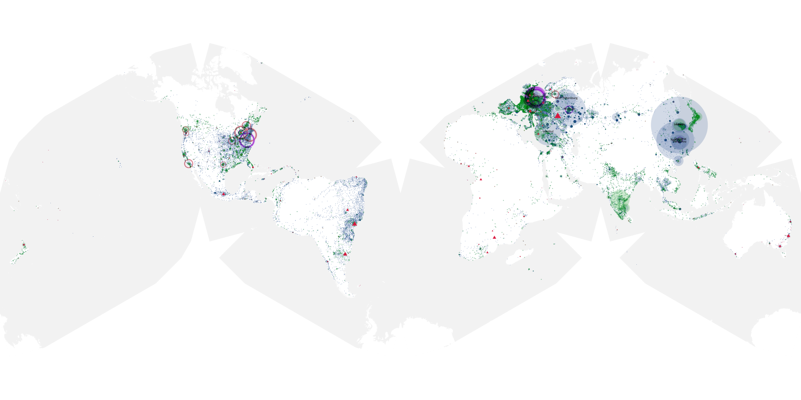
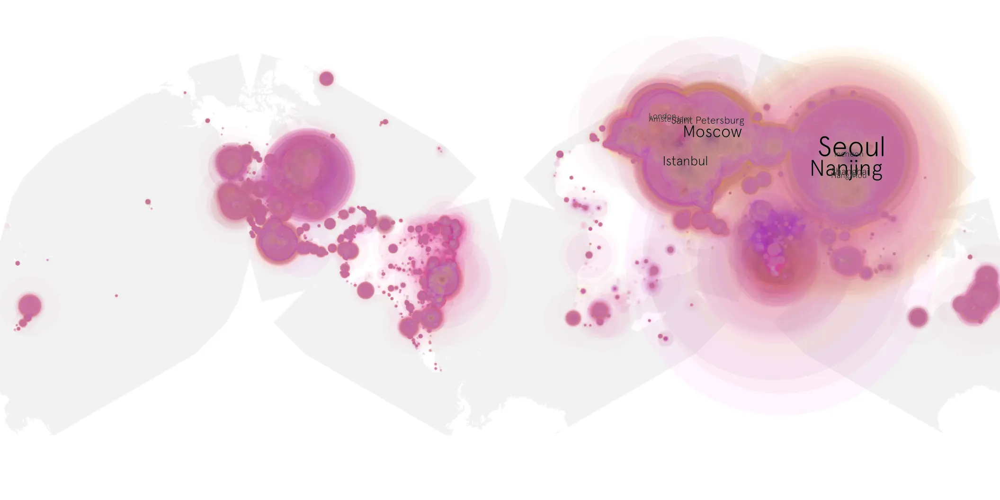
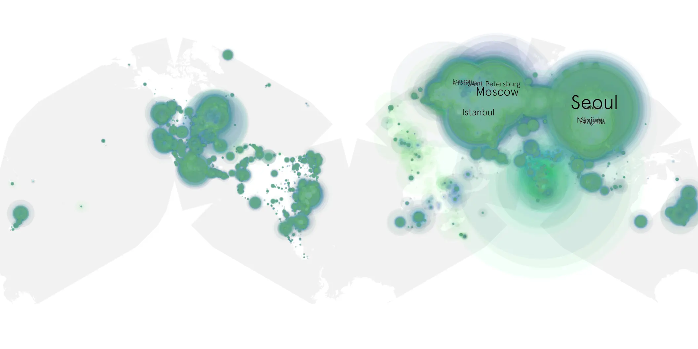

# stranger-things-05.3 sample cache audit

## 1. Media object

| Field | Value |
| --- | --- |
| Media object | Stranger Things |
| Collection key | `stranger-things-05.3` |
| imdb_id | [tt4574334](https://www.imdb.com/title/tt4574334/) |
| wikipedia_url | [Stranger Things](https://en.wikipedia.org/wiki/Stranger_Things) |
| Sample dates | 2026-01-01-to-2026-07-01 |
| Sample days | 182 |
| BTIH count | 234 |
| Unique BTIH count | 220 |
| Downloaders total | 47,403,212 |
| Uploaders total | 2,418,583 |
| Data version | `2026-08-05` |
| IP geolocation version | `6:1777968300` |

## 2. Sample coverage report

- Generated: 2026-09-13T17:13:10Z
- Sample archive directory: `/mnt/gold/src/alpha60-samples-raw.gold/stranger-things-05.3.xz`
- Hour directories: 4365
- Zero-length sample files: 0
- Other unparsable sample files: 0
- Hourly discontinuities: 1 (1 missing hours)
- Missing days: 0

### Sample archive discontinuities

- hourly gap: last `2026-03-29 01:06`, resumed `2026-03-29 03:06` — missing 1 hour(s)

## 3. Media objects file size histogram

## 4. Visualization pass — graphs

### Downloads by week cumulative (normalized start)



### Downloads by day, Saturday and Sunday in gray

## 5. Visualization pass — maps

### Cumulative geographic slices

| Africa | Americas | Asia | Europe | Oceania | Unknown |
| --- | --- | --- | --- | --- | --- |
| 1.18 | 14.28 | 35.66 | 45.35 | 0.99 | 0.70 |

### Cumulative network infrastructure

{:target="_blank" rel="noopener"}

### Cumulative data maps

**Cumulative >= 1080p**

{:target="_blank" rel="noopener"}

**Cumulative < 1080p**

{:target="_blank" rel="noopener"}
