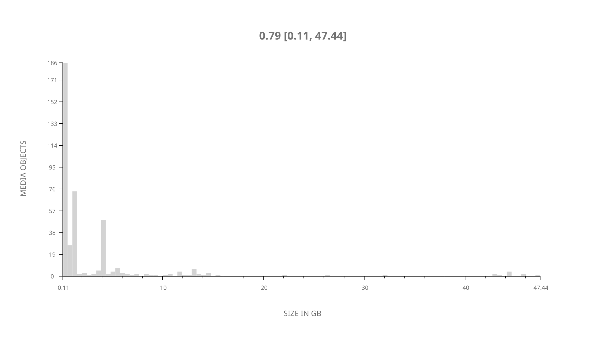
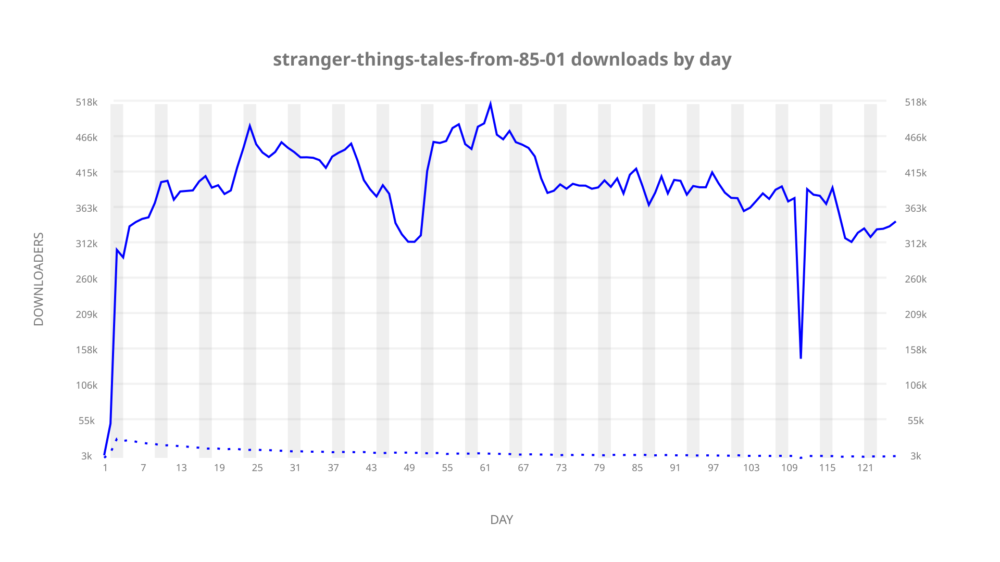
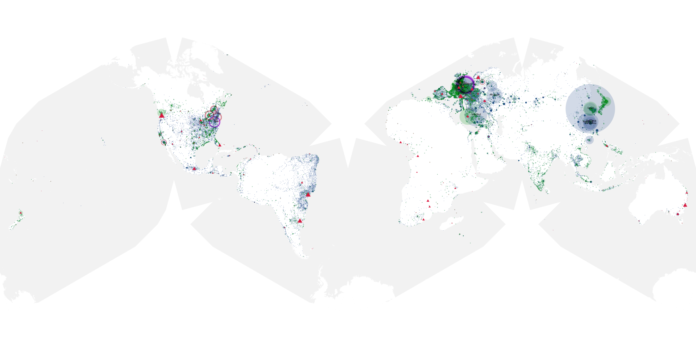
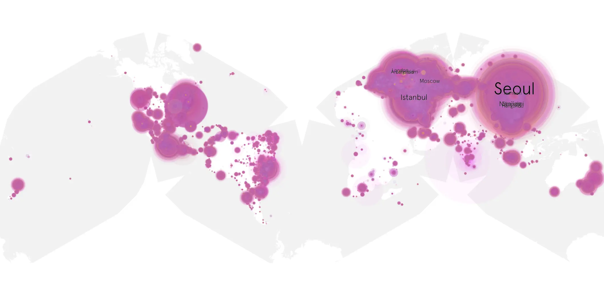
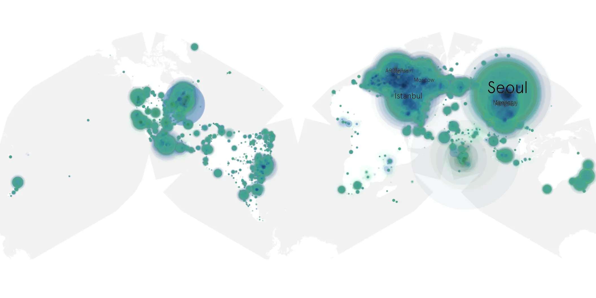

# stranger-things-tales-from-85-01 sample cache audit

## 1. Media object

| Field | Value |
| --- | --- |
| Media object | Stranger Things Tales from 85 |
| Collection key | `stranger-things-tales-from-85-01` |
| imdb_id | [tt27486290](https://www.imdb.com/title/tt27486290/) |
| wikipedia_url | [Stranger Things: Tales from '85](https://en.wikipedia.org/wiki/Stranger_Things:_Tales_from_%2785) |
| Sample dates | 2026-04-23-to-2026-08-26 |
| Sample days | 126 |
| BTIH count | 412 |
| Unique BTIH count | 409 |
| Downloaders total | 38,496,797 |
| Uploaders total | 590,888 |
| Data version | `2026-08-05` |
| IP geolocation version | `6:1777968300` |

## 2. Coverage report

- Generated: 2026-09-13T17:13:10Z
- Sample archive directory: `/mnt/gold/src/alpha60-samples-raw.gold/stranger-things-tales-from-85-01.xz`
- Hour directories: 2991
- Zero-length sample files: 0
- Other unparsable sample files: 0
- Hourly discontinuities: 1 (16 missing hours)
- Missing days: 0

### Sample archive discontinuities

- hourly gap: last `2026-08-10 23:03`, resumed `2026-08-11 16:03` — missing 16 hour(s)

## 3. File sizes histogram *median[lowest, highest]*

## 4. Graphs

### Downloads by week cumulative (normalized start)



### Downloads by day, Saturday and Sunday in gray

## 5. Cumulative Maps

<!-- https://raw.githubusercontent.com/alpha60-devops/alpha60-results-2026/refs/heads/main/data/ -->

### <a href="https://raw.githubusercontent.com/alpha60-devops/alpha60-results-2026/refs/heads/main/data/geojson.cumulative/stranger-things-tales-from-85-01-cumulative-aggregate.geojson.gz" data-map-title="Stranger Things Tales from 85 — stranger-things-tales-from-85-01" onclick="leaflet_map_open_window(this.href, this.dataset.mapTitle); return false;" class="table-link" aria-label="Open Stranger Things Tales from 85 (stranger-things-tales-from-85-01) cumulative data map in new window" title="Opens interactive map for Stranger Things Tales from 85 (stranger-things-tales-from-85-01) data">Swarm Detail</a>

### Geographic Regions

| Africa | Americas | Asia | Europe | Oceania | Unknown |
| --- | --- | --- | --- | --- | --- |
| 1.18 | 16.28 | 36.31 | 43.44 | 1.03 | 0.82 |

### Network infrastructure

{:target="_blank" rel="noopener"}

### Resolution >= 1080p

{:target="_blank" rel="noopener"}

### Resolution < 1080p

{:target="_blank" rel="noopener"}
