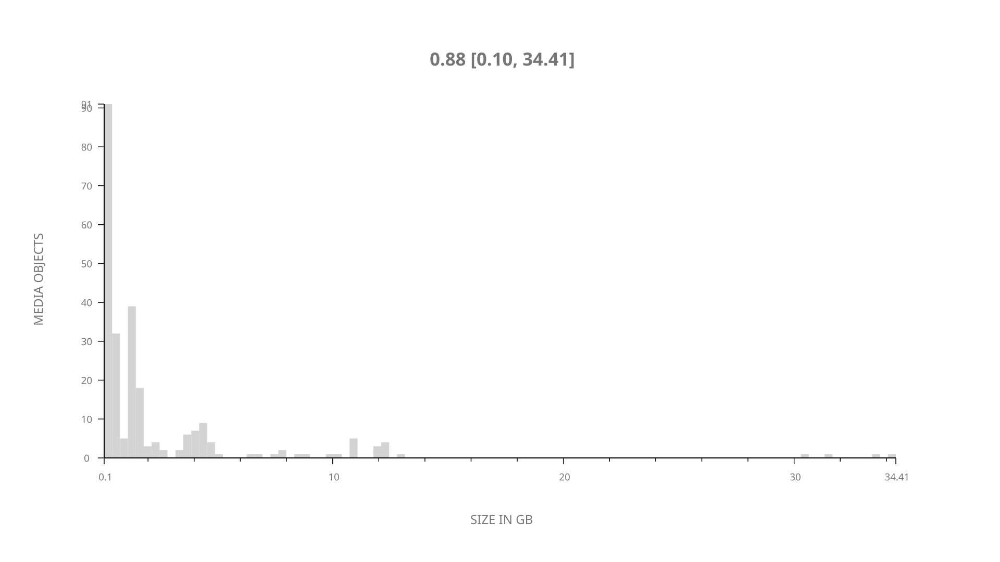
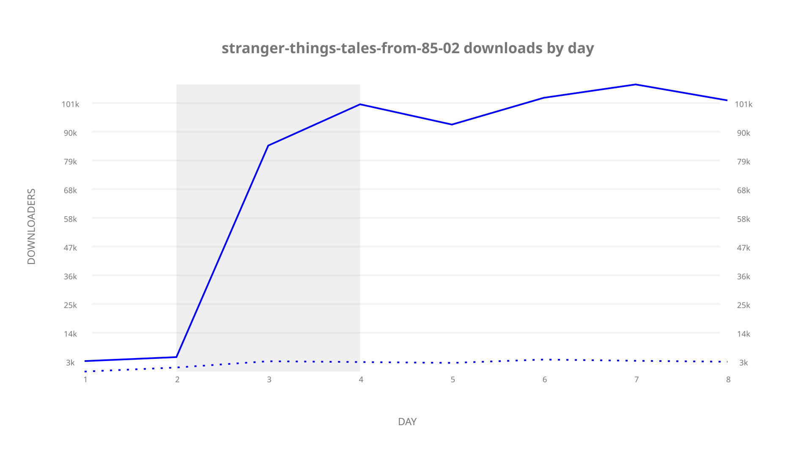
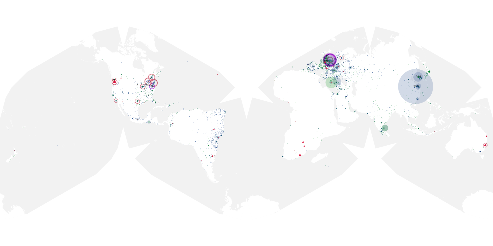
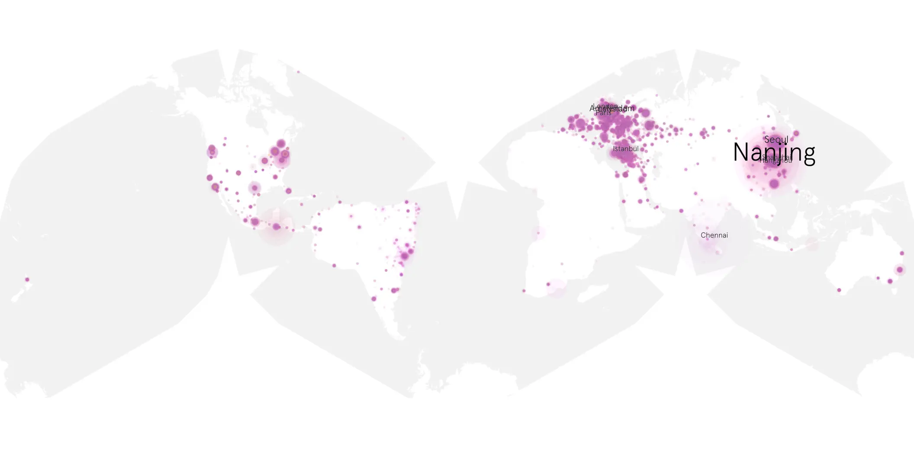
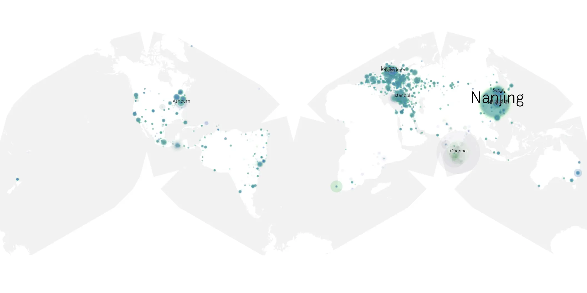

# stranger-things-tales-from-85-02 sample cache audit

## 1. Media object

| Field | Value |
| --- | --- |
| Media object | Stranger Things Tales from 85 |
| Collection key | `stranger-things-tales-from-85-02` |
| imdb_id | [tt27486290](https://www.imdb.com/title/tt27486290/) |
| wikipedia_url | [Stranger Things: Tales from '85#Season 2 (2026)](https://en.wikipedia.org/wiki/Stranger_Things:_Tales_from_%2785#Season_2_(2026)) |
| Sample dates | 2026-09-17-to-2026-09-24 |
| Sample days | 8 |
| BTIH count | 251 |
| Unique BTIH count | 249 |
| Downloaders total | 527,231 |
| Uploaders total | 23,074 |
| Data version | `2026-08-05` |
| IP geolocation version | `6:1777968300` |

## 2. Sample coverage report

- Generated: 2026-10-07T11:57:09Z
- Frozen sample archive directory: `/mnt/gold/src/alpha60-samples-raw.gold/stranger-things-tales-from-85-02.xz`
- Hour directories: 173
- Zero-length sample files: 0
- Malformed in-scope records accepted: 0 (producer rejects nonempty malformed input)
- Hourly discontinuities: 0 (0 missing hours)
- Missing days: 0

### Sample archive discontinuities

None detected.

### Frozen validation evidence

- Frozen content SHA-256: `ee00c7435e9a7fbea7d651a9a6c2e03cf28b3f6b2ec59f6f71c8041e61c9a18d`
- Full-input producer receipt SHA-256: `8d6637e5ee2cdb1d3871dcd4d50f77b2e11e9266677c3e051055aa469554a54d`
- Frozen raw archives: 173
- Empty sampler observations remain explicit gaps; no observations were imputed.
- Out-of-scope records retain the collection factory's established filtering.
- Excluded raw members: 0
- Excluded observations: 0

## 3. Media objects file size histogram

## 4. Visualization pass — graphs

### Downloads by week cumulative (normalized start)



### Downloads by day, Saturday and Sunday in gray

## 5. Visualization pass — maps

### Cumulative geographic slices

| Africa | Americas | Asia | Europe | Oceania | Unknown |
| --- | --- | --- | --- | --- | --- |
| 1.63 | 20.33 | 34.16 | 42.15 | 1.17 | 0.55 |

### Cumulative network infrastructure

{:target="_blank" rel="noopener"}

### Cumulative data maps

**Cumulative >= 1080p**

{:target="_blank" rel="noopener"}

**Cumulative < 1080p**

{:target="_blank" rel="noopener"}
