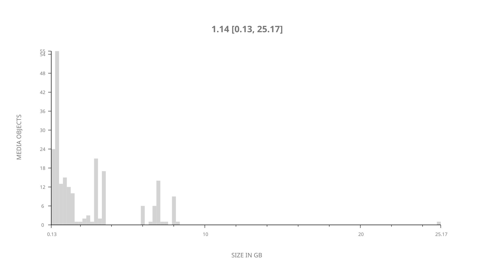
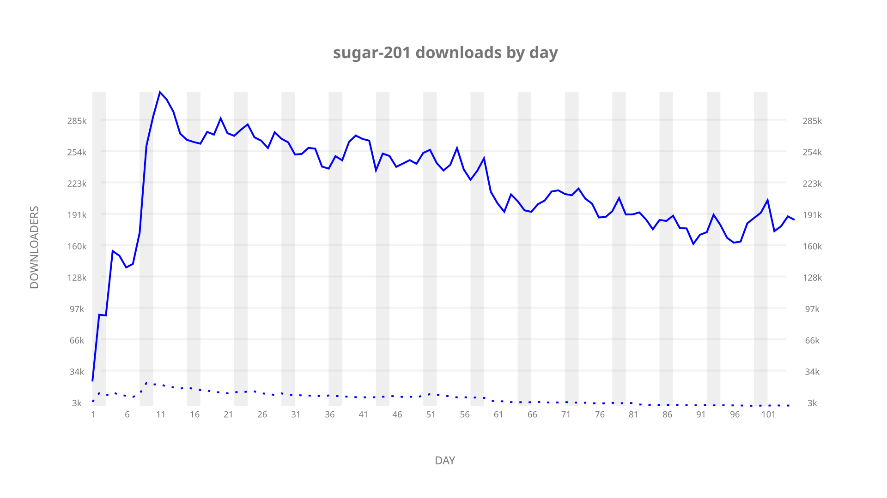
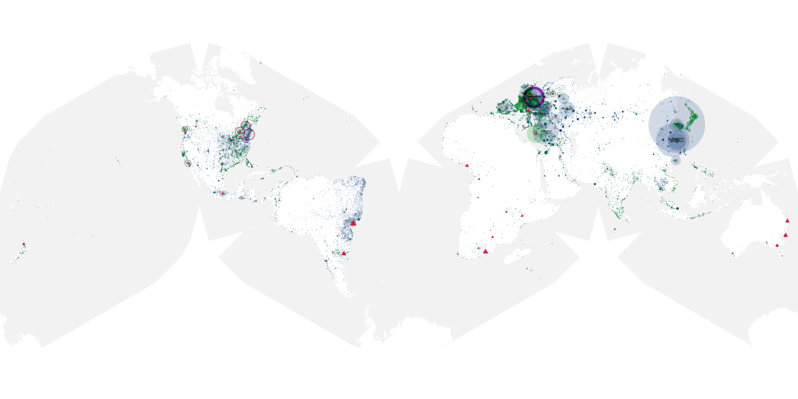
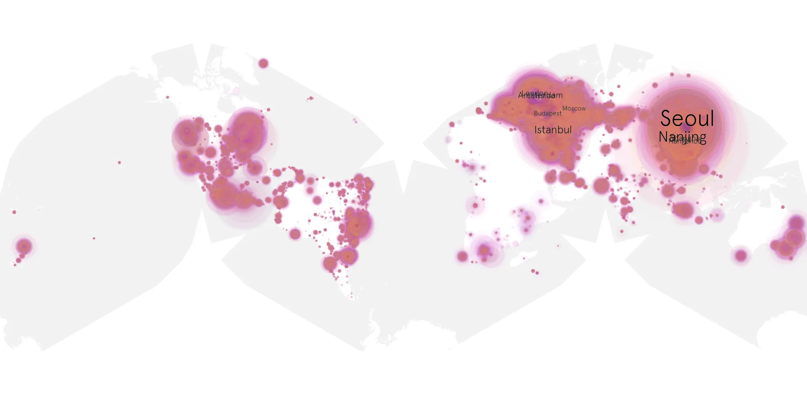
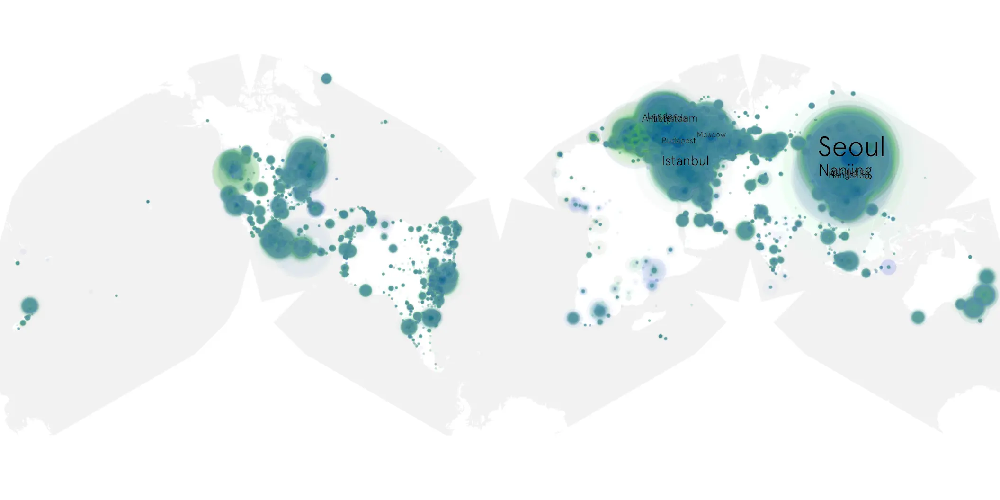

# sugar-201 sample cache audit

## 1. Media object

| Field | Value |
| --- | --- |
| Media object | Sugar |
| Collection key | `sugar-201` |
| imdb_id | [tt16418808](https://www.imdb.com/title/tt16418808/) |
| wikipedia_url | [Sugar (2024 TV series)](https://en.wikipedia.org/wiki/Sugar_(2024_TV_series)) |
| Sample dates | 2026-06-19-to-2026-10-01 |
| Sample days | 105 |
| BTIH count | 220 |
| Unique BTIH count | 217 |
| Downloaders total | 18,040,002 |
| Uploaders total | 540,407 |
| Data version | `2026-08-05` |
| IP geolocation version | `6:1777968300` |

## 2. Sample coverage report

- Generated: 2026-10-07T11:57:09Z
- Frozen sample archive directory: `/mnt/gold/src/alpha60-samples-raw.gold/sugar-201.xz`
- Hour directories: 2501
- Zero-length sample files: 0
- Malformed in-scope records accepted: 0 (producer rejects nonempty malformed input)
- Hourly discontinuities: 0 (0 missing hours)
- Missing days: 0

### Sample archive discontinuities

None detected.

### Frozen validation evidence

- Frozen content SHA-256: `428bc44411b371da130963280b47faea0228780049b9a3c52c972647a2b1a677`
- Full-input producer receipt SHA-256: `6c614faca21b821fe2558af8d9044ad3070c4d8a46a21224998d568681927d50`
- Frozen raw archives: 2501
- Empty sampler observations remain explicit gaps; no observations were imputed.
- Out-of-scope records retain the collection factory's established filtering.
- Excluded raw members: 0
- Excluded observations: 0

## 3. Media objects file size histogram

## 4. Visualization pass — graphs

### Downloads by week cumulative (normalized start)



### Downloads by day, Saturday and Sunday in gray

## 5. Visualization pass — maps

### Cumulative geographic slices

| Africa | Americas | Asia | Europe | Oceania | Unknown |
| --- | --- | --- | --- | --- | --- |
| 1.45 | 17.66 | 34.88 | 43.97 | 1.18 | 0.87 |

### Cumulative network infrastructure

{:target="_blank" rel="noopener"}

### Cumulative data maps

**Cumulative >= 1080p**

{:target="_blank" rel="noopener"}

**Cumulative < 1080p**

{:target="_blank" rel="noopener"}
