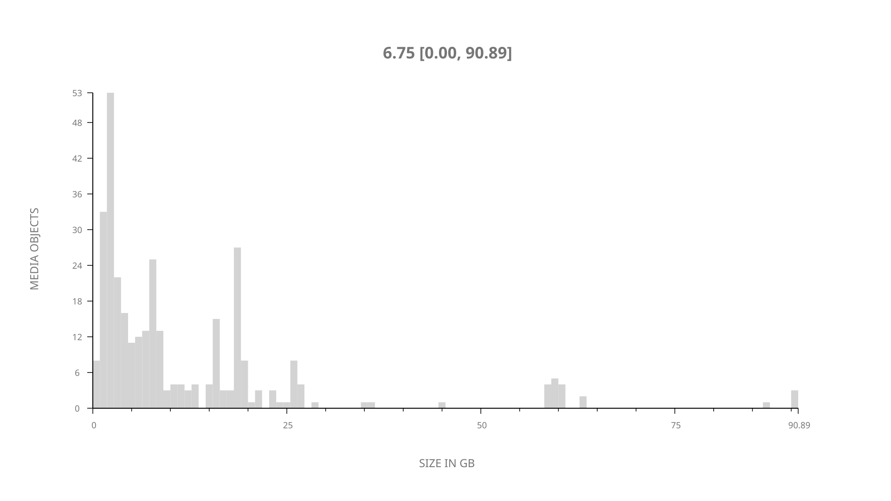
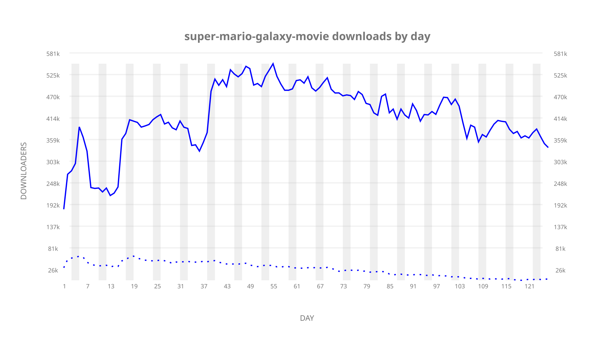
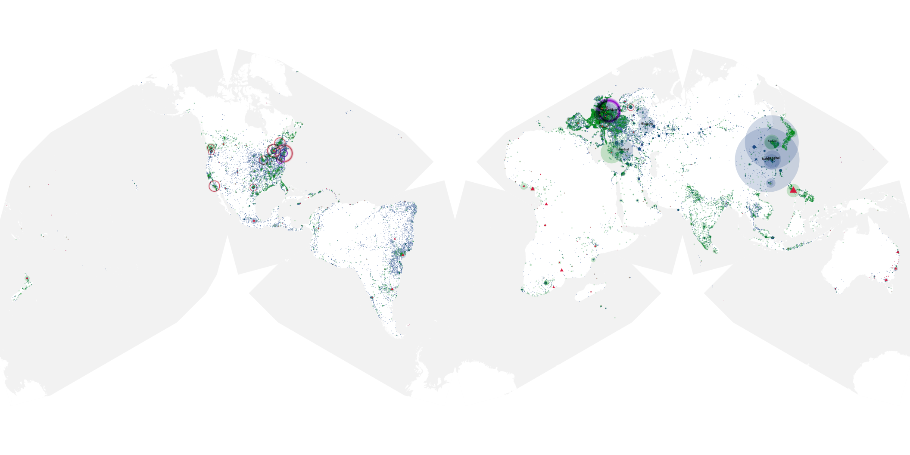
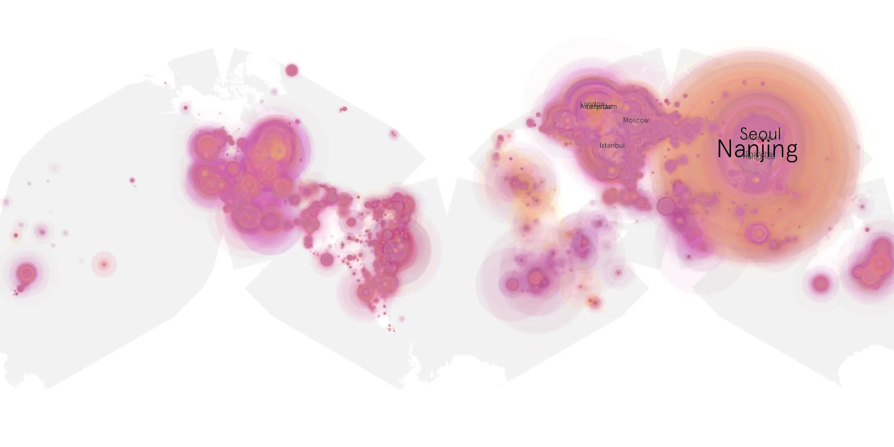
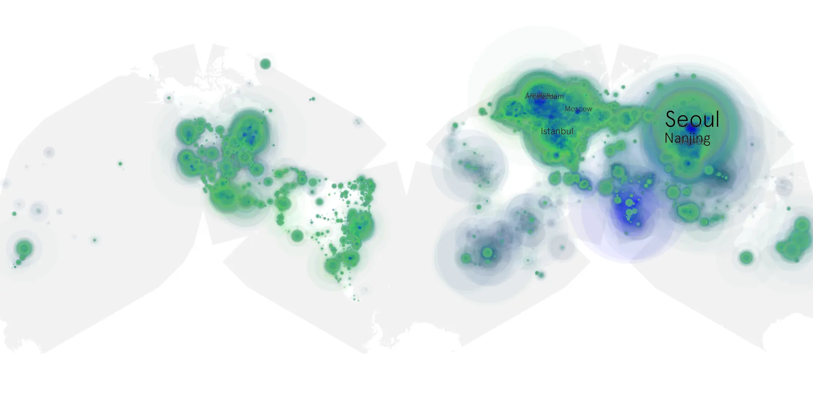

# super-mario-galaxy-movie sample cache audit

## 1. Media object

| Field | Value |
| --- | --- |
| Media object | Super Mario Galaxy Movie |
| Collection key | `super-mario-galaxy-movie` |
| imdb_id | [tt28650488](https://www.imdb.com/title/tt28650488/) |
| wikipedia_url | [The Super Mario Galaxy Movie](https://en.wikipedia.org/wiki/The_Super_Mario_Galaxy_Movie) |
| Sample dates | 2026-05-06-to-2026-09-08 |
| Sample days | 126 |
| BTIH count | 349 |
| Unique BTIH count | 328 |
| Downloaders total | 39,338,561 |
| Uploaders total | 3,205,388 |
| Data version | `2026-08-05` |
| IP geolocation version | `6:1777968300` |

## 2. Sample coverage report

- Generated: 2026-09-13T17:13:10Z
- Sample archive directory: `/mnt/gold/src/alpha60-samples-raw.gold/super-mario-galaxy-movie.xz`
- Hour directories: 3023
- Zero-length sample files: 0
- Other unparsable sample files: 0
- Hourly discontinuities: 0 (0 missing hours)
- Missing days: 0

### Sample archive discontinuities

None detected.

## 3. Media objects file size histogram

## 4. Visualization pass — graphs

### Downloads by week cumulative (normalized start)



### Downloads by day, Saturday and Sunday in gray

## 5. Visualization pass — maps

### Cumulative geographic slices

| Africa | Americas | Asia | Europe | Oceania | Unknown |
| --- | --- | --- | --- | --- | --- |
| 2.27 | 17.21 | 36.82 | 39.64 | 1.32 | 0.81 |

### Cumulative network infrastructure

{:target="_blank" rel="noopener"}

### Cumulative data maps

**Cumulative >= 1080p**

{:target="_blank" rel="noopener"}

**Cumulative < 1080p**

{:target="_blank" rel="noopener"}
