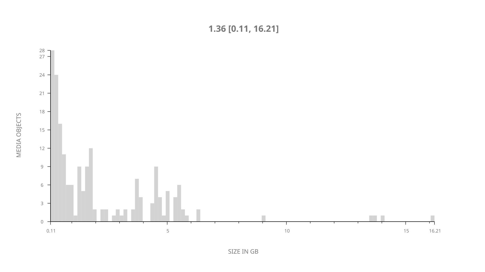
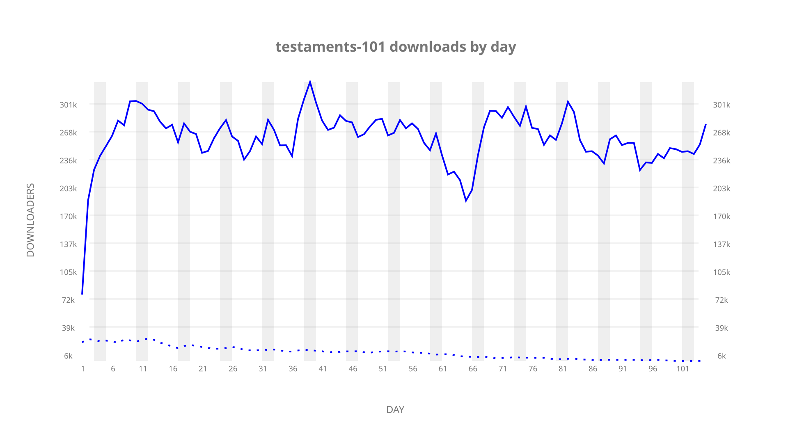
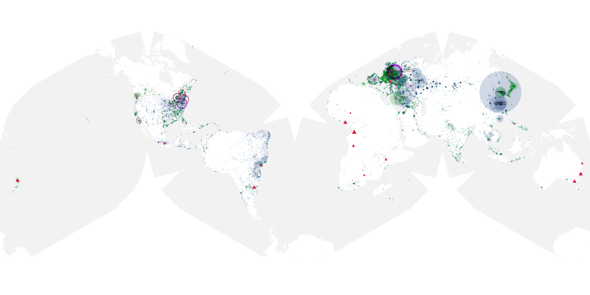
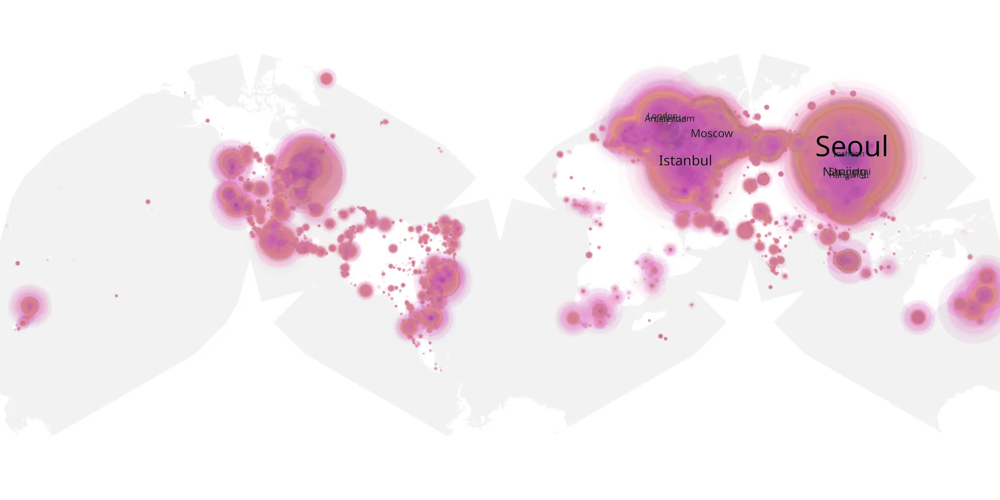
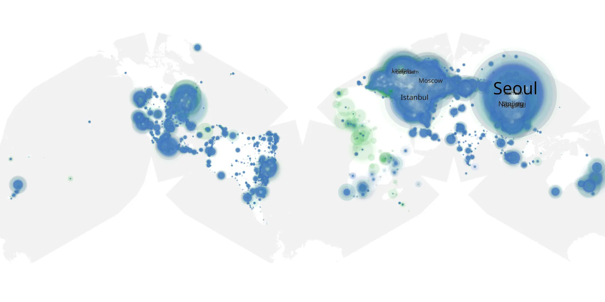

# testaments-101 sample cache audit

## 1. Media object

| Field | Value |
| --- | --- |
| Media object | The Testaments |
| Collection key | `testaments-101` |
| imdb_id | [tt10970762](https://www.imdb.com/title/tt10970762/) |
| wikipedia_url | [The Testaments (TV series)](https://en.wikipedia.org/wiki/The_Testaments_(TV_series)) |
| Sample dates | 2026-04-08-to-2026-07-21 |
| Sample days | 105 |
| BTIH count | 207 |
| Unique BTIH count | 194 |
| Downloaders total | 22,297,278 |
| Uploaders total | 941,106 |
| Data version | `2026-08-05` |
| IP geolocation version | `6:1777968300` |

## 2. Coverage report

- Generated: 2026-09-13T17:13:10Z
- Sample archive directory: `/mnt/gold/src/alpha60-samples-raw.gold/testaments-101.xz`
- Hour directories: 2513
- Zero-length sample files: 0
- Other unparsable sample files: 0
- Hourly discontinuities: 0 (0 missing hours)
- Missing days: 0

### Sample archive discontinuities

None detected.

## 3. File sizes histogram *median[lowest, highest]*

## 4. Graphs

### Downloads by week cumulative (normalized start)



### Downloads by day, Saturday and Sunday in gray

## 5. Cumulative Maps

<!-- https://raw.githubusercontent.com/alpha60-devops/alpha60-results-2026/refs/heads/main/data/ -->

### <a href="https://raw.githubusercontent.com/alpha60-devops/alpha60-results-2026/refs/heads/main/data/geojson.cumulative/testaments-101-cumulative-aggregate.geojson.gz" data-map-title="The Testaments — testaments-101" onclick="leaflet_map_open_window(this.href, this.dataset.mapTitle); return false;" class="table-link" aria-label="Open The Testaments (testaments-101) cumulative data map in new window" title="Opens interactive map for The Testaments (testaments-101) data">Swarm Detail</a>

### Geographic Regions

| Africa | Americas | Asia | Europe | Oceania | Unknown |
| --- | --- | --- | --- | --- | --- |
| 1.51 | 15.93 | 35.32 | 43.27 | 1.35 | 0.75 |

### Network infrastructure

{:target="_blank" rel="noopener"}

### Resolution >= 1080p

{:target="_blank" rel="noopener"}

### Resolution < 1080p

{:target="_blank" rel="noopener"}
