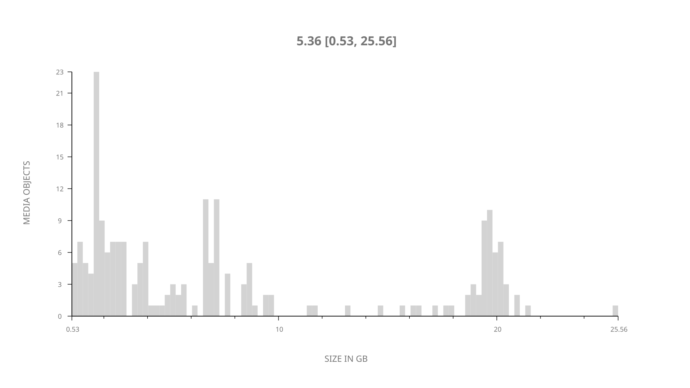
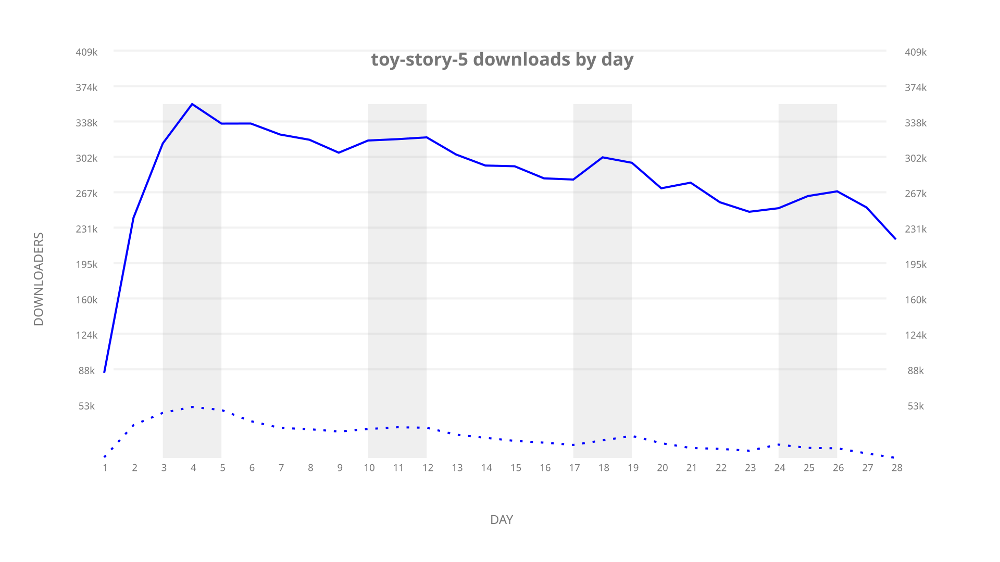
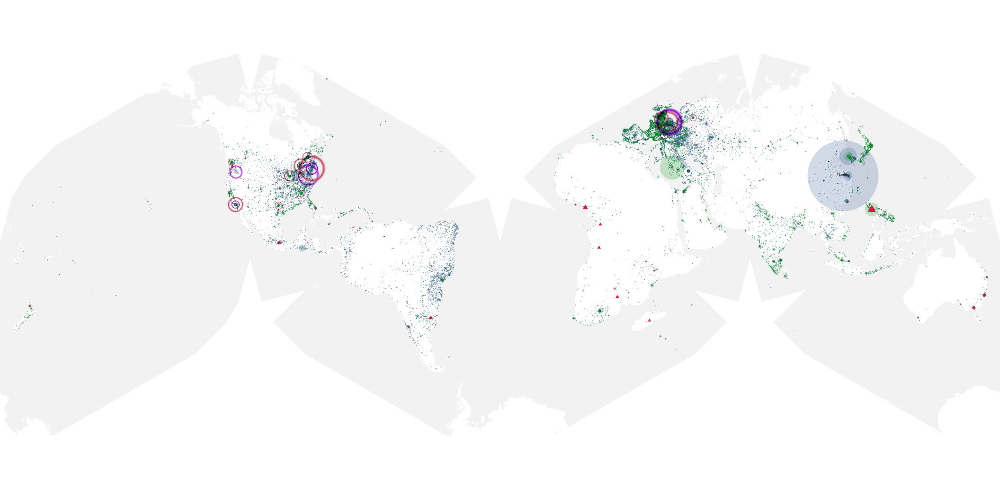
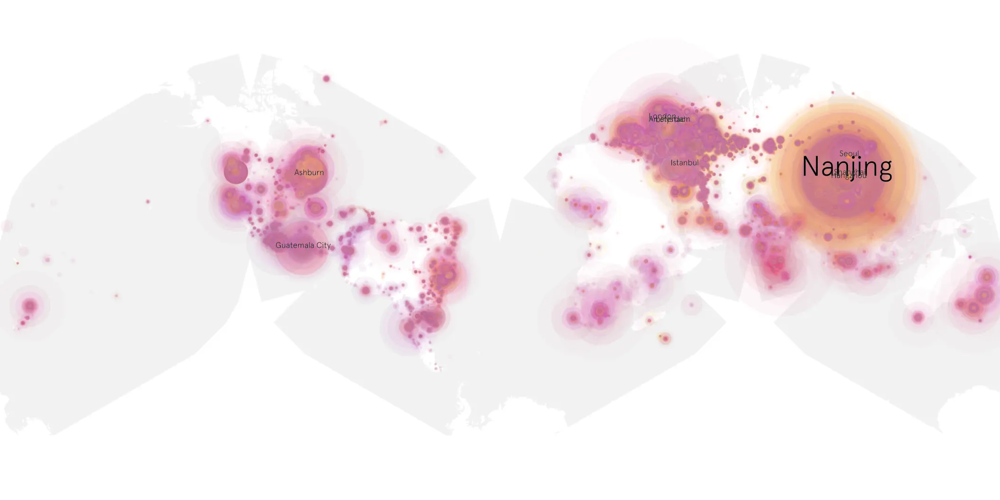
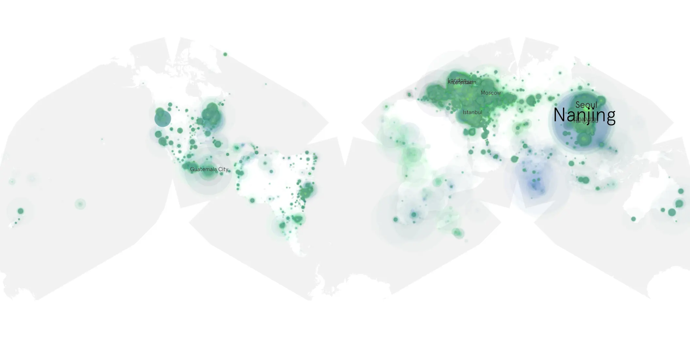

# toy-story-5 sample cache audit

## 1. Media object

| Field | Value |
| --- | --- |
| Media object | Toy Story 5 |
| Collection key | `toy-story-5` |
| imdb_id | [tt29355505](https://www.imdb.com/title/tt29355505/) |
| wikipedia_url | [Toy Story 5](https://en.wikipedia.org/wiki/Toy_Story_5) |
| Sample dates | 2026-08-19-to-2026-09-15 |
| Sample days | 28 |
| BTIH count | 224 |
| Unique BTIH count | 209 |
| Downloaders total | 7,134,803 |
| Uploaders total | 1,275,148 |
| Data version | `2026-08-05` |
| IP geolocation version | `6:1777968300` |

## 2. Sample coverage report

- Generated: 2026-10-07T10:10:22Z
- Frozen sample archive directory: `/mnt/gold/src/alpha60-samples-raw.gold/toy-story-5.xz`
- Hour directories: 672
- Zero-length sample files: 0
- Malformed in-scope records accepted: 0 (producer rejects nonempty malformed input)
- Hourly discontinuities: 0 (0 missing hours)
- Missing days: 0

### Sample archive discontinuities

None detected.

### Frozen validation evidence

- Frozen content SHA-256: `15a31753e812ccb426dc2e54a7e08db5eca37f0ff3089512acdc9c740c054ab4`
- Full-input producer receipt SHA-256: `e64ff2d0870ffafd0c8ab87f794a9815caf2b535408a2b359bde2ca264e3c088`
- Frozen raw archives: 672
- Empty sampler observations remain explicit gaps; no observations were imputed.
- Out-of-scope records retain the collection factory's established filtering.
- Excluded raw members: 0
- Excluded observations: 0

## 3. Media objects file size histogram

## 4. Visualization pass — graphs

### Downloads by week cumulative (normalized start)



### Downloads by day, Saturday and Sunday in gray

## 5. Visualization pass — maps

### Cumulative geographic slices

| Africa | Americas | Asia | Europe | Oceania | Unknown |
| --- | --- | --- | --- | --- | --- |
| 3.66 | 21.20 | 37.09 | 35.37 | 1.96 | 0.72 |

### Cumulative network infrastructure

{:target="_blank" rel="noopener"}

### Cumulative data maps

**Cumulative >= 1080p**

{:target="_blank" rel="noopener"}

**Cumulative < 1080p**

{:target="_blank" rel="noopener"}
