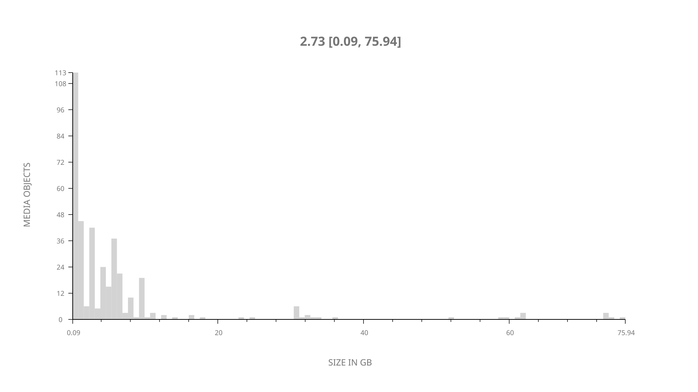
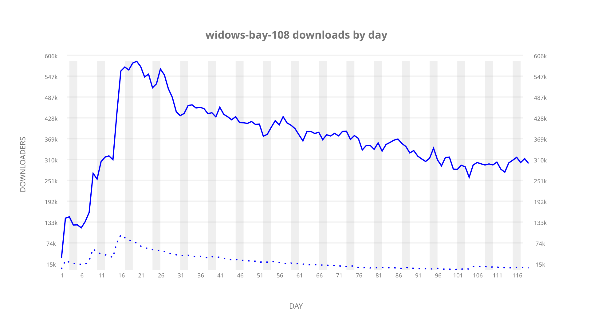
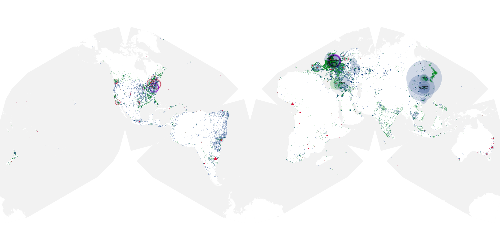
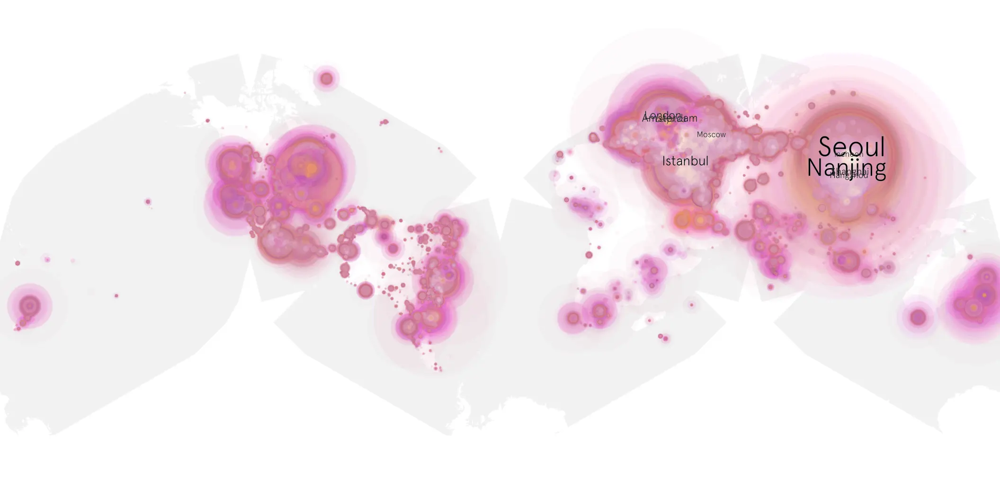
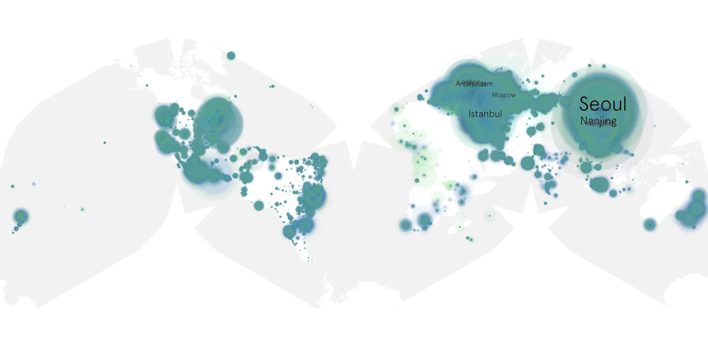

# widows-bay-108 sample cache audit

## 1. Media object

| Field | Value |
| --- | --- |
| Media object | Widows Bay |
| Collection key | `widows-bay-108` |
| imdb_id | [tt33332385](https://www.imdb.com/title/tt33332385/) |
| wikipedia_url | [Widow's Bay](https://en.wikipedia.org/wiki/Widow%27s_Bay) |
| Sample dates | 2026-06-03-to-2026-09-29 |
| Sample days | 119 |
| BTIH count | 381 |
| Unique BTIH count | 377 |
| Downloaders total | 32,745,151 |
| Uploaders total | 2,078,948 |
| Data version | `2026-08-05` |
| IP geolocation version | `6:1777968300` |

## 2. Sample coverage report

- Generated: 2026-10-07T14:25:18Z
- Frozen sample archive directory: `/mnt/gold/src/alpha60-samples-raw.gold/widows-bay-108.xz`
- Hour directories: 2840
- Zero-length sample files: 0
- Malformed in-scope records accepted: 0 (producer rejects nonempty malformed input)
- Hourly discontinuities: 0 (0 missing hours)
- Missing days: 0

### Sample archive discontinuities

None detected.

### Frozen validation evidence

- Frozen content SHA-256: `98252c876d63923c8ccac8cc05f1f66586ea9080a93108dce0d3409470918c7a`
- Full-input producer receipt SHA-256: `b00e8ed3d7ccf6583afa52a15f75188567fd9ea18e8b564bbdfee7962e5a409d`
- Frozen raw archives: 2840
- Empty sampler observations remain explicit gaps; no observations were imputed.
- Out-of-scope records retain the collection factory's established filtering.
- Excluded raw members: 15
- Excluded observations: 144552

## 3. Media objects file size histogram

## 4. Visualization pass — graphs

### Downloads by week cumulative (normalized start)



### Downloads by day, Saturday and Sunday in gray

## 5. Visualization pass — maps

### Cumulative geographic slices

| Africa | Americas | Asia | Europe | Oceania | Unknown |
| --- | --- | --- | --- | --- | --- |
| 1.69 | 18.93 | 34.47 | 42.65 | 1.45 | 0.82 |

### Cumulative network infrastructure

{:target="_blank" rel="noopener"}

### Cumulative data maps

**Cumulative >= 1080p**

{:target="_blank" rel="noopener"}

**Cumulative < 1080p**

{:target="_blank" rel="noopener"}
