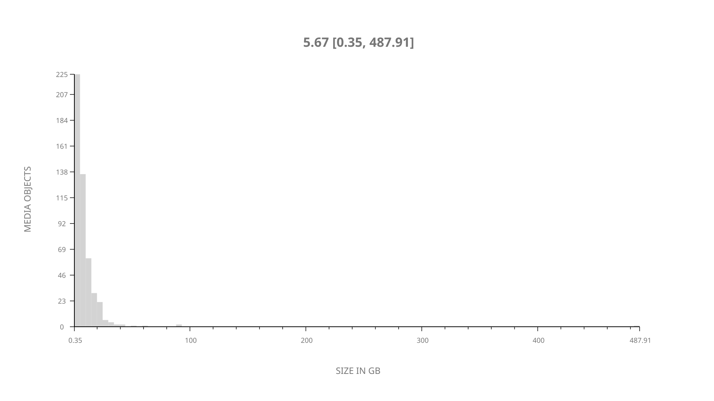
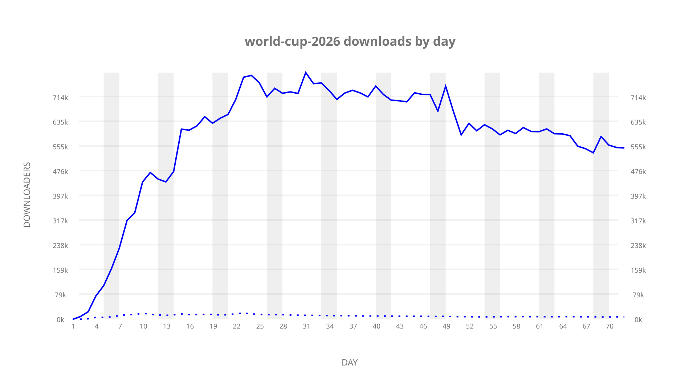
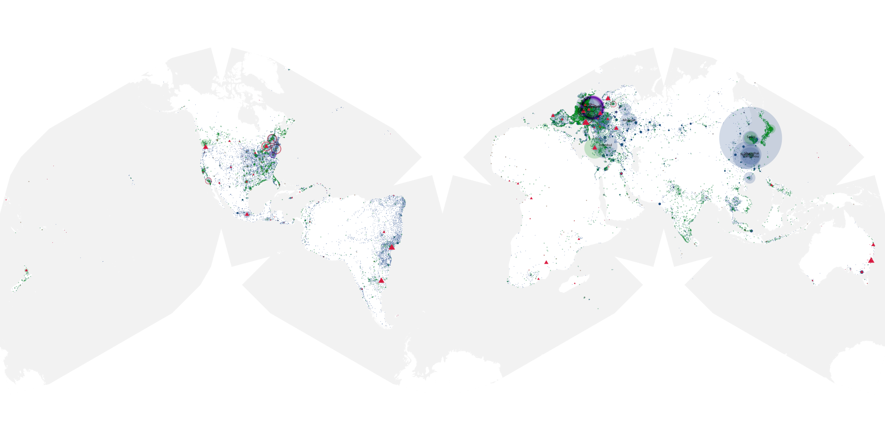
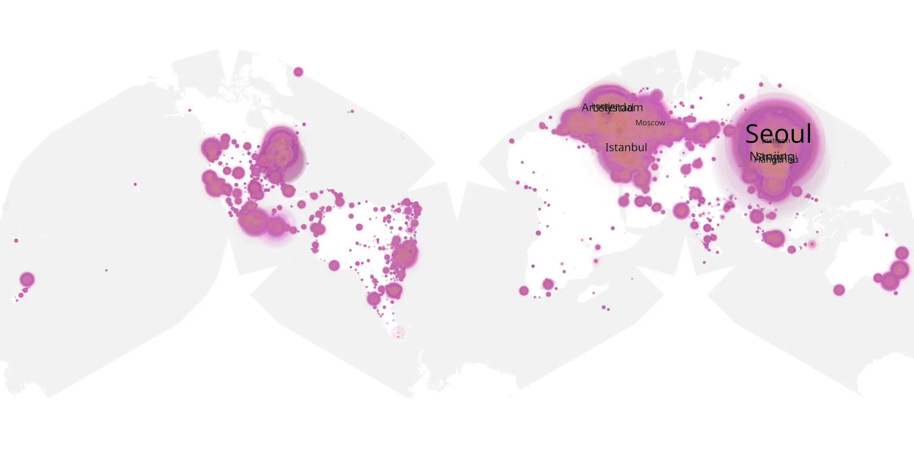
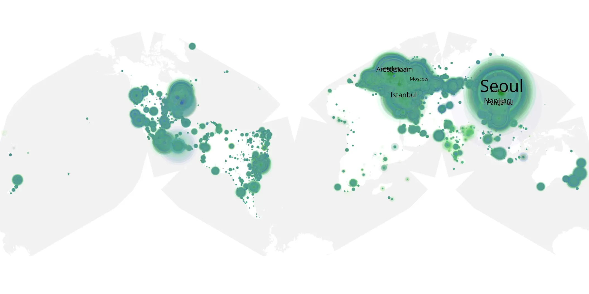

# world-cup-2026 sample cache audit

## 1. Media object

| Field | Value |
| --- | --- |
| Media object | 2026 FIFA World Cup |
| Collection key | `world-cup-2026` |
| imdb_id | [tt32915471](https://www.imdb.com/title/tt32915471/) |
| wikipedia_url | [2026 FIFA World Cup](https://en.wikipedia.org/wiki/2026_FIFA_World_Cup) |
| Sample dates | 2026-06-29-to-2026-09-08 |
| Sample days | 72 |
| BTIH count | 574 |
| Unique BTIH count | 493 |
| Downloaders total | 34,662,047 |
| Uploaders total | 412,914 |
| Data version | `2026-08-05` |
| IP geolocation version | `6:1777968300` |

## 2. Coverage report

- Generated: 2026-09-13T17:13:10Z
- Sample archive directory: `/mnt/gold/src/alpha60-samples-raw.gold/world-cup-2026.xz`
- Hour directories: 1724
- Zero-length sample files: 0
- Other unparsable sample files: 0
- Hourly discontinuities: 0 (0 missing hours)
- Missing days: 0

### Sample archive discontinuities

None detected.

## 3. File sizes histogram *median[lowest, highest]*

## 4. Graphs

### Downloads by week cumulative (normalized start)



### Downloads by day, Saturday and Sunday in gray

## 5. Cumulative Maps

<!-- https://raw.githubusercontent.com/alpha60-devops/alpha60-results-2026/refs/heads/main/data/ -->

### <a href="https://raw.githubusercontent.com/alpha60-devops/alpha60-results-2026/refs/heads/main/data/geojson.cumulative/world-cup-2026-cumulative-aggregate.geojson.gz" data-map-title="2026 FIFA World Cup — world-cup-2026" onclick="leaflet_map_open_window(this.href, this.dataset.mapTitle); return false;" class="table-link" aria-label="Open 2026 FIFA World Cup (world-cup-2026) cumulative data map in new window" title="Opens interactive map for 2026 FIFA World Cup (world-cup-2026) data">Swarm Detail</a>

### Geographic Regions

| Africa | Americas | Asia | Europe | Oceania | Unknown |
| --- | --- | --- | --- | --- | --- |
| 1.13 | 17.18 | 34.96 | 44.04 | 1.03 | 0.89 |

### Network infrastructure

{:target="_blank" rel="noopener"}

### Resolution >= 1080p

{:target="_blank" rel="noopener"}

### Resolution < 1080p

{:target="_blank" rel="noopener"}
