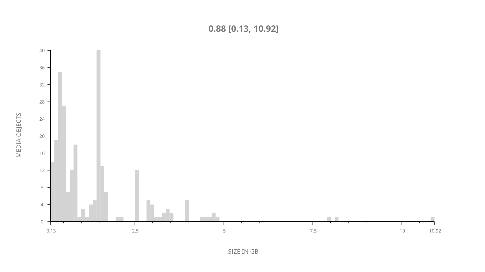
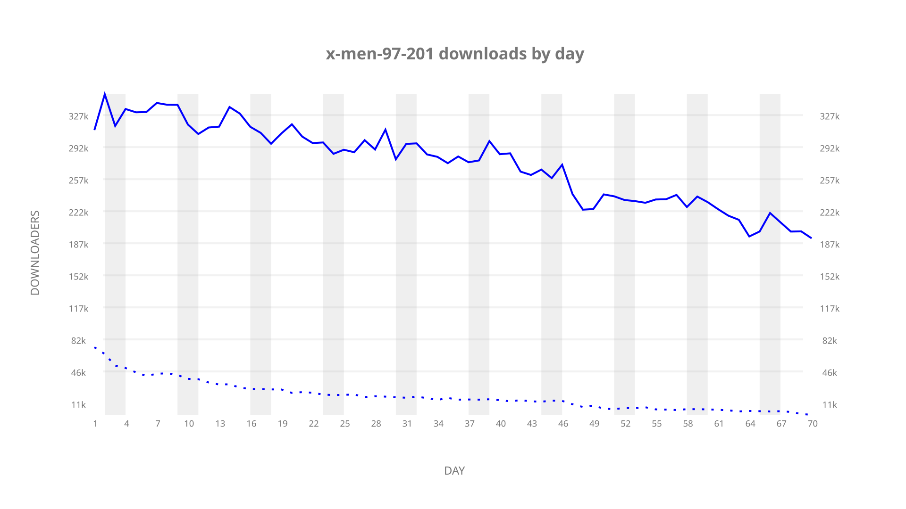
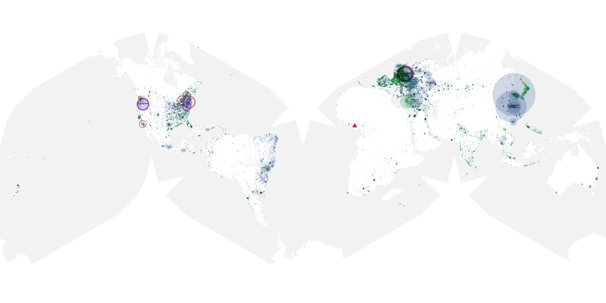
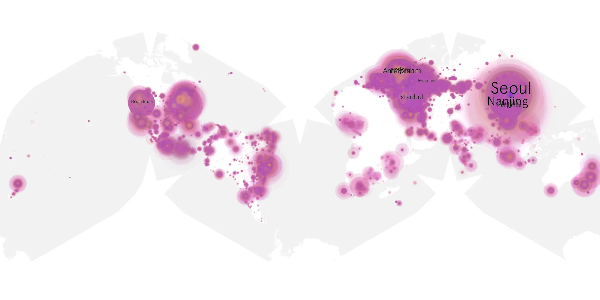
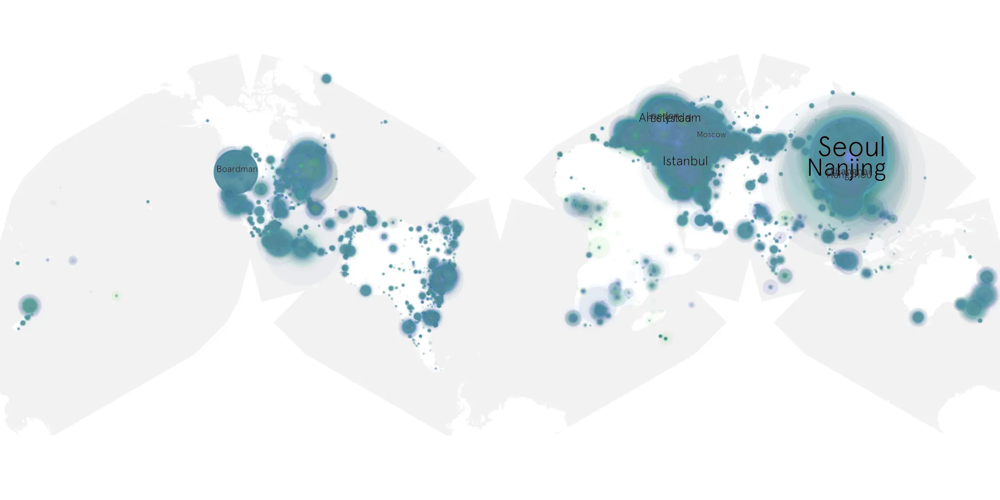

# x-men-97-201 sample cache audit

## 1. Media object

| Field | Value |
| --- | --- |
| Media object | X-Men '97 |
| Collection key | `x-men-97-201` |
| imdb_id | [tt16026746](https://www.imdb.com/title/tt16026746/) |
| wikipedia_url | [X-Men '97](https://en.wikipedia.org/wiki/X-Men_%2797) |
| Sample dates | 2026-07-02-to-2026-09-09 |
| Sample days | 70 |
| BTIH count | 254 |
| Unique BTIH count | 252 |
| Downloaders total | 14,631,671 |
| Uploaders total | 1,057,204 |
| Data version | `2026-08-05` |
| IP geolocation version | `6:1777968300` |

## 2. Coverage report

- Generated: 2026-09-13T17:13:10Z
- Sample archive directory: `/mnt/gold/src/alpha60-samples-raw.gold/x-men-97-201.xz`
- Hour directories: 1678
- Zero-length sample files: 0
- Other unparsable sample files: 0
- Hourly discontinuities: 0 (0 missing hours)
- Missing days: 0

### Sample archive discontinuities

None detected.

## 3. File sizes histogram *median[lowest, highest]*

## 4. Graphs

### Downloads by week cumulative (normalized start)



### Downloads by day, Saturday and Sunday in gray

## 5. Cumulative Maps

<!-- https://raw.githubusercontent.com/alpha60-devops/alpha60-results-2026/refs/heads/main/data/ -->

### <a href="https://raw.githubusercontent.com/alpha60-devops/alpha60-results-2026/refs/heads/main/data/geojson.cumulative/x-men-97-201-cumulative-aggregate.geojson.gz" data-map-title="X-Men &#x27;97 — x-men-97-201" onclick="leaflet_map_open_window(this.href, this.dataset.mapTitle); return false;" class="table-link" aria-label="Open X-Men &#x27;97 (x-men-97-201) cumulative data map in new window" title="Opens interactive map for X-Men &#x27;97 (x-men-97-201) data">Swarm Detail</a>

### Geographic Regions

| Africa | Americas | Asia | Europe | Oceania | Unknown |
| --- | --- | --- | --- | --- | --- |
| 1.80 | 20.85 | 33.52 | 40.15 | 1.31 | 0.79 |

### Network infrastructure

{:target="_blank" rel="noopener"}

### Resolution >= 1080p

{:target="_blank" rel="noopener"}

### Resolution < 1080p

{:target="_blank" rel="noopener"}
