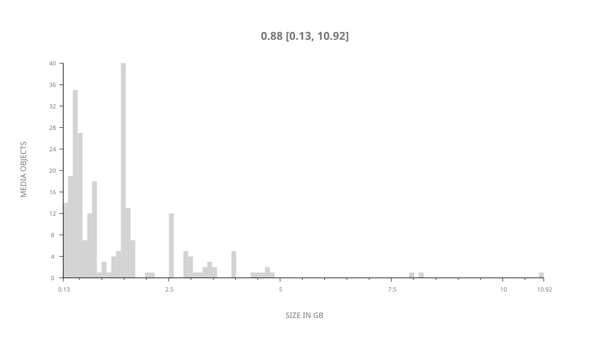
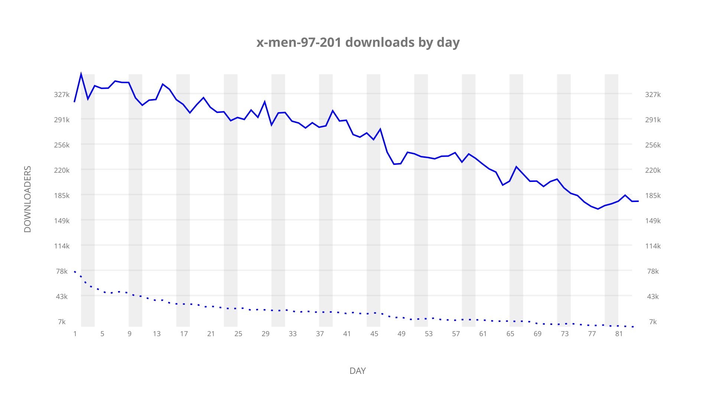
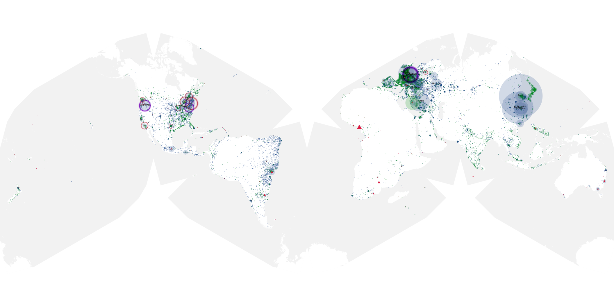
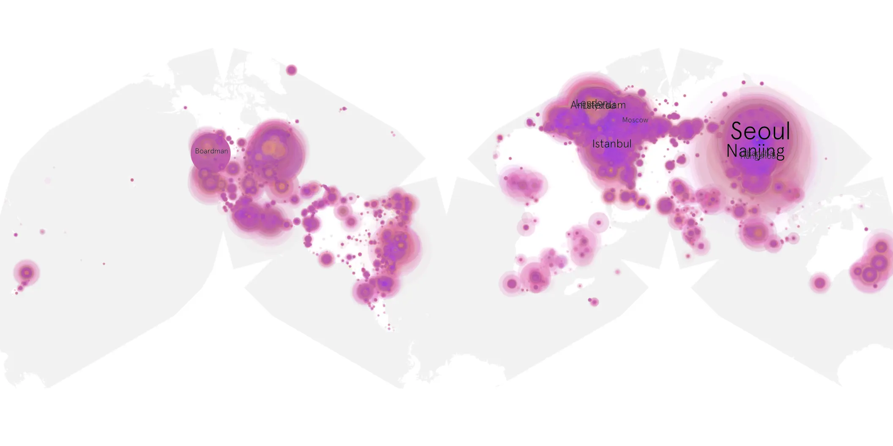
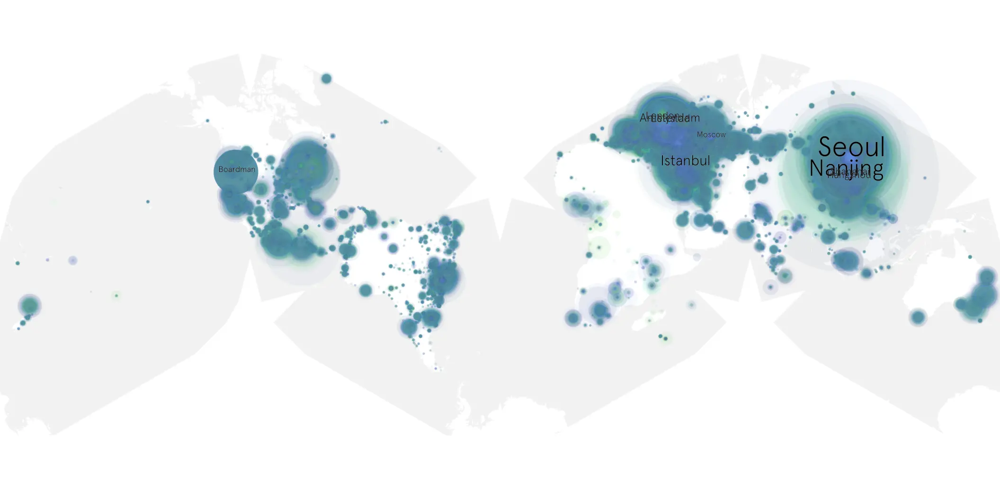

# x-men-97-201 sample cache audit

## 1. Media object

| Field | Value |
| --- | --- |
| Media object | X-Men '97 |
| Collection key | `x-men-97-201` |
| imdb_id | [tt16026746](https://www.imdb.com/title/tt16026746/) |
| wikipedia_url | [X-Men '97](https://en.wikipedia.org/wiki/X-Men_%2797) |
| Sample dates | 2026-07-02-to-2026-09-23 |
| Sample days | 84 |
| BTIH count | 254 |
| Unique BTIH count | 252 |
| Downloaders total | 16,418,474 |
| Uploaders total | 1,094,872 |
| Data version | `2026-08-05` |
| IP geolocation version | `6:1777968300` |

## 2. Sample coverage report

- Generated: 2026-10-07T11:57:10Z
- Frozen sample archive directory: `/mnt/gold/src/alpha60-samples-raw.gold/x-men-97-201.xz`
- Hour directories: 2014
- Zero-length sample files: 0
- Malformed in-scope records accepted: 0 (producer rejects nonempty malformed input)
- Hourly discontinuities: 0 (0 missing hours)
- Missing days: 0

### Sample archive discontinuities

None detected.

### Frozen validation evidence

- Frozen content SHA-256: `36212d4a86d9522027e6ac1ccaf45ea3b08abe46e3213e274cfdd5e440f51a2c`
- Full-input producer receipt SHA-256: `f5599f28946173f2ede20663d883fad881cdb38a44efb1e9cdfa51b84a98f8e6`
- Frozen raw archives: 2014
- Empty sampler observations remain explicit gaps; no observations were imputed.
- Out-of-scope records retain the collection factory's established filtering.
- Excluded raw members: 1
- Excluded observations: 256

## 3. Media objects file size histogram

## 4. Visualization pass — graphs

### Downloads by week cumulative (normalized start)



### Downloads by day, Saturday and Sunday in gray

## 5. Visualization pass — maps

### Cumulative geographic slices

| Africa | Americas | Asia | Europe | Oceania | Unknown |
| --- | --- | --- | --- | --- | --- |
| 1.86 | 21.17 | 33.61 | 41.28 | 1.29 | 0.80 |

### Cumulative network infrastructure

{:target="_blank" rel="noopener"}

### Cumulative data maps

**Cumulative >= 1080p**

{:target="_blank" rel="noopener"}

**Cumulative < 1080p**

{:target="_blank" rel="noopener"}
