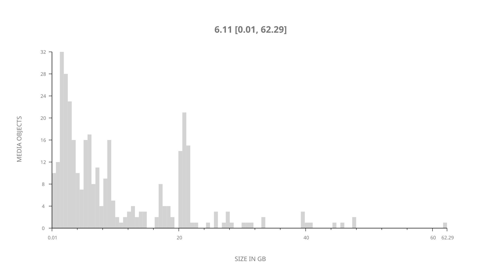
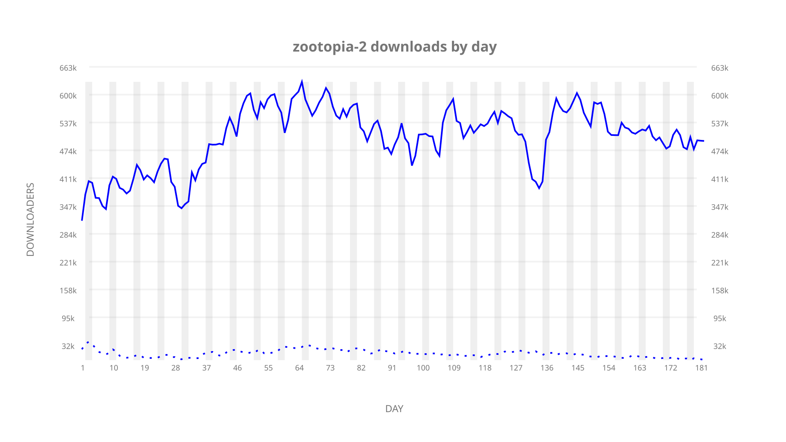
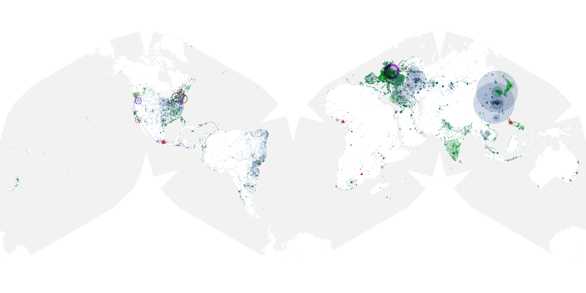
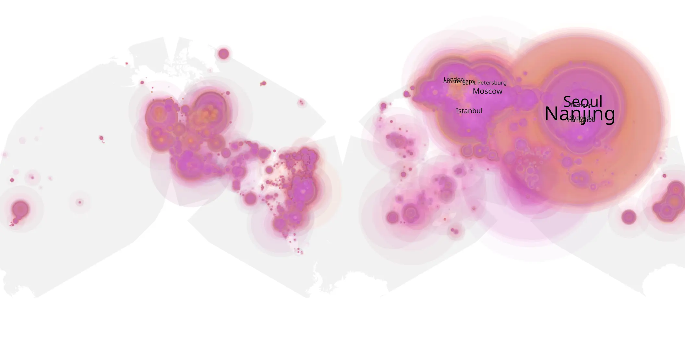
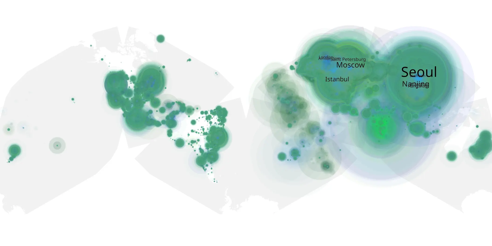

# zootopia-2 sample cache audit

## 1. Media object

| Field | Value |
| --- | --- |
| Media object | Zootopia |
| Collection key | `zootopia-2` |
| imdb_id | [tt26443597](https://www.imdb.com/title/tt26443597/) |
| wikipedia_url | [Zootopia 2](https://en.wikipedia.org/wiki/Zootopia_2) |
| Sample dates | 2026-01-29-to-2026-07-29 |
| Sample days | 182 |
| BTIH count | 360 |
| Unique BTIH count | 340 |
| Downloaders total | 72,764,609 |
| Uploaders total | 4,670,772 |
| Data version | `2026-08-05` |
| IP geolocation version | `6:1777968300` |

## 2. Sample coverage report

- Generated: 2026-09-13T17:13:10Z
- Sample archive directory: `/mnt/gold/src/alpha60-samples-raw.gold/zootopia-2.xz`
- Hour directories: 4368
- Zero-length sample files: 0
- Other unparsable sample files: 0
- Hourly discontinuities: 1 (1 missing hours)
- Missing days: 0

### Sample archive discontinuities

- hourly gap: last `2026-03-29 01:02`, resumed `2026-03-29 03:02` — missing 1 hour(s)

## 3. Media objects file size histogram

## 4. Visualization pass — graphs

### Downloads by week cumulative (normalized start)



### Downloads by day, Saturday and Sunday in gray

## 5. Visualization pass — maps

### Cumulative geographic slices

| Africa | Americas | Asia | Europe | Oceania | Unknown |
| --- | --- | --- | --- | --- | --- |
| 1.92 | 14.54 | 37.47 | 42.89 | 1.02 | 0.74 |

### Cumulative network infrastructure

{:target="_blank" rel="noopener"}

### Cumulative data maps

**Cumulative >= 1080p**

{:target="_blank" rel="noopener"}

**Cumulative < 1080p**

{:target="_blank" rel="noopener"}
